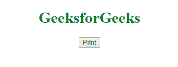
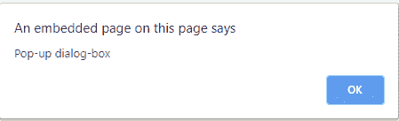
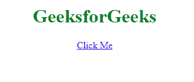

# 如何用 JavaScript 创建弹出打印对话框？

> 原文:[https://www . geesforgeks . org/如何使用 javascript 创建弹出打印对话框/](https://www.geeksforgeeks.org/how-to-create-a-pop-up-to-print-dialog-box-using-javascript/)

给定一个 HTML 文档，任务是设计一个按钮，弹出一个打印对话框。我们将使用 JavaScript 来完成分配的任务:

*   **Approach:**:
    *   添加一个链接到 JavaScript 函数的按钮。
    *   在 JavaScript 函数中，使用 JavaScript 默认函数调用打印对话框

    **语法:**

    ```
    window.print
    ```

    **示例:**

    ```
    <!DOCTYPE html>
    <html>

    <head>
        <title>create a pop-up to print 
          dialog box using JavaScript</title>
    </head>

    <body>
        <center>
            <h1 style="color:green">GeeksforGeeks</h1>
            <script>
                function printPopUp() {
                    alert("Pop-up dialog-box")
                    window.print();
                }
            </script>

            <button onclick="printPopUp()">Print</button>
        </center>
    </body>

    </html>
    ```

    **输出:**
    **前:**
    
    **后:**
    

*   **Approach:**:
    *   在正文标签中使用 DOM onload Event。
    *   使用弹出对话框和*窗口的窗口提醒方式，打印*打印文档。

    **示例:**

    ```
    <!DOCTYPE html>
    <html>

    <head>
        <title>create a pop-up to print
          dialog box using JavaScript</title>
    </head>

    <body onload="alert('Pop-up dialog-box');window.print();">
        <center>
            <h1 style="color:green">
              GeeksforGeeks
          </h1> 
          create a pop-up to print dialog box using JavaScript
      </center>
    </body>

    </html>
    ```

    **输出:**
    

*   **Approach:**:
    *   使用 
    *   使用弹出对话框和*窗口的窗口提醒方式，打印*打印文档。

    **示例:**

    ```
    <!DOCTYPE html>
    <html>

    <head>
        <title>create a pop-up to print 
          dialog box using JavaScript</title>
    </head>

    <body>
        <center>
            <h1 style="color:green">
              GeeksforGeeks
          </h1>
            <a href="javascript:alert('Pop-up dialog-box');window.print();">
              Click Me
          </a>
      </center>
    </body>

    </html>
    ```

    **输出:**
    **前:**
    

    **之后:**
    