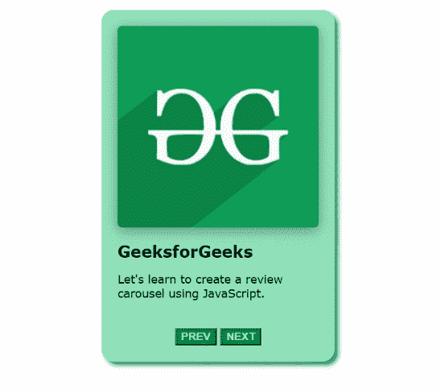

# 如何使用 JavaScript 创建评论转盘？

> 原文:[https://www . geesforgeks . org/how-create-a-review-carousel-use-JavaScript/](https://www.geeksforgeeks.org/how-to-create-a-review-carousel-using-javascript/)

在本文中，我们使用 [JavaScript](https://www.geeksforgeeks.org/javascript-tutorial/) 创建了一个评审转盘。我们还使用了基本的 [HTMM](https://www.geeksforgeeks.org/html-tutorials/) 和 [CSS](https://www.geeksforgeeks.org/css-tutorials/) 进行造型。轮播基本上是一种幻灯片放映，用于以循环方式显示图像、文本或两者。评论转盘用于显示评论。

**进场:**

*   在主体标签中，使用包含审阅者图像、名称和文本的类名创建嵌套的 [div](https://www.geeksforgeeks.org/div-tag-html/) 标签。
*   添加上一个和下一个按钮，分别检查上一个和下一个评论。
*   对于样式，在[样式](https://www.geeksforgeeks.org/html-style-tag/)标签中添加一些 CSS 属性，比如对齐方式、字体大小、填充、边距等。
*   在[脚本](https://www.geeksforgeeks.org/html-script-tag/)标签中使用 JavaScript 创建一个[函数](https://www.geeksforgeeks.org/functions-in-javascript/)，一次只显示一条评论。

**示例:**使用上述方法创建评审转盘。

**HTML 代码:**和前两步一样，我们将在[主体](https://www.geeksforgeeks.org/html-body-tag/)标签中创建一个嵌套的 *div* 标签和两个[按钮](https://www.geeksforgeeks.org/html-button-tag/)。

## index.html

```html
<div class="review">
    <div class="review__items">
        
        <h1>GeeksforGeeks</h1>

        <p>
            Let's learn to create a review 
            carousel using JavaScript.
        </p>
    </div>

    <div class="review__items">
        
        <h1>Geek Here</h1>

        <p>
            Very useful site to learn cool 
            stuff. Improve your skills
        </p>
    </div>

    <div class="review__items">
        
        <h1>Hello there!</h1>

        <p>
            Have a nice day, Please visit 
            us again. Nice to meet you.
        </p>
    </div>

    <div class="review__button">
        <button id="prev" onclick="previousReview()">
            PREV
        </button>

        <button id="next" onclick="nextReview()">
            NEXT
        </button>
    </div>
</div>
```

**注意:**在按钮标签中，我们指定了一个属性 [onclick](https://www.geeksforgeeks.org/html-onclick-event-attribute/) 。当用户点击按钮时， *onclick* 事件属性起作用。当按钮被点击时，它将执行该功能。

**CSS 代码:**对于样式，我们使用了 CSS 属性。

## style.css

```html
.review {
    background: rgb(145, 226, 188);
    height: auto;
    width: 270px;
    border-radius: 15px;
    margin: auto;
    padding: 10px;
    margin-top: 30px;
    box-shadow: 5px 5px 5px #32917d;
    align-items: center;
}

.review__items {
    align-items: center;
    justify-content: space-evenly;
    width: 250px;
    padding: 10px;
    align-items: center;
}

.review__items img {
    height: 250px;
    width: 250px;
    border-radius: 5px;
    box-shadow: rgba(0, 0, 0, 0.35) 0px 4px 15px;
}

.review__items h1 {
    font-family: Verdana, Geneva, Tahoma, sans-serif;
    font-size: 20px;
}

.review__items p {
    font-family: Verdana, Geneva, Tahoma, sans-serif;
    font-size: 14px;
}

.review__button {
    text-align: center;
    padding: 10px;
}

.review__button button {
    color: rgb(192, 229, 192);
    background: green;
    font-weight: bold;
}

.review__items {
    display: none;
}
```

**注意:**我们也可以创建另一个文件进行样式化，或者我们可以将它们添加到样式标签下的同一个 HTML 文件中。

现在，为了一次只显示一篇评论，我们将在 JavaScript 中创建一些[函数](https://www.geeksforgeeks.org/functions-in-javascript/)。

**轮播函数**:这个函数借助 [getElementsByClassName()](https://www.geeksforgeeks.org/html-dom-getelementsbyclassname-method/) 方法，获取所有使用指定类名作为对象的元素。这些对象可以通过元素的索引来访问。此函数接收一个参数，该参数是它将显示的元素的索引。

```html
function carousel(review) {
    let reviews = document.getElementsByClassName("review__items");

    if(review>=reviews.length){
        review=0;
        rev=0;
    }
    if(review<0){
        review=reviews.length-1;
        rev=reviews.length-1;
    }
    for (let i = 0; i < reviews.length; i++) {
      reviews[i].style.display = "none";
    }
    reviews[review].style.display="block";
}
```

要显示指定的索引，首先，它将使用简单的[循环](https://www.geeksforgeeks.org/javascript-for-loop/)将所有评论的显示设置为无，从而隐藏所有评论，对于特定的索引，它将通过将其显示设置为阻止来显示信息。

**注意:** [条件语句](https://www.geeksforgeeks.org/if-else-statement-in-javascript/)负责轮播的循环方式，如果参数为负会将参数设置到最后一个索引，如果参数大于等于最后一个索引会将参数设置到第一个索引。

**perviousReview 函数**:点击上一个按钮时会执行这个函数，它将变量减 1，然后传递给轮播函数。

```html
function previousReview() {
    rev = rev - 1;
    carousel(rev);
}
```

**nextReview 函数:**点击下一步按钮会执行该函数，它将变量增加 1，然后传递给轮播函数。

```html
function nextReview() {
    rev = rev + 1;
    carousel(rev);
}
```

**完整代码:**

## 超文本标记语言

```html
<!DOCTYPE html>
<html lang="en">

<head>
    <title>Review Carousel</title>

    <style>
        .review {
            background: rgb(145, 226, 188);
            height: auto;
            width: 270px;
            border-radius: 15px;
            margin: auto;
            padding: 10px;
            margin-top: 30px;
            box-shadow: 5px 5px 5px #32917d;
            align-items: center;
        }

        .review__items {
            align-items: center;
            justify-content: space-evenly;
            width: 250px;
            padding: 10px;
            align-items: center;
        }

        .review__items img {
            height: 250px;
            width: 250px;
            border-radius: 5px;
            box-shadow: rgba(0, 0, 0, 0.35) 0px 4px 15px;
        }

        .review__items h1 {
            font-family: Verdana, Geneva, Tahoma, sans-serif;
            font-size: 20px;
        }

        .review__items p {
            font-family: Verdana, Geneva, Tahoma, sans-serif;
            font-size: 14px;
        }

        .review__button {
            text-align: center;
            padding: 10px;
        }

        .review__button button {
            color: rgb(192, 229, 192);
            background: green;
            font-weight: bold;
        }

        .review__items {
            display: none;
        }
    </style>
</head>

<body>
    <div class="review">
        <div class="review__items">
            
            <h1>GeeksforGeeks</h1>
            <p>
                Let's learn to create a review 
                carousel using JavaScript.
            </p>

        </div>

        <div class="review__items">
            
            <h1>Geek Here</h1>
            <p>
                Very useful site to learn cool 
                stuff. Improve your skills.
            </p>

        </div>

        <div class="review__items">
            
            <h1>Hello there!</h1>
            <p>
                Have a nice day, Please visit 
                us again. Nice to meet you
            <p>
        </div>

        <div class="review__button">
            <button id="prev" onclick="previousReview()">
                PREV
            </button>

            <button id="next" onclick="nextReview()">
                NEXT
            </button>
        </div>
    </div>

    <script>
        let rev = 0;
        carousel(rev);

        function previousReview() {
            rev = rev - 1;
            carousel(rev);
        }

        function nextReview() {
            rev = rev + 1;
            carousel(rev);
        }

        function carousel(review) {
            let reviews = document
                .getElementsByClassName("review__items");

            if (review >= reviews.length) {
                review = 0;
                rev = 0;
            }
            if (review < 0) {
                review = reviews.length - 1;
                rev = reviews.length - 1;
            }
            for (let i = 0; i < reviews.length; i++) {
                reviews[i].style.display = "none";
            }
            reviews[review].style.display = "block";
        }
    </script>
</body>

</html>
```

**输出:**

