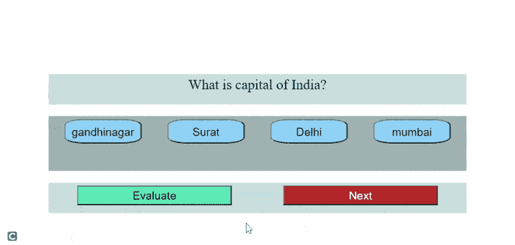

# 如何创建简单的 JavaScript 小测验？

> 原文:[https://www . geesforgeks . org/如何创建一个简单的 javascript 问答/](https://www.geeksforgeeks.org/how-to-create-a-simple-javascript-quiz/)

JavaScript 对于使任何网页成为动态网页都很有用。在本文中，我们将看到如何使用 JavaScript 制作一个简单的测验网络应用程序。

此测验网络应用程序将具有以下功能。

*   问题用户界面和四个交互选项。
*   问题之间的导航。
*   以*真*或*假*输出值的形式进行评估。

**方法:**对于用户界面，使用 HTML [*div*](https://www.geeksforgeeks.org/div-tag-html/) 标签和给定的类和 id 来识别它们，将页面分成四个部分。选择[类](https://www.geeksforgeeks.org/html-class-attribute/)和[id](https://www.geeksforgeeks.org/html-id-attributes/)名称，使其承载每个 *div* 的目的。

*   第一个“div”代表“result”，如果所选答案正确与否，它将用于显示问题的状态。
*   第二个“div”是“问题容器”，用于保存问题文本并显示它们。
*   第三个“div”是“选项-容器”，顾名思义，它将包含问题的所有四个选项。
*   第四个“div”用于“导航”，它将有一个按钮用于导航到下一个问题并评估所选答案。

所有这四个“div”都在另一个带有类“panel”的“div”中。我们在脚本中使用了这个 DOM 元素。

**示例:**

**HTML 代码:**以下代码演示了问答应用的设计部分。

## index.html

```html
<!DOCTYPE html>
<html lang="en">
<head>
    <meta charset="UTF-8">
    <meta http-equiv="X-UA-Compatible" content="IE=edge">
    <meta name="viewport" content="width=device-width, initial-scale=1.0">
    <link rel="stylesheet" href="style.css">   
</head>
<body>
    <div class="panel">
        <div class="result">

        </div>
        <div class="question-container" id="question">
            Question goes here.
        </div>
        <div class="option-container">
            <button class="option" onclick="" id="op1" >option1</button>

            <button class="option" id="op2" >option2</button>

            <button class="option" id="op3">option3</button>

            <button class="option" id="op4">option4</button>
        </div>
        <div class="navigation">
            <button class="evaluate">Evaluate</button>
            <button class="next">Next</button>
        </div>
    </div>
    <script src="script.js"></script>
</body>
</html>
```

**CSS 代码:**CSS 有助于对齐不同的选项和按钮。 [*:悬停*](https://www.geeksforgeeks.org/css-hover-selector/) 属性负责创建选择选项的效果。我们还将使用 JavaScript 更改选择效果。

代码负责用户界面的外观和对齐。该文件包含在上述代码的头部。

## style.css

```html
body{
    padding: 0;
    margin: 0;    
    width:100vw;
    height: 100vh;    
}
.panel{
    height: 100vh;
    display: flex;
    flex-direction: column;
    justify-content: center;
    align-items: center;
}
.question-container{
    margin: 10px;
    padding: 5px;
    width: 80vw;
    height: 10vh;
    background-color: #c7dddf;
    font-size: x-large;
    text-align: center;

}
.result{
    margin: 10px;
    padding: 5px;
    width:80vw;
    height: 10vh;
    text-align: center;
    font-size: 50px;

}
.option-container{
    display: flex;
    justify-content: space-around; 
    margin: 10px;
    padding: 5px;
    width: 80vw;
    height: 20vh;
    background-color: #9eb1b3;   

}
.option{    
    padding: 10px;
    width: 15vw;
    height: 10vh;
    font-size: larger;
    background-color: lightskyblue;
    border-radius: 25%;
}
.option:hover{
    background-color: lightgoldenrodyellow;
}
.navigation{
    width: 80vw;
    height: 10vh;
    margin: 10px;
    padding: 5px;
    display: flex;
    justify-content: space-around;
    background-color:#c7dddf;
}

.evaluate,.next{
    width:30vw;
    height: 8vh;
    padding: 5px;
    font-size: larger;
}
.evaluate{

    background-color: #50DBB4;
}
.next{
    color: white;
    background-color: #BF3325;
}
```

**JavaScript 代码:**我们将动态显示问题和选项，为此，我们创建了一个对象数组，其中每个对象都有一个问题和相应的选项以及正确答案的信息。有了这个对象数组，我们就有了 JSON 格式，所以它帮助我们处理 API，并处理大部分时间都是 JSON 类型的真实数据。

让我们看看如何从这个数组中访问不同的东西【提问】:

<figure class="table">

| How to access any question text | Ask [id]. q |
| How to access any question type | Text question type [id] of the first option. a[0]。 main body |
| How do I know if the option is *true* or *false* | 我的天【id】a[0]。魔形女魔形女魔形女魔形女魔形女魔形女魔形女魔形女魔形女魔形女魔形女魔形女魔形女魔形女魔形女 |

</figure>

**注:**id 根据题号不断变化，它代表数组中的题号。

定义了*问题*数组。我们取了一个布尔变量“开始”，它最初被设置为*真*，表示测验开始。 *iterate()* 函数负责根据传递给它的“id”显示问题和选项。在代码的后面使用“下一步”按钮有条件地调用这个函数。

**iterate()函数的工作方式:**我们从 HTML i div 中获取结果，并使用节点元素的 HTML [*innerText*](https://www.geeksforgeeks.org/html-dom-innertext-property/) 属性将其设置为空文本。一旦问题设置完毕，我们将使用表中讨论的相同方法设置选项。我们还设置了选项“值”，它也来自数组“问题”。该“op1.value”是指该选项按钮和“问题[id]”的值。a[0]。isCorrect”将设置为*真*或*假*。然后我们设置一个变量“selected”，用于保存用户选择的选项的值。

使用[添加事件监听器](https://www.geeksforgeeks.org/javascript-addeventlistener-with-examples/)功能实现*评估*按钮。如果它是正确的，那么它将把“结果”div 文本设置为“真”，并将把[“样式.颜色”](https://www.geeksforgeeks.org/html-dom-style-color-property/)属性设置为“绿色”，否则它将把“结果”div 设置为“假”，并将把“[样式.颜色”](https://www.geeksforgeeks.org/html-dom-style-color-property/)属性设置为“红色”。

我们将使用类名获得下一个按钮。设置点击事件将检查 id 变量。如果它小于我们的总问题 id，在我们的例子中是(0，1，2)，那么我们的数组就不会出界。我们调用“迭代”函数，有条件地传递问题的新 id，同时将“*开始*”设置为*假*，表示这不是测验的开始。

## script.js

```html
// Questions will be asked
const Questions = [{
        id: 0,
        q: "What is capital of India?",
        a: [{ text: "gandhinagar", isCorrect: false },
            { text: "Surat", isCorrect: false },
            { text: "Delhi", isCorrect: true },
            { text: "mumbai", isCorrect: false }
        ]

    },
    {
        id: 1,
        q: "What is the capital of Thailand?",
        a: [{ text: "Lampang", isCorrect: false, isSelected: false },
            { text: "phuket", isCorrect: false },
            { text: "Ayutthaya", isCorrect: false },
            { text: "Bangkok", isCorrect: true }
        ]

    },
    {
        id: 2,
        q: "What is the capital of Gujarat",
        a: [{ text: "surat", isCorrect: false },
            { text: "vadodara", isCorrect: false },
            { text: "gandhinagar", isCorrect: true },
            { text: "rajkot", isCorrect: false }
        ]

    }

]

// Set start
var start = true;

// Iterate
function iterate(id) {

    // Getting the result display section
    var result = document.getElementsByClassName("result");
    result[0].innerText = "";

    // Getting the question
    const question = document.getElementById("question");

    // Setting the question text
    question.innerText = Questions[id].q;

    // Getting the options
    const op1 = document.getElementById('op1');
    const op2 = document.getElementById('op2');
    const op3 = document.getElementById('op3');
    const op4 = document.getElementById('op4');

    // Providing option text 
    op1.innerText = Questions[id].a[0].text;
    op2.innerText = Questions[id].a[1].text;
    op3.innerText = Questions[id].a[2].text;
    op4.innerText = Questions[id].a[3].text;

    // Providing the true or false value to the options
    op1.value = Questions[id].a[0].isCorrect;
    op2.value = Questions[id].a[1].isCorrect;
    op3.value = Questions[id].a[2].isCorrect;
    op4.value = Questions[id].a[3].isCorrect;

    var selected = "";

    // Show selection for op1
    op1.addEventListener("click", () => {
        op1.style.backgroundColor = "lightgoldenrodyellow";
        op2.style.backgroundColor = "lightskyblue";
        op3.style.backgroundColor = "lightskyblue";
        op4.style.backgroundColor = "lightskyblue";
        selected = op1.value;
    })

    // Show selection for op2
    op2.addEventListener("click", () => {
        op1.style.backgroundColor = "lightskyblue";
        op2.style.backgroundColor = "lightgoldenrodyellow";
        op3.style.backgroundColor = "lightskyblue";
        op4.style.backgroundColor = "lightskyblue";
        selected = op2.value;
    })

    // Show selection for op3
    op3.addEventListener("click", () => {
        op1.style.backgroundColor = "lightskyblue";
        op2.style.backgroundColor = "lightskyblue";
        op3.style.backgroundColor = "lightgoldenrodyellow";
        op4.style.backgroundColor = "lightskyblue";
        selected = op3.value;
    })

    // Show selection for op4
    op4.addEventListener("click", () => {
        op1.style.backgroundColor = "lightskyblue";
        op2.style.backgroundColor = "lightskyblue";
        op3.style.backgroundColor = "lightskyblue";
        op4.style.backgroundColor = "lightgoldenrodyellow";
        selected = op4.value;
    })

    // Grabbing the evaluate button
    const evaluate = document.getElementsByClassName("evaluate");

    // Evaluate method
    evaluate[0].addEventListener("click", () => {
        if (selected == "true") {
            result[0].innerHTML = "True";
            result[0].style.color = "green";
        } else {
            result[0].innerHTML = "False";
            result[0].style.color = "red";
        }
    })
}

if (start) {
    iterate("0");
}

// Next button and method
const next = document.getElementsByClassName('next')[0];
var id = 0;

next.addEventListener("click", () => {
    start = false;
    if (id < 2) {
        id++;
        iterate(id);
        console.log(id);
    }

})
```

**输出:**



JavaScript 测验

这是一个简单的使用 JavaScript 的问答网络应用程序，你可以用你真正的应用编程接口实现它，问题洗牌，为问题设置分数，设置计数器，等等，从而使它更上一层楼。