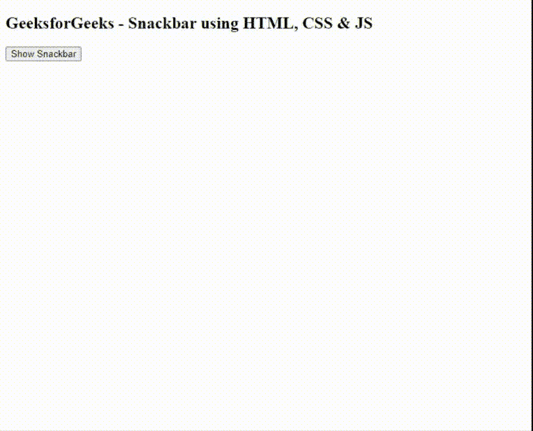
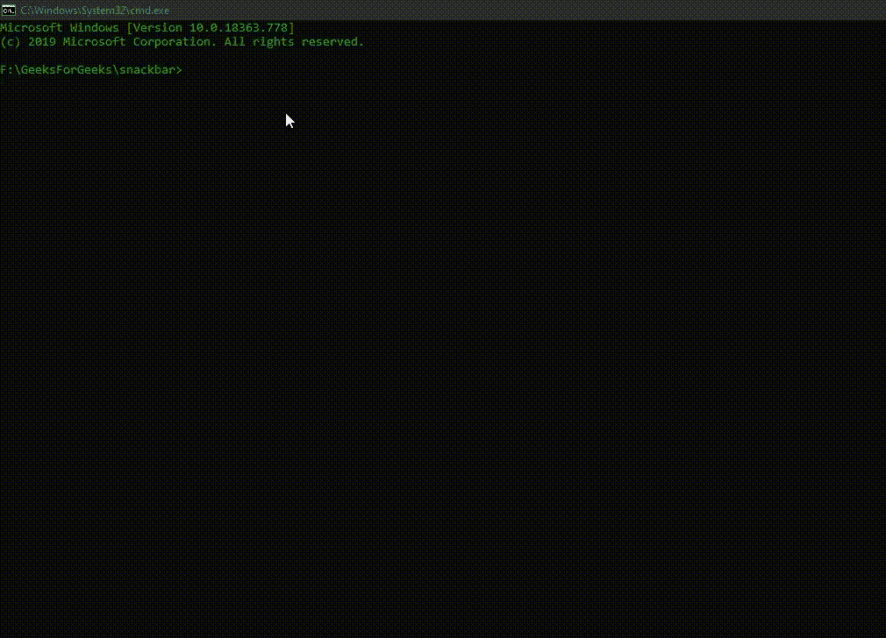

# 如何使用 HMTL，CSS & JavaScript 创建一个 Snackbar？

> 原文:[https://www . geeksforgeeks . org/如何使用-hmtl-css-javascript 创建-snackbar/](https://www.geeksforgeeks.org/how-to-create-a-snackbar-using-hmtl-css-javascript/)

网页设计中的滚动条是显示在网站上的**通知。有时开发人员希望向用户显示额外的通知，使他们意识到某些重要但同时又不影响用户体验的信息。该信息可以是关于已经或将要在网站内发生的某种事件，无论它是否成功，或者需要一些快速的用户输入或干预。**

Snackbars 通知用户网站将要执行的过程，或者提供关于网站已经执行的过程的反馈。例如，不成功的 API 调用等。它们通常出现在网站的屏幕底部，不应妨碍当前的流量或用户体验。除非需要用户干预，否则它们通常会自行消失。Snackbars 一次只能显示一个，以免堵塞屏幕。它们通常包含单个操作，如**消除/取消/确定**，也可以用作错误处理的一部分。它们也可以由自定义操作触发，例如当用户单击按钮时。

[**Bootstrap**](https://www.geeksforgeeks.org/bootstrap-4-introduction/) 和 **[jQuery](https://www.geeksforgeeks.org/jquery-tutorials/)** 通过类和插件为 snackbar 通知提供了广泛的支持，但是它们也可以在没有任何外部库的情况下设计和实现，只需使用**[HTML](https://www.geeksforgeeks.org/html-tutorials/)****[CSS](https://www.geeksforgeeks.org/css-tutorials/)**和 **[JavaScript](https://www.geeksforgeeks.org/javascript-tutorial/)** 。同样重要的是要知道，许多 web 框架，如 Angular 4+、ReactJS 等以及 Android 应用程序也提供了对 Snackbar 通知的支持，它们可以使用自己的类和方法来实现。有关详细解释，请参考以下文章:

*   **[如何在安卓中添加 Snackbar](https://www.geeksforgeeks.org/how-to-add-a-snackbar-in-android/)**
*   **[如何创建 SnackBar 服务？](https://www.geeksforgeeks.org/how-to-create-a-snackbar-service/)T3】**

在本教程中，我们将只使用 HTML、CSS 和 JavaScript 为网站实现 Snackbar 通知。
我们假设你熟悉 HTML，和 CSS 规则，对 CSS 动画有基本的了解。

*   **步骤 1:** 使用 **[npm](https://www.geeksforgeeks.org/node-js-npm-node-package-manager/)** 安装 **[浏览器同步](https://www.browsersync.io/)** 。我们将使用**浏览器同步**启动一个服务器，并提供一个网址来查看 HTML 网站、CSS 动画和加载相应的 JavaScript 文件。我们将在全球安装**浏览器同步**。

    ```html
    npm install -g browser-sync
    ```

*   **步骤 2:** 在项目根文件夹中创建一个**【索引. html】**文件、 **index.css** 文件和一个 **index.js** 。
    *   **index.html:** 在该文件中添加以下代码片段。

        ## 超文本标记语言

        ```html
        <!DOCTYPE html>
        <html lang="en">
        <head>
            <meta charset="UTF-8">
            <meta name="viewport" 
                  content="width=device-width, 
                           initial-scale=1.0">
            <title>GeeksforGeeks</title>
            <!-- Loading External index.css file -->
            <link rel="stylesheet" href="index.css">
        </head>
        <body>
            <h2>
             GeeksforGeeks - Snackbar using HTML, CSS & JS
            </h2>

            <!-- Custom Action to Trigger the Snackbar -->
            <button class="btn btn-lg" 
                    onclick="showSnackbar()">
                 Show Snackbar
            </button>
            <div id="snackbar">Hello GeeksforGeeks</div>
            <!-- Loading External index.js file -->
            <script src="index.js"></script>
        </body>
        </html>
        ```

    *   **index.css:** 默认情况下，我们已经使用 CSS **可见性**属性将 **#snackbar** HTML 元素设置为隐藏。我们也定义了**位置:固定；**和 **z 指数:1；**Snackbar 通知的 CSS 属性，这样当它变得可见时，它将始终显示在用户的屏幕上方。为了更好的理解，请参考代码注释。**！重要的** CSS 属性声明一个 HTML DOM 元素上所有其他冲突的规则都将被忽略，而**所表示的规则！重要的**要应用。此规则会覆盖设置 CSS 规则之前的所有规则。我们使用了简单的 CSS 动画，通过淡入和淡出屏幕向用户显示 Snackbar 通知。详细说明见[此处](https://www.geeksforgeeks.org/css-animations/)。为 CSS 动画设置的总时间取决于我们希望通知对用户可见的时间限制。**淡出** CSS 动画的时间是通过从我们这里的总时间中减去 0.5 秒来计算的。

        ## 钢性铸铁

        ```html
        #snackbar {
            /* By Default, Hidden */
            visibility: hidden; 
            min-width: 250px;
            background-color: #333;
            color: #fff;
            text-align: left;
            border-radius: 2px;
            padding: 16px;
            /* To always Keep on 
               Top of screen */
            position: fixed;

            /* To be displayed above 
               Parent HTML DOM element  */ 
            z-index: 1; 

            /* Position Bottom Left 
               Corner of Screen */
            left: 10px;
            bottom: 30px;
        }

        /* Dynamically Appending this 
           Class to #snackbar via JS */
        .show-bar {
            visibility: visible !important;
            /* fadeout Time decided in 
               accordance to Total Time */
            /* In case, Time = 3s, 
               fadeout 0.5s 2.5s */
            animation: fadein 0.5s, fadeout 0.5s 4.5s;
        }

        /* when the Snackbar Appears */
        @keyframes fadein {
            from {
                bottom: 0;
                opacity: 0;
            }
            to {
                bottom: 30px;
                opacity: 1;
            }
        }

        /* when the Snackbar Disappears
           from the Screen */
        @keyframes fadeout {
            from {
                bottom: 30px;
                opacity: 1;
            }
            to {
                bottom: 0;
                opacity: 0;
            }
        }
        ```

    *   **index.js:** 我们在点击 ****Show Snackbar**** 按钮时，已经使用了 JavaScript 动态地将一个类追加到 HTML strong div 元素中。**显示工具栏()**功能由**点击** HTML 按钮属性触发。动态追加的类将 CSS 规则添加到 **#snackbar** HTML 元素中，使其对用户可见。我们已经使用**[setTimeout()](https://www.geeksforgeeks.org/java-script-settimeout-setinterval-method/)**JavaScript 函数在 5 秒后动态移除之前追加的 Class，这会让 Snackar 通知消失。

        ## 射流研究…

        ```html
        function showSnackbar() {
            var snackBar = 
              document.getElementById("snackbar")
            // Dynamically Appending class
            // to HTML element 
            snackBar.className = "show-bar";

            setTimeout(function () {
               // Dynamically Removing the Class 
               // from HTML element
               // By Replacing it with an Empty
               // String after 5 seconds
               snackBar.className = 
                  snackBar.className.replace("show-bar", ""); 
            }, 5000);
        }
        ```

*   **第三步:**我们已经使用 HTML、CSS 和 JavaScript 成功实现了 Snackbar 通知。在 HTML 中，我们定义了一个自定义的**显示滚动条**按钮，它将在屏幕上触发滚动条通知。Snackbar 通知是向用户显示的简单文本消息。由于 Snackbar 是一个简单的 HTML“div”元素，我们可以向 Snackbar 通知添加自定义操作。例如，“输入框”或“关闭按钮”，如果需要的话。在我们的例子中，snackbar 通知将在 5 秒钟后自动从屏幕上消失。
    **输出:**
    
*   **Step 4:** At this Point our Snackbar Notification is ready. To launch the application using Browsersync, run the following command in the project directory or you can run the HTML file directly into your browser.

    ```html
    browser-sync start --server --files "*"
    ```

    这将在服务器模式下启动 Browsersync，并按照 ***** 通配符的指定，监视目录中所有文件的更改。默认情况下，应用程序将在 **http://localhost:3000/** 启动。

    **输出:**
    