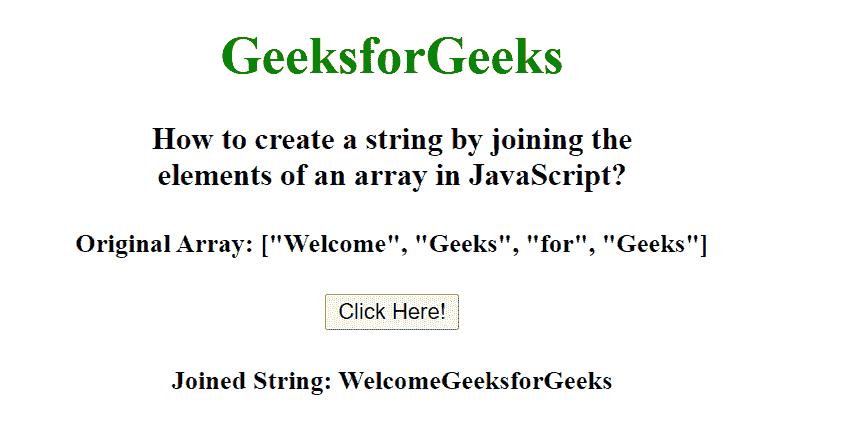

# 如何在 JavaScript 中通过连接数组的元素来创建字符串？

> 原文:[https://www . geesforgeks . org/如何通过在 javascript 中连接数组元素来创建字符串/](https://www.geeksforgeeks.org/how-to-create-a-string-by-joining-the-elements-of-an-array-in-javascript/)

给定一个包含数组元素的数组，这里我们将把所有数组元素连接成一个字符串。为了连接数组元素，我们使用 arr.join()方法。此方法用于将数组的元素连接成字符串。字符串的元素将由指定的分隔符分隔，其默认值是逗号(，)。

**语法:**

```html
array.join(separator) 
```

在这种情况下，我们使用空分隔符，即 array.join(" ")来连接数组元素。

**示例:**

## 超文本标记语言

```html
<!DOCTYPE html>
<html>

<head>
    <title>
        How to create a string by joining the
        elements of an array in JavaScript?
    </title>
</head>

<body style="text-align: center;">
    <h1 style="color:green;">
        GeeksforGeeks
    </h1>

    <h3>
        How to create a string by joining the<br>
        elements of an array in JavaScript?
    </h3>

    <h4>Original Array: ["Welcome", "Geeks", "for", "Geeks"]</h4>

    <button onclick="geeks()">Click Here!</button>

    <h4 id="result"></h4>

    <script>
        function geeks() {
            var str = ["Welcome", "Geeks", "for", "Geeks"];

            document.getElementById("result").innerHTML 
                = "Joined String: " + str.join("");
        }
    </script>
</body>

</html>
```

**输出:**

