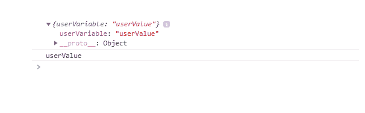
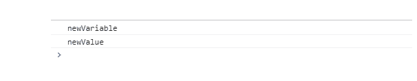

# 如何在 JavaScript 中使用用户定义的名称创建变量？

> 原文:[https://www . geesforgeks . org/如何使用用户定义的 javascript 名称创建变量/](https://www.geeksforgeeks.org/how-to-create-a-variable-using-a-user-defined-name-in-javascript/)

在本文中，我们将学习在 JavaScript 中使用用户定义的名称创建一个变量。

**JavaScript 中的变量:**

基本上，它是一个容器，在 JavaScript 中保存可重用的数据。变量的值可以在程序执行期间更改，并且应该在使用它之前声明。在 ES6 声明一个变量之前，我们只是使用 [*var*](https://www.geeksforgeeks.org/javascript-course-variables-in-javascript/) 关键字来创建一个变量，但是 ES6 以及之后，又增加了两个关键字来创建一个变量即 [*让*](https://www.geeksforgeeks.org/javascript-let/) 和*[T15】const](https://www.geeksforgeeks.org/javascript-const/)*。**

***进场:***

*在 JavaScript 中，可以使用用户定义的名称创建一个变量。首先，我们将使用一个对象创建一个变量，然后，我们将使用 [*这个*](https://www.geeksforgeeks.org/this-in-javascript/) 关键字创建一个变量。*

***示例 1:** 借助[对象](https://www.geeksforgeeks.org/objects-in-javascript/)，在 JavaScript 中使用用户定义的名称创建一个变量。*

## *java 描述语言*

```
*<script>
  // A user-defined variable created
  let my_var = "userVariable";
  let my_value = "userValue";

  let x = {
    // Assign value of a user-defined variable
    [my_var]: my_value,
  };
  console.log(x);
  console.log(x[my_var]);
</script>*
```

***输出:***

**

***示例 2:** 借助 [*这个*](https://www.geeksforgeeks.org/this-in-javascript/) 关键字，在 JavaScript 中使用用户定义的名称创建一个变量。*

## *java 描述语言*

```
*<script>
  let var_name = "newVariable";
  let var_value = "newValue";

  this[var_name] = var_value;
  console.log(var_name);
  console.log(this[var_name]);
</script>*
```

***输出:***

**

***结论:**在本文中，借助两种合适的方法，我们学习了在 JavaScript 中使用用户定义的名称创建变量。*