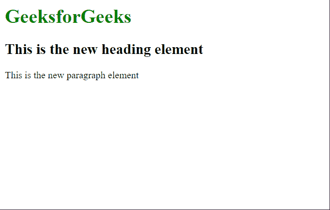
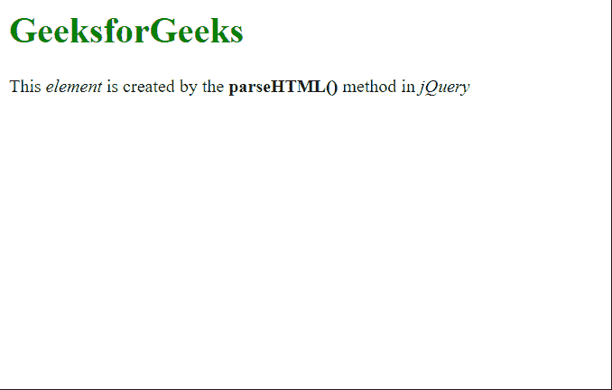

# 如何在 JavaScript 中从字符串创建元素？

> 原文:[https://www . geesforgeks . org/如何从 javascript 字符串中创建元素/](https://www.geeksforgeeks.org/how-to-create-an-element-from-a-string-in-javascript/)

在本文中，我们将学习如何使用 JavaScript 从字符串创建元素。这可以在用户需要动态生成元素的情况下使用。这可以通过下面给出的两种方法来实现。

**方法 1:** 使用[创建元素()方法](https://www.geeksforgeeks.org/html-dom-createelement-method/)

**[createElement()方法](https://www.geeksforgeeks.org/html-dom-createelement-method/)** 用于在 DOM 中创建元素。它接受两个参数，一个**标记名**，它是一个定义要创建的元素类型的字符串，以及一个可选的**选项**对象，可用于修改元素的创建方式。任何需要的元素都可以作为字符串在这个函数中传递，这将返回指定的元素。这种方法只能用于从一个字符串创建单个元素。

**示例:**在本例中，我们通过将字符串指定为“h2”来创建标题元素。

## 超文本标记语言

```
<html>
<body>
  <h1 style="color:green">
    GeeksforGeeks
  </h1>

  <script>
    // Specify the string from which 
    // the elements would be created
    var str = "h2";
    var str2 = "p";

    // Creating the elements 
    var elem =
        document.createElement(str);
    var elem2 =
        document.createElement(str2);

    // Insert text in the element
    elem.innerText =
      "This is the new heading element";
    elem2.innerText =
      "This is the new paragraph element";

    // Add the element to the body 
    document.body.appendChild(elem);
    document.body.appendChild(elem2);
  </script>
</body>
</html>
```

**输出:**



**方法 2:** 使用 [jQuery 解析 HTML()方法](https://www.geeksforgeeks.org/jquery-parsehtml-method/)

jQuery 的 **parseHTML()方法**用于解析一个 HTML 字符串，以便可以根据给定的 HTML 创建元素。这种方法可用于从字符串创建多个元素。

**示例:**在本例中，字符串由多个元素指定，这些元素被解析为 HTML 并添加到文档正文中。

## 超文本标记语言

```
<html>
<head>

  <!-- Include jQuery -->
  <script src="https://code.jquery.com/jquery-3.6.0.js">
  </script>
</head>
<body>
  <h1 style="color:green">
    GeeksforGeeks
  </h1>
  <script>

    // Define the HTML string to be parsed
    str = "<p>This <i>element</i> is created by" +
      " the <b>parseHTML()</b> " +
      "method in <i>jQuery</i></p>";

    // Parsing the string into HTML
    html = $.parseHTML(str);

    // Append the element in the document
    $('body').append(html);
  </script>
</body>
</html>
```

**输出:**

