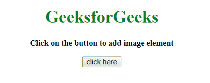
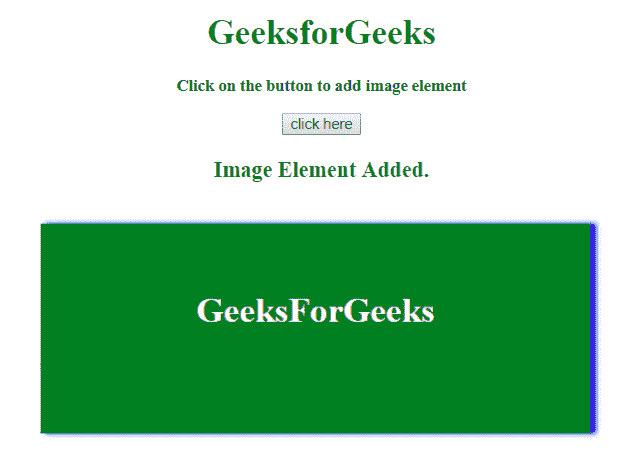

# 如何使用 JavaScript 动态创建图像元素？

> 原文:[https://www . geesforgeks . org/如何使用 javascript 动态创建图像元素/](https://www.geeksforgeeks.org/how-to-create-an-image-element-dynamically-using-javascript/)

给定一个 HTML 元素，任务是创建一个元素，并使用 JavaScript 将其附加到文档中。在这些例子中，当有人点击按钮时，就会创建元素。我们可以用任何其他的 JavaScript 事件来代替点击事件。

**方法 1:**

*   使用 **document.createElement()方法**创建一个空的 img 元素。
*   然后设置它的属性，如(src，高度，宽度，alt，标题等)。
*   最后，将其插入到文档中。

**示例 1:** 该示例实现了上述方法。

```
<!DOCTYPE HTML> 
<html> 

<head> 
    <title> 
        How to create an image element
        dynamically using JavaScript ?
    </title>     
</head> 

<body id = "body" style = "text-align:center;"> 

    <h1 style = "color:green;" > 
        GeeksforGeeks 
    </h1> 

    <p id = "GFG_UP" style = 
            "font-size: 15px; font-weight: bold;"> 
    </p> 

    <button onclick = "GFG_Fun()"> 
        click here 
    </button> 

    <p id = "GFG_DOWN" style = 
            "color:green; font-size: 20px; font-weight: bold;"> 
    </p> 

    <script> 
        var up = document.getElementById('GFG_UP'); 
        up.innerHTML = "Click on the button to add image element"; 
        var down = document.getElementById('GFG_DOWN'); 

        function GFG_Fun() {
            var img = document.createElement('img');
            img.src = 
'https://media.geeksforgeeks.org/wp-content/uploads/20190529122828/bs21.png';
            document.getElementById('body').appendChild(img);
            down.innerHTML = "Image Element Added."; 
        } 
    </script> 
</body> 

</html>
```

**输出:**

*   **点击按钮前:**
    
*   **点击按钮后:**
    

**方法 2:**

*   使用**新图像()**创建一个空图像实例。
*   然后设置它的属性，如(src，高度，宽度，alt，标题等)。
*   最后，将其插入到文档中。

**示例 2:** 该示例实现了上述方法。

```
<!DOCTYPE HTML> 
<html> 

<head> 
    <title> 
        How to create an image element
        dynamically using JavaScript ?
    </title>     
</head> 

<body id = "body" style = "text-align:center;"> 

    <h1 style = "color:green;" > 
        GeeksforGeeks 
    </h1> 

    <p id = "GFG_UP" style = 
            "font-size: 15px; font-weight: bold;"> 
    </p> 

    <button onclick = "GFG_Fun()"> 
        click here 
    </button> 

    <p id = "GFG_DOWN" style = 
            "color:green; font-size: 20px; font-weight: bold;"> 
    </p> 

    <script> 
        var up = document.getElementById('GFG_UP'); 
        up.innerHTML = "Click on the button to add image element"; 
        var down = document.getElementById('GFG_DOWN'); 

        function GFG_Fun() {
            var img = new Image();
            img.src = 
'https://media.geeksforgeeks.org/wp-content/uploads/20190529122828/bs21.png';
            document.getElementById('body').appendChild(img);
            down.innerHTML = "Image Element Added."; 
        } 
    </script> 
</body> 

</html>
```

**输出:**

*   **点击按钮前:**
    
*   **点击按钮后:**
    

JavaScript 最出名的是网页开发，但它也用于各种非浏览器环境。您可以通过以下 [JavaScript 教程](https://www.geeksforgeeks.org/javascript-tutorial/)和 [JavaScript 示例](https://www.geeksforgeeks.org/javascript-examples/)从头开始学习 JavaScript。