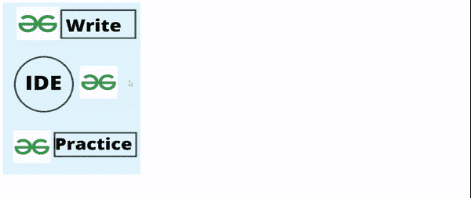
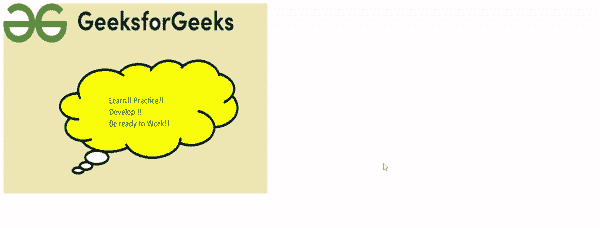

# 如何用 JavaScript 创建图像地图？

> 原文:[https://www . geesforgeks . org/如何用 javascript 创建图像地图/](https://www.geeksforgeeks.org/how-to-create-an-image-map-in-javascript/)

一张图像地图只不过是一张被分解成各种**热点**的图像，每个热点会把你带到一个不同的文件。热点只不过是我们使用 [**<区域>**](https://www.geeksforgeeks.org/html-area-alt-attribute/) 标签在图像上创建的可点击区域。这种类型的地图称为客户端图像地图，因为地图嵌入在 HTML 本身中。

**方法:**下面是如何在 JavaScript 中创建图像地图的分步实现。

**步骤 1:** 第一步是使用 [**< img >**](https://www.geeksforgeeks.org/html-img-usemap-attribute/) 标签插入图像。这里我们将使用一个额外的属性“ **usemap** ”。usemap 的值必须以 **'#'** 标记开始，后跟如下所述的地图名称。

**语法:**

```html

```

**步骤 2:** 然后我们使用标签 **<地图>创建一个图像地图。**这将使用所需的名称属性创建链接到图像的地图。名称属性值必须与< img >标签的 usemap 属性中给出的相同。

**语法:**

```html
<map name="mymap">
```

**第三步:**使用标签 **<区域>** 创建不同的可点击区域。我们必须确定这个区域的形状。不同的形状有*长方形、圆形*、*和多边形。*还必须给出区域的坐标， **href** 是用户点击区域时会打开的链接。

**语法:**

```html
<area shape="rect" coords="x,y,x,y" href="">
<area shape="circle" coords="x,y,r" href="">
<area shape="poly" coords="" href="">
```

**第四步:**现在来找一个图像的坐标。

*   **矩形**图像将有坐标 x1，y1，x2，y2，其中 x1，y1 是左上角的坐标，x2，y2 是右下角的坐标，如图所示。
*   **圆**图像会有坐标 x，y，r 其中 x，y 是圆心的坐标，r 是圆的半径。
*   **多边形**图像将有坐标 x1，y1，x2，y2，x3，y3，x4，y4，…。其中 x，y 定义了图像中一个角的坐标，如图所示。

**示例 1:** 在本例中，我们将简单地创建矩形和圆形图像的图像映射。

## 超文本标记语言

```html
<!DOCTYPE html>
<html>
  <body>
    
    <map name="mymap">
      <area
        shape="rect"
        coords="167,22,380,113"
        alt="Write"
        href="https://write.geeksforgeeks.org/"
        onmouseover="myFunction('Write for Us!!')"
        onmouseout="myFunction('')"/>
      <area
        shape="rect"
        coords="148,423,382,500"
        alt="Practice"
        href="https://practice.geeksforgeeks.org/"
        onmouseover="myFunction('Practice and Learn')"
        onmouseout="myFunction('')"/>
      <area
        shape="circle"
        coords="115,260,40"
        alt="IDE"
        href="https://ide.geeksforgeeks.org/"
        onmouseover="myFunction('IDE')"
        onmouseout="myFunction('')"/>
    </map>
    <h1 id="info"></h1>
    <script>
      function myFunction(name) {
        document.getElementById("info").innerHTML = name;
      }
    </script>
  </body>
</html>
```

**输出:**



**示例 2:** 在本例中，我们将图像的黄色部分视为多边形。

## 超文本标记语言

```html
<!DOCTYPE html>
<html>
  <body>
    
    <map name="map1">
      <area
        shape="poly"
        coords="152,244,160,180,251,133,368,123,495,117,551,185,
                467,278,396,303,311,298,230,292,169,268"
        alt="Polygon"
        href="https://www.geeksforgeeks.org/"
        onmouseover="myFunction('A Computer Science portal for geeks. 
                     It contains well written, well thought and well 
                     explained computer science and programming
                     articles')"
        onmouseout="myFunction('')"
      />
    </map>
    <h1 id="info"></h1>
    <script>
      function myFunction(name) {
        document.getElementById("info").innerHTML = name;
      }
    </script>
  </body>
</html>
```

**输出:**

