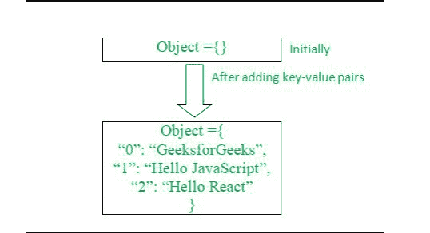

# 如何使用 JavaScript 从给定的键值对创建对象？

> 原文:[https://www . geeksforgeeks . org/如何使用 javascript 从给定的键值对创建对象/](https://www.geeksforgeeks.org/how-to-create-an-object-from-the-given-key-value-pairs-using-javascript/)

在本文中，我们将学习使用 JavaScript 从给定的键值对创建一个对象。

**问题陈述:**给你不同的键值对，以任何形式，像一个数组，使用这些键值对，你需要构造一个对象，它将有这些键值对。

让我们借助下面的图画来理解。



**方法:**我们首先需要声明一个空对象，用任何合适的名称，然后通过使用各种 JavaScript 技术和方法，我们需要将给定的键值对插入到之前创建的空对象中。

让我们首先尝试理解我们如何在 JavaScript 中创建一个空对象。用 JavaScript 创建一个空对象可以通过几种方式来实现。

**例 1:**

```
let object = {};
console.log(object);
Output:
{}
```

**例 2:**

```
let object = new Object();
console.log(object);
Output:
{}
```

现在，在创建了对象之后，现在我们将分析在先前创建的空对象中添加给定键值对的方法。

以下是实现上述目标的一些方法。

**示例 1:** 这是最简单也是最原始的方法。在这种方法中，我们将直接在之前创建的空对象中添加键值对。

## java 描述语言

```
<script>  
  let object = {};
  let firstKey = 0;
  let firstKeyValue = "GeeksforGeeks";
  let secondKey = 1;
  let secondKeyValue = "Hello JavaScript";
  let thirdKey = 2;
  let thirdKeyValue = "Hello React";

  object[firstKey] = firstKeyValue;
  object[secondKey] = secondKeyValue;
  object[thirdKey] = thirdKeyValue;
  console.log(object);
</script>
```

**输出:**

```
{ "0": "GeeksforGeeks", "1": "Hello JavaScript", "2": "Hello React" }
```

**示例 2:** 在第二种方法中，我们将使用**[**Object . assign()**](https://www.geeksforgeeks.org/object-assign-javascript/)方法，该方法是 Object 超类的一部分。此方法将复制所有值，并将这些值作为键值对追加到对象中。**

## **java 描述语言**

```
<script> 
  let object = {};
  let firstKey = 0;
  let firstKeyValue = "GeeksforGeeks";
  let secondKey = 1;
  let secondKeyValue = "Hello JavaScript";
  let thirdKey = 2;
  let thirdKeyValue = "Hello React";

  Object.assign(object, { [firstKey]: firstKeyValue });
  Object.assign(object, { [secondKey]: secondKeyValue });
  Object.assign(object, { [thirdKey]: thirdKeyValue });

  console.log(object);
</script>
```

****输出:****

```
{ "0": "GeeksforGeeks", "1": "Hello JavaScript", "2": "Hello React" }
```

****示例 3:** 在第三种方法中，我们将考虑我们的键及其对应的值存在于一个数组中。我们将首先在数组上运行 的 [*循环，然后我们将数组中的数据作为键值对动态追加到一个空对象中。*](https://www.geeksforgeeks.org/javascript-for-loop/)**

## **java 描述语言**

```
<script>  
  let object={};
  let keys = [0, 1, 2];
  let values = ["GeeksforGeeks", 
    "Hello JavaScript", "Hello React"];
  for (let i = 0; i < keys.length; i++) {
    object[keys[i]] = values[i];
  }
  console.log(object);
</script>
```

****输出:****

```
{ "0": "GeeksforGeeks", "1": "Hello JavaScript", "2": "Hello React" }
```