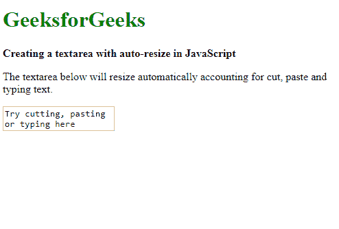

# 如何使用 JavaScript/jQuery 创建自动调整大小的文本区？

> 原文:[https://www . geesforgeks . org/如何创建-自动调整大小-textarea-使用-javascript-jquery/](https://www.geeksforgeeks.org/how-to-create-auto-resize-textarea-using-javascript-jquery/)

创建一个文本区域，当我们在其中键入或粘贴内容时，任务是自动调整它的大小。可以通过使用 JavaScript 和 jQuery 来实现。

**方法一:使用 JavaScript:** 为了改变高度，创建了一个新的函数来改变 textarea 的样式属性。文本区的高度首先设置为**自动**。该值使浏览器自动设置元素的高度。这将使文本可滚动，因为文本区域的高度小于文本。紧接在下一行，高度再次设置为等于滚动高度。

**scrollHeight** 属性用于返回元素的整个高度，包括像素填充。这将使文本区域的高度等于整个文本区域的高度，有效地调整文本区域的大小以适合文本。

每当输入或文本区域的值发生变化时，就会触发“input”事件。可以使用 **addEventListener()** 方法检测此事件。这个方法的回调函数被设置为上面创建的新函数。每当检测到任何文本输入时，这将触发 textarea 调整大小，因此会根据键入或粘贴的文本自动调整大小。

**示例:**

## 超文本标记语言

```
<!DOCTYPE html>
<html>

<head>
    <title>
        How to create auto-resize textarea
        using JavaScript/jQuery?
    </title>

    <style>
        #autoresizing {
            display: block;
            overflow: hidden;
            resize: none;
        }
    </style>
</head>

<body>
    <h1 style="color: green">
        GeeksforGeeks
    </h1>

    <b>
        Creating a textarea with
        auto-resize in JavaScript
    </b>

<p>
        The textarea below will resize
        automatically accounting for
        cut, paste and typing text.
    </p>

    <textarea id="autoresizing">
        Try cutting, pasting
        or typing here
    </textarea>

    <script type="text/javascript">
        textarea = document.querySelector("#autoresizing");
        textarea.addEventListener('input', autoResize, false);

        function autoResize() {
            this.style.height = 'auto';
            this.style.height = this.scrollHeight + 'px';
        }
    </script>
</body>

</html>
```

**输出:**

*   **写任何文字前:**


*   **写完文字后:**


**方法二:使用 jQuery:** 与上面使用的方法类似。jQuery 中的 **on()** 方法用于将事件处理程序附加到任何元素。首先选择 textarea，此方法用于在所选元素上应用事件处理程序。
在回调中声明了一个新函数，该函数改变了 textarea 的 style 属性。文本区域的高度首先设置为“自动”，然后立即在下一行，高度再次设置为等于**滚动高度**。

这将使文本区域的高度等于整个文本区域的高度，从而有效地调整文本区域的大小以适合文本。只要检测到输入发生变化，就会执行该功能，并且文本区域会自动调整大小。

**示例:**

## 超文本标记语言

```
<!DOCTYPE html>
<html>

<head>
    <title>
        How to create auto-resize textarea
        using JavaScript/jQuery?
    </title>

    <script src=
"https://code.jquery.com/jquery-3.4.1.min.js">
    </script>

    <style>
        #autoresizing {
            display: block;
            overflow: hidden;
            resize: none;
        }
    </style>
</head>

<body>
    <h1 style="color: green">
        GeeksforGeeks
    </h1>

    <b>
        Creating a textarea with
        auto-resize in JavaScript
    </b>

<p>
        The textarea below will resize
        automatically accounting for cut,
        paste and typing text.
    </p>

    <textarea id="autoresizing">
        Try cutting, pasting or typing here
    </textarea>

    <script type="text/javascript">
        $('#autoresizing').on('input', function () {
            this.style.height = 'auto';

            this.style.height = 
                    (this.scrollHeight) + 'px';
        });
    </script>
</body>

</html>
```

**输出:**

*   **写任何文字前:**



*   **写完文字后:**


jQuery 是一个开源的 JavaScript 库，它简化了 HTML/CSS 文档之间的交互，它以其“少写多做”的理念而闻名。
跟随本 [jQuery 教程](https://www.geeksforgeeks.org/jquery-tutorials/)和 [jQuery 示例](https://www.geeksforgeeks.org/jquery-examples/)可以从头开始学习 jQuery。