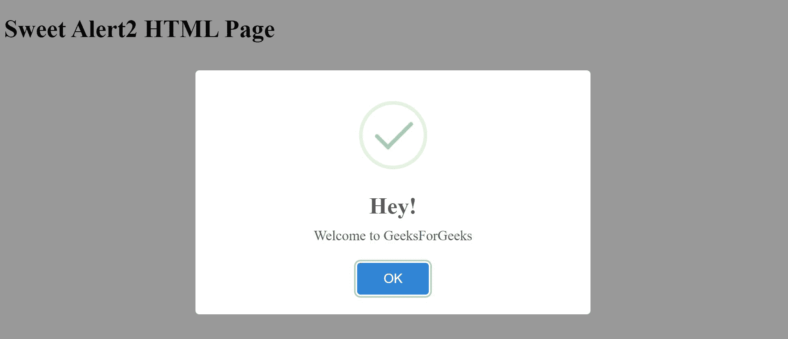

# 如何在 JavaScript 中创建可定制的提醒？

> 原文:[https://www . geesforgeks . org/如何创建可自定义的 javascript 警报/](https://www.geeksforgeeks.org/how-to-create-customizable-alerts-in-javascript/)

JavaScript 中的提醒是网页设计中的一个重要组成部分。它们通常用于通知用户。 **SweetAlert2** 库旨在使基本外观的警报更具吸引力，并为警报提供上下文。糖果 2 的文档和使用示例可以在这里[找到。](https://sweetalert2.github.io/)

**安装:**可通过以下 CDN 链接包含 SweetAlert2 库:

```html
<script src="https://cdn.jsdelivr.net/npm/sweetalert2@9"></script>
```

**例 1:**

## 超文本标记语言

```html
<!DOCTYPE html>
<html>

<head>
    <title>Sweet Alert2</title>

    <!-- Include the library -->
    <script src=
"https://cdn.jsdelivr.net/npm/sweetalert2@9">
    </script>
</head>

<body>
    <h1>
        Sweet Alert2 HTML Page
    </h1>

    <script type="text/javascript">

        // Make a simple alert
        // with the given text
        Swal.fire(
            'Hey!',
            'Welcome to GeeksForGeeks',
            'success'
        );
    </script>
</body>

</html>
```

**输出:**



**示例 2:** 该示例显示了该库对相似按钮的使用。

## 超文本标记语言

```html
<!DOCTYPE html>
<html>

<head>
    <title>Sweet Alert3</title>

    <!-- Include the library -->
    <script src=
"https://cdn.jsdelivr.net/npm/sweetalert2@9">
    </script>

    <link rel="stylesheet" href=
"https://cdnjs.cloudflare.com/ajax/libs/font-awesome/4.7.0/css/font-awesome.min.css">
</head>

<body>
    <h1>
        Sweet Alert3 HTML Page
    </h1>

    <script type="text/javascript">

        // Show a more complex alert with
        // the given text and properties
        Swal.fire({

            // Specify the title
            // of the alert
            title:
'<strong>Hit the Like Button at GeeksForGeeks</strong>',
            html: '',

            // Show a close button
            showCloseButton: true,
            focusConfirm: false,

            // Specify the text 
            // for the button
            confirmButtonText:
'<i class="fa fa-thumbs-up"></i> Great!',
            confirmButtonAriaLabel: 
                'Thumbs up, great!',
        })
    </script>
</body>

</html>
```

**输出:**

