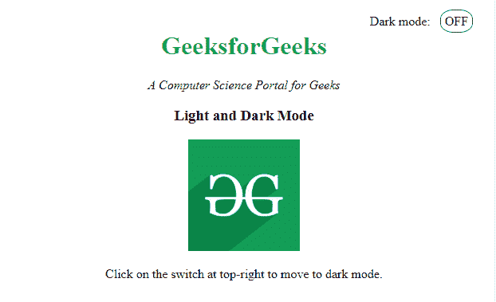
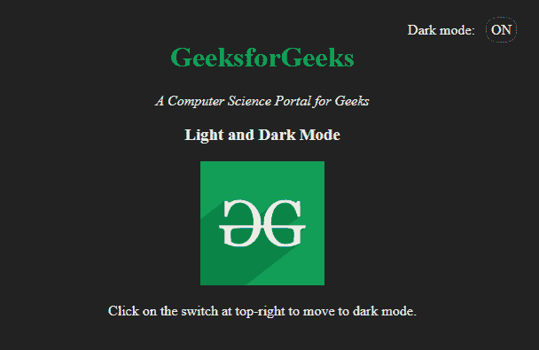
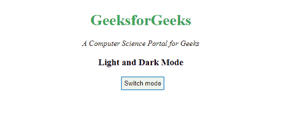
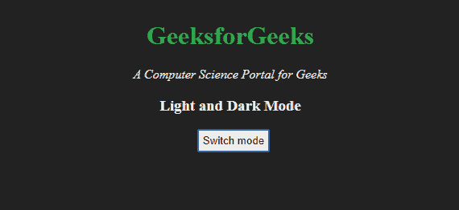

# 如何使用 JavaScript/jQuery 为网站创建暗/亮模式？

> 原文:[https://www . geesforgeks . org/how-create-dark-light-mode-for-web-use-JavaScript-jquery/](https://www.geeksforgeeks.org/how-to-create-dark-light-mode-for-website-using-javascript-jquery/)

亮暗配色方案，也称为暗模式，是一种补充模式，使用的配色方案是网页内容显示在暗背景上。这种配色方案减少了屏幕发出的光，增强了可读性。切换到黑暗模式可以让网站用户在任何时候都可以转向一种对眼睛友好且节省资源的设计。
**创建黑暗/光明模式的步骤:**

*   创建一个超文本标记语言文档。
*   为文档文件和黑暗模式创建 CSS。
*   添加一个开关/toggler 在亮暗模式之间切换。
*   向 switch/toggler 添加使用 javascript 或 jQuery 代码在亮暗模式之间切换的功能。

**示例 1:** 以下示例演示了使用 JQuery 代码在亮暗模式之间切换。它基本上是通过使用函数 hasClass()，addClass()和 removeClass()方法工作的。

## 超文本标记语言

```
<!DOCTYPE html>
<html lang="en">
<head>
    <meta charset="UTF-8">
    <meta name="viewport"
        content="width=device-width, initial-scale=1.0">
    <title>Dark Mode</title>

    <script src=
"https://cdnjs.cloudflare.com/ajax/libs/jquery/3.4.0/jquery.min.js">
    </script>

    <style>
        body{
        padding:10% 3% 10% 3%;
        text-align:center;
        }
        img{
            height:140px;
                width:140px;
        }
        h1{
        color: #32a852;
        }
        .mode {
            float:right;
        }
        .change {
            cursor: pointer;
            border: 1px solid #555;
            border-radius: 40%;
            width: 20px;
            text-align: center;
            padding: 5px;
            margin-left: 8px;
        }
        .dark{
            background-color: #222;
            color: #e6e6e6;
        }
    </style>
</head>

<body>
    <div class="mode">
        Dark mode:            
        <span class="change">OFF</span>
    </div>

    <div>
        <h1>GeeksforGeeks</h1>

<p><i>A Computer Science Portal for Geeks</i></p>

        <h3>Light and Dark Mode</h3>

        

<p>
            Click on the switch on top-right
            to move to dark mode.
        </p>

    </div>

    <script>
        $( ".change" ).on("click", function() {
            if( $( "body" ).hasClass( "dark" )) {
                $( "body" ).removeClass( "dark" );
                $( ".change" ).text( "OFF" );
            } else {
                $( "body" ).addClass( "dark" );
                $( ".change" ).text( "ON" );
            }
        });
    </script>
</body>

</html>
```

**输出:**

*   **灯光模式:**



*   **黑暗模式:**



**示例 2:** 以下示例演示了在 javascript 代码中使用 toggle()函数在亮暗模式之间切换。

## 超文本标记语言

```
<!DOCTYPE html>
<html lang="en">
<head>
    <meta charset="UTF-8">
    <meta name="viewport" content=
        "width=device-width, initial-scale=1.0">
    <title>Dark Mode</title>

    <style>
        body{
        padding:0% 3% 10% 3%;
        text-align:center;
        }
        h1{
        color: #32a852;
        margin-top:30px;
        }

        button{
            cursor: pointer;
            border: 1px solid #555;
            text-align: center;
            padding: 5px;
            margin-left: 8px;
        }
        .dark{
            background-color: #222;
            color: #e6e6e6;
        }
    </style>
</head>

<body>
    <h1>GeeksforGeeks</h1>

<p><i>A Computer Science Portal for Geeks</i></p>

    <h3>Light and Dark Mode</h3>
    <button onclick="myFunction()">Switch mode</button>

    <script>
        function myFunction() {
        var element = document.body;
        element.classList.toggle("dark");
        }
    </script>
</body>

</html>
```

**输出:**

*   **灯光模式:**



*   **黑暗模式:**



夜间模式/黑暗模式除了为网站增加额外功能外，还增强了用户体验和可访问性。它对于发布长内容并要求用户长时间关注屏幕的网站非常有用。