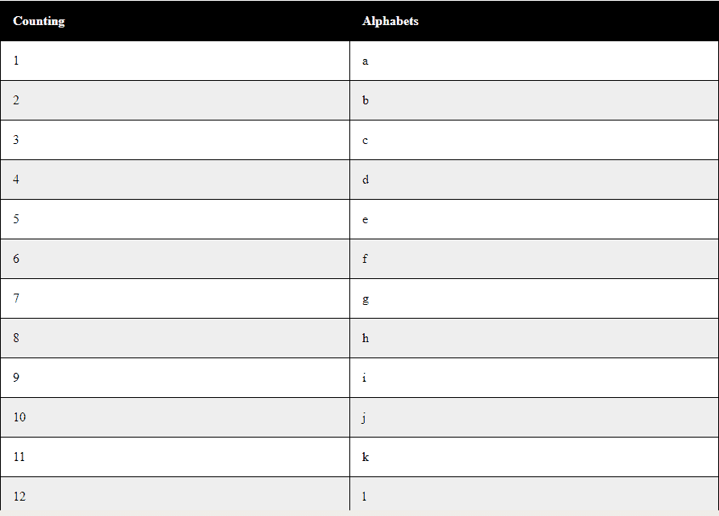
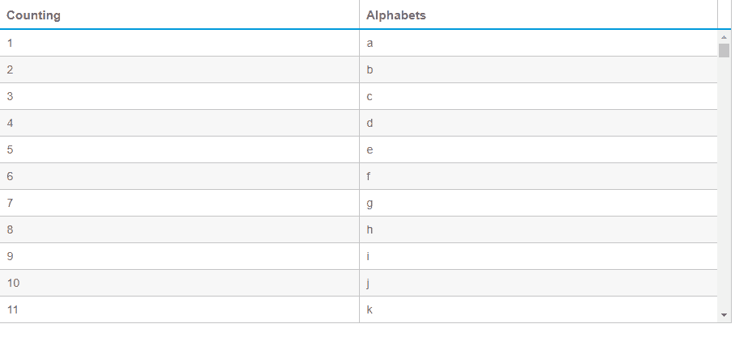

# 如何在 JavaScript 中为百万行创建数据网格？

> 原文:[https://www . geeksforgeeks . org/如何用 javascript 创建百万行数据网格/](https://www.geeksforgeeks.org/how-to-create-data-grid-for-millions-of-rows-in-javascript/)

在 JavaScript 中，使用一个简单的循环最多可以显示 **10 <sup>5</sup>** 。这也取决于浏览器运行如此复杂的大循环的能力。当如此庞大的任务交给浏览器时，页面就会崩溃。下面的代码是一个示例，说明我们如何填充一个包含 10**行和 5 行的表格。**

**示例 1:** 这个示例将展示如何使用简单的 JavaScript 代码用 10 <sup>5</sup> 行填充一个表。

```
<!DOCTYPE html>
<html>

<head>
    <style>
        table {
            width: 100%;
        }

        table,
        th,
        td {
            border: 1px solid black;
            border-collapse: collapse;
        }

        th,
        td {
            padding: 15px;
            text-align: left;
        }

        table#t01 tr:nth-child(even) {
            background-color: #eee;
        }

        table#t01 tr:nth-child(odd) {
            background-color: #fff;
        }

        table#t01 th {
            background-color: black;
            color: white;
        }
    </style>
</head>

<body>
    <br>

    <table id="t01">
        <tr>
            <th>Counting</th>
            <th>Alphabets</th>
        </tr>
        <script>
            var k = 97;
            for (var j = 1; j <= 100000; j++) {
                if (k == 123)
                    k = 97;
                var string = String.fromCharCode(k);
                document.write(" <tr><td>" + (j) + "</td><td>" 
                               + string + "</td></tr>");
                k++;
            }
        </script>
    </table>

</body>

</html>
```

**输出:**


**100 万行的性能**
为了执行如此繁重的任务，我们将导入一个由 shield UI 制作的 API。这是一个用于加载大网格的轻量级应用编程接口，它实际上是实时加载网格的，也就是说，当我们向下滚动表格时，这样就减少了当时浏览器上的负载。

现在让我们对 100 万行，即 10 <sup>行和 6</sup> 行执行相同的操作。下面的代码将实时加载 100 万行。
T3】例:

```
<!DOCTYPE html>
<html lang="en">

<head>
    <meta charset="utf-8" />
    <title>1 Million Rows Demo</title>
    <link id="themecss" 
          rel="stylesheet" 
          type="text/css" 
          href=
"//www.shieldui.com/shared/components/latest/css/light/all.min.css" />
    <script type="text/javascript"
            src=
"//www.shieldui.com/shared/components/latest/js/jquery-1.11.1.min.js">
  </script>
    <script type="text/javascript" 
            src=
"//www.shieldui.com/shared/components/latest/js/shieldui-all.min.js">
  </script>
</head>

<body class="theme-light">
    <div id="grid" style="margin-bottom: -500px;"></div>
    <script type="text/javascript">
        $(function() {
            var grid = new shield.DataSource({
                remote: {
                    operations: ["skip", "take"],
                    read: function(params, success, error) {
                        var skip = grid.skip || 0,
                            take = grid.take || 20,
                            data = [],
                            k = 96;

                        for (var i = skip; i < skip + take; i++) {
                            k++;
                            var row = {};
                            for (var j = 1; j < 3; j++) {
                                row["Counting"] = i + 1;
                                if (k == 123)
                                    k = 97;
                                var string = String.fromCharCode(k);
                                row["Alphabets"] = string;
                            }
                            data.push(row);
                        }
                        success({
                            data: data,
                            total: 1000000
                        });
                    }
                },
                schema: {
                    data: "data",
                    total: "total"
                }
            });
            $("#grid").shieldGrid({
                dataSource: grid,
                height: 400,
                scrolling: {
                    virtual: true
                },
                columns: (function() {
                    var cols = [];

                    cols.push({
                        field: "Counting",
                        width: 140
                    });

                    cols.push({
                        field: "Alphabets",
                        width: 140
                    });
                    return cols;
                })()
            });
        });
    </script>
</body>

</html>
```

**输出:**
