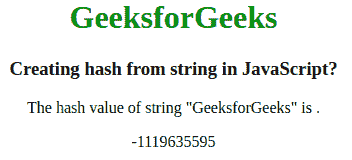

# 如何在 JavaScript 中从字符串创建哈希？

> 原文:[https://www . geesforgeks . org/如何从 javascript 字符串创建哈希/](https://www.geeksforgeeks.org/how-to-create-hash-from-string-in-javascript/)

为了从特定字符串创建唯一的哈希，可以使用自己的字符串到哈希转换函数来实现。它将返回字符串的散列等价物。此外，一个名为 Crypto 的库可以用来生成各种类型的哈希，如 SHA1、MD5、SHA256 等。

**注意:**空字符串的哈希值始终为零。

**例 1:**

```
<!DOCTYPE html>
<html>

<head>
    <title>
        How to convert hash from
        string in JavaScript ?
    </title>

    <style>
        h1 {
            color: green;
        }
    </style>
</head>

<body>
    <center>
        <h1>GeeksforGeeks</h1>

        <h3>Creating hash from string in JavaScript?</h3>

        <p>The hash value of string "GeeksforGeeks" is .</p>

        <p id="geek"></p>

        <script>

            // Convert to 32bit integer
            function stringToHash(string) {

                var hash = 0;

                if (string.length == 0) return hash;

                for (i = 0; i < string.length; i++) {
                    char = string.charCodeAt(i);
                    hash = ((hash << 5) - hash) + char;
                    hash = hash & hash;
                }

                return hash;
            }

            // String printing in hash
            var gfg = "GeeksforGeeks"

            document.getElementById("geek").innerHTML
                        = stringToHash(gfg);
        </script>
    </center>
</body>

</html>
```

**输出:**

**例 2:**

```
<script>

    // Importing 'crypto' module
    const crypto = require('crypto'),

    // Returns the names of supported hash algorithms 
    // such as SHA1,MD5
    hash = crypto.getHashes();

    // Create hash of SHA1 type
    x = "Geek"

    // 'digest' is the output of hash function containing 
    // only hexadecimal digits
    hashPwd = crypto.createHash('sha1').update(x).digest('hex');

    console.log(hash); 
</script>
```

**输出:**

```
321cca8846c784b6f2d6ba628f8502a5fb0683ae
```