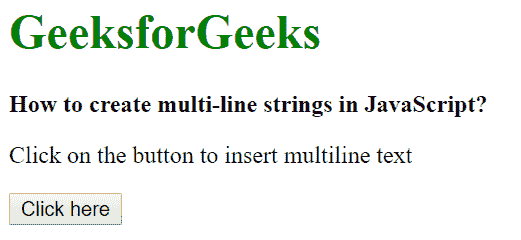
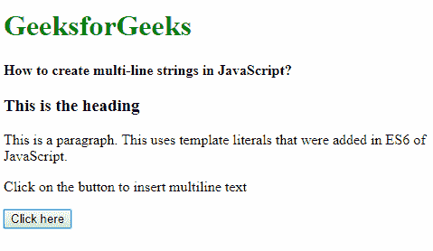
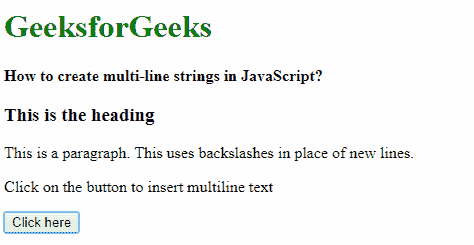
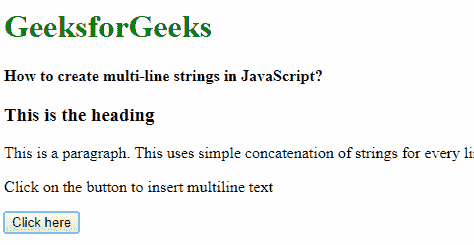

# 如何在 JavaScript 中创建多行字符串？

> 原文:[https://www . geesforgeks . org/如何创建多行 javascript 字符串/](https://www.geeksforgeeks.org/how-to-create-multi-line-strings-in-javascript/)

JavaScript 2015 不支持多行字符串，但是当 ES6 问世并引入字符串文字时。ES6 支持多行字符串。如果较旧的浏览器支持是必不可少的，有多种方法可以处理多行字符串。

**方法 1:** 使用模板文字创建多行字符串。字符串是用反号分隔的，不像普通的单引号/双引号分隔符。

**示例:**本示例使用模板文字创建多行字符串。

```
<!DOCTYPE html>
<html>

<head>
    <title>
        Create multi-line strings
    </title>
</head>

<body>
    <h1 style="color: green">
        GeeksforGeeks
    </h1>

    <b>
        How to create multi-line
        strings in JavaScript?
    </b>

    <div class="multiline"></div>

    <p>
        Click on the button to
        insert multiline text
    </p>

    <button onclick="showMultiline()">
        Click here
    </button>

    <script type="text/javascript">
        function showMultiline() {
            multilineString = 
                `<div>
                    <h3>This is the heading</h3>
                    <p>
                        This is a paragraph. This uses
                        template literals that were
                        added in ES6 of JavaScript
                    </p>
                </div>`

            document.querySelector('.multiline').innerHTML
                    = multilineString;
        }
    </script>
</body>

</html>
```

**输出:**

*   **点击按钮前:**
    
*   **点击按钮后:**
    

**方法 2:使用反斜杠转义文字换行符:**另一个可以用来创建多行字符串的方法是转义每行的每一个换行符。

**示例:**本示例使用反斜杠转义文字换行符来创建多行字符串。

```
<!DOCTYPE html>
<html>

<head>
    <title>
        Create multi-line strings
    </title>
</head>

<body>
    <h1 style="color: green">
        GeeksforGeeks
    </h1>

    <b>
        How to create multi-line
        strings in JavaScript? 
    </b>

    <div class="multiline"></div>

    <p>
        Click on the button to
        insert multiline text
    </p>

    <button onclick="showMultiline()">
        Click here
    </button>

    <script type="text/javascript">
        function showMultiline() {
            multilineString = 
                "<div> \
                    <h3>This is the heading</h3> \
                    <p>This is a paragraph \
                    This uses backslashes in place\
                    of new lines</p> \
                </div>"

            document.querySelector('.multiline').innerHTML
                    = multilineString;
        }
    </script>
</body>
</html>
```

**输出:**

*   **点击按钮前:**
    
*   **点击按钮后:**
    

**方法 3:将单个字符串连接在一起:**最简单，但最麻烦的方法是将每一行作为一个字符串分开，并连接成最后一个字符串。

**示例:**本示例连接字符串以创建多行字符串。

```
<!DOCTYPE html>
<html>

<head>
    <title>
        Create multi-line strings
    </title>
</head>

<body>
    <h1 style="color: green">
        GeeksforGeeks
    </h1>

    <b>
        How to create multi-line 
        strings in JavaScript? 
    </b>

    <div class="multiline"></div>

    <p>
        Click on the button to
        insert multiline text
    </p>

    <button onclick="showMultiline()">
        Click here
    </button>

    <script type="text/javascript">
        function showMultiline() {
            multilineString = 
                "<div>" +
                    "<h3>This is the heading</h3>" +
                    "<p>This is a paragraph" +
                    "This uses simple concatenation " +
                    "of strings for every line</p> " +
                "</div>"

            document.querySelector('.multiline').innerHTML
                    = multilineString;
        }
    </script>
</body>

</html>
```

**输出:**

*   **点击按钮前:**
    
*   **点击按钮后:**
    