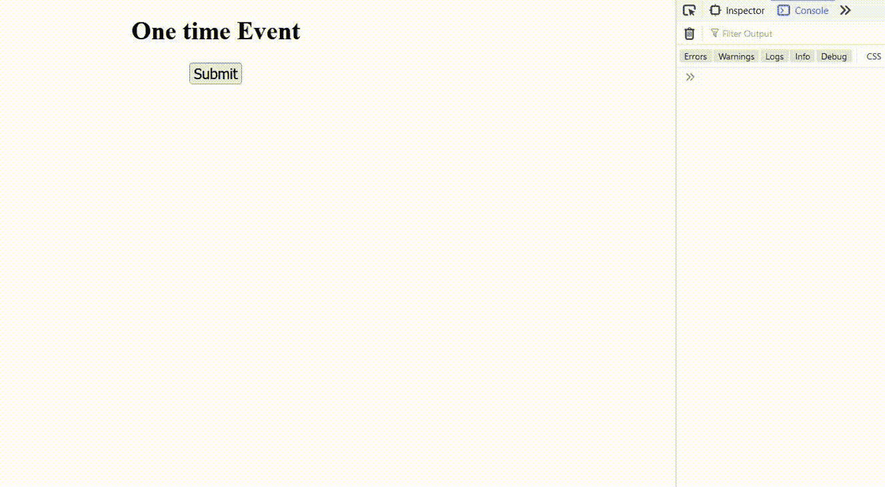

# 如何在 JavaScript 中创建一次性事件？

> 原文:[https://www . geesforgeks . org/如何用 javascript 创建一次性事件/](https://www.geeksforgeeks.org/how-to-create-one-time-events-in-javascript/)

在本文中，我们将学习 JavaScript 中的一次性事件以及如何创建它们。为了执行任务，我们通常在 JavaScript 中使用事件监听器。例如，如果我们需要计算两个变量的总和，则通过单击 DOM 中的一个按钮来完成。意思是我们用一个**点击**事件监听器得到两个变量的和。

**一次性事件:**这些事件只执行事件监听器一次。假设我们已经创建了一个按钮并添加了一个点击事件。如果一次性事件只执行一次，不管用户点击按钮几次，我们都会创建一个一次性事件。

假设我们已经创建了一个从应用编程接口获取数据的按钮，如果我们没有在它上面添加一次性事件，那么它会在用户每次点击时从应用编程接口获取数据，忽略之前的响应。正因为如此，它使我们的系统过载，降低了性能，也给用户带来了非常糟糕的体验。

**方法:**我们[给一个按钮添加一个事件监听器](https://www.geeksforgeeks.org/javascript-addeventlistener-with-examples/)，然后使用[**removeEventListener()**](https://www.geeksforgeeks.org/javascript-removeeventlistener-method-with-examples/)功能从该按钮中移除事件。这样，事件监听器只执行一次指令。

**如果我们不使用一次性事件监听器会发生什么？**

事件侦听器每次从用户那里侦听该侦听器时都会执行其功能。假设**“点击** ***”、*** 所以每当用户点击那个特定的按钮，它每次都开始执行相同的指令。

**示例:**

## 超文本标记语言

```
<!DOCTYPE html>
<html>
<head>
    <meta charset="UTF-8">
    <meta http-equiv="X-UA-Compatible" content="IE=edge">
    <meta name="viewport" content="width=device-width, initial-scale=1.0">

    <style>
      body{
      text-align:center;
      }
    </style>
</head>
<body>
    <h2 style="color:green">GeeksforGeeks</h2>

    <div class="container"
         style="width:500px;
                margin:auto;
                text-align:center;">
        <h3>One time event</h3>
        <button id="submitBtn"
                type="button"
                style="font-size:large;">
          Submit
        </button>
    </div>
    <script src="script.js"></script>
</body>

</html>
```

## java 描述语言

```
let submitBtn = document.getElementById('submitBtn');

submitBtn.addEventListener("click",()=>{
    console.log("Executing Everytime");
})
```

**输出:**



**一次性事件监听器创建:**我们使用**removeEventListener()****在事件监听器只执行一次后将其移除。即使在多次单击按钮后，它也不会执行，因为事件侦听器已从按钮中移除。**

****示例:****

## **超文本标记语言**

```
<!DOCTYPE html>
<html>
<head>
    <meta charset="UTF-8">
    <meta http-equiv="X-UA-Compatible" content="IE=edge">
    <meta name="viewport"
          content="width=device-width, initial-scale=1.0">   
    <style>
      body{
      text-align:center;
      }
    </style>
</head>
<body>
    <h2 style="color:green">GeeksforGeeks</h2>

    <div class="container"
         style="width:500px;
                margin:auto;
                text-align:center;">
        <h3>One time event</h3>
        <button id="submitBtn"
                type="button"
                style="font-size:large;">
          Submit</button>
    </div>
    <script src="script1.js"></script>
</body>

</html>
```

## **java 描述语言**

```
// button element 
let submitBtn = document.getElementById('submitBtn');
submitBtn.addEventListener("click",func);

// function execute when click event fires
function func() {
    console.log("Event Listener Removed");

    /* In "removeEventListener" first argument is event
       type and second argument is the name of
       the function that is start executing when
       click event fires */

    submitBtn.removeEventListener("click",func);
}
```

****输出:****

****