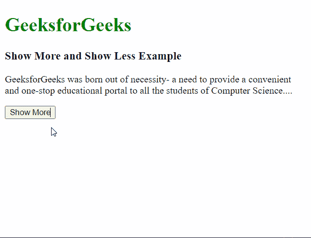

# 如何使用 JavaScript 创建显示更多和显示更少的功能来隐藏文本？

> 原文:[https://www . geeksforgeeks . org/如何使用 javascript 创建-显示-更多-显示-更少-隐藏-文本-功能/](https://www.geeksforgeeks.org/how-to-create-show-more-and-show-less-functionality-for-hiding-text-using-javascript/)

A **显示更多**和**显示更少**功能在文本量很大的网站中会很有用，比如在单个页面上包含大量文章的新闻和杂志网站。这可以帮助网页设计者根据需要给用户自由阅读更多或更少的文本。

通过点击按钮可以改变显示的内容量。不是在网页上显示一个完整的段落，而是最初只显示部分文本，并添加一个按钮来显示更多的文本。开发人员可以决定在点击按钮前后应该显示的文本量。

上述方法可以通过使用简单的 if-else 条件来实现，该条件检查文本的当前状态，并在此基础上显示或隐藏它。下面的例子说明了这种方法:

## 超文本标记语言

```html
<!DOCTYPE html>
<html>

<head>
    <style>
        /* Initially, hide the extra text that
            can be revealed with the button */
        #moreText {

            /* Display nothing for the element */
            display: none;
        }
    </style>
</head>

<body>
    <h1 style="color: green;">
        GeeksforGeeks
    </h1>

    <h3>Show More and Show Less Example</h3>

    <p>
        GeeksforGeeks was born out of necessity-
        a need to provide a convenient and
        one-stop educational portal to all the
        students of Computer Science.
        <span id="points">...</span>

        <!-- Define the text that would be 
            hidden by default and only shown 
            when clicked on the button -->
        <span id="moreText"> This necessity was
            as personal to me as it was universal.
            This need combined with my passion for
            teaching resulted in GeeksforGeeks as
            we know today. My message to you, in
            our inaugural edition of Geeks Digest,
            would be that if you are looking for
            a problem to work on, you don’t need
            to look very far for it. All you should
            do is to look around yourself.
        </span>
    </p>

    <!-- Trigger toggleText() when the 
        button is clicked -->
    <button onclick="toggleText()" id="textButton">
        Show More
    </button>

    <script>
        function toggleText() {

            // Get all the elements from the page
            var points = 
                document.getElementById("points");

            var showMoreText =
                document.getElementById("moreText");

            var buttonText =
                document.getElementById("textButton");

            // If the display property of the dots 
            // to be displayed is already set to 
            // 'none' (that is hidden) then this 
            // section of code triggers
            if (points.style.display === "none") {

                // Hide the text between the span
                // elements
                showMoreText.style.display = "none";

                // Show the dots after the text
                points.style.display = "inline";

                // Change the text on button to 
                // 'Show More'
                buttonText.innerHTML = "Show More";
            }

            // If the hidden portion is revealed,
            // we will change it back to be hidden
            else {

                // Show the text between the
                // span elements
                showMoreText.style.display = "inline";

                // Hide the dots after the text
                points.style.display = "none";

                // Change the text on button
                // to 'Show Less'
                buttonText.innerHTML = "Show Less";
            }
        }
    </script>
</body>

</html>
```

**输出:**

