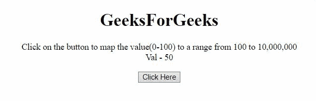
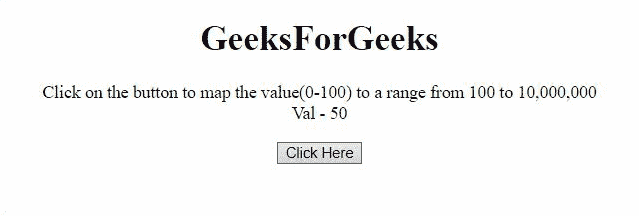

# 如何在 JavaScript 中创建滑块来映射一系列值？

> 原文:[https://www . geesforgeks . org/如何创建滑块来映射 javascript 中的值范围/](https://www.geeksforgeeks.org/how-to-create-slider-to-map-a-range-of-values-in-javascript/)

任务是将一个范围的值映射到另一个范围的值，如 JavaScript 中的映射(0-100)到(100-10000000)。下面讨论两种方法。

**方法 1:** 使用对数刻度绘制范围图。在该示例中，首先计算范围的对数值，然后使用目标刻度的对数值与起始刻度的差值来计算刻度。然后使用幂运算来映射特定数字的范围。

**示例:**该示例实现了上述方法。

```
<!DOCTYPE HTML>
<html>

<body style="text-align:center;">
    <h1>GeeksForGeeks</h1>

    <p id="GFG_UP"></p>

    <button onclick="myGFG()">
        Click Here
    </button>

    <p id="GFG_DOWN"></p>
    <script>
        var up = document.getElementById("GFG_UP");
        var val = 50;
        up.innerHTML = "Click on the button to map"
            + " the value(0-100) to a range from "
            + "100 to 10, 000, 000<br> Val - " + val;

        var down = document.getElementById("GFG_DOWN");

        function Slider(pos) {
            var minM = 0;
            var maxM = 100;
            var minV = Math.log(100);
            var maxV = Math.log(10000000);
            var scal = (maxV - minV) / (maxM - minM);
            return Math.exp(minV + scal * (pos - minM));
        }
        function myGFG() {
            down.innerHTML = "The value for " 
                + val + " is " + Slider(val);
        }
    </script>
</body>

</html>
```

**输出:**


**方法 2:** 此示例还将值从一个范围映射到另一个范围，但使用了不同的公式。

**示例:**该示例实现了上述方法。

```
<!DOCTYPE HTML>
<html>

<body style="text-align:center;">
    <h1>GeeksForGeeks</h1>

    <p id="GFG_UP"></p>

    <button onclick="myGFG()">
        Click Here
    </button>

    <p id="GFG_DOWN"></p>

    <script>
        var up = document.getElementById("GFG_UP");
        var val = 50;
        up.innerHTML = "Click on the button to map"
            + " the value(0-100) to a range from "
            + "100 to 10, 000, 000<br> Val - " + val;

        var down = document.getElementById("GFG_DOWN");
        function Slider(pos) {
            return Math.floor(-900 + 1000 * 
                    Math.exp(pos / 10.857255959));
        }
        function myGFG() {
            down.innerHTML = "The value for " 
            + val + " is " + Slider(val);
        }
    </script>
</body>

</html>
```

**输出:**
