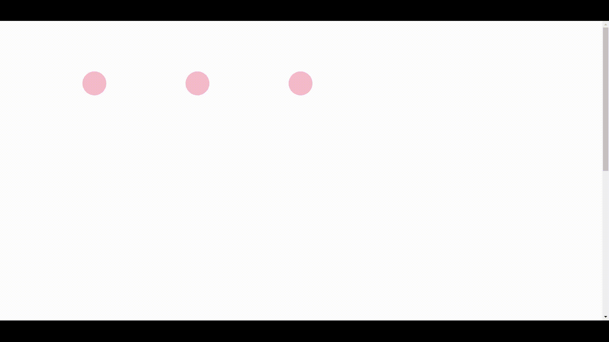
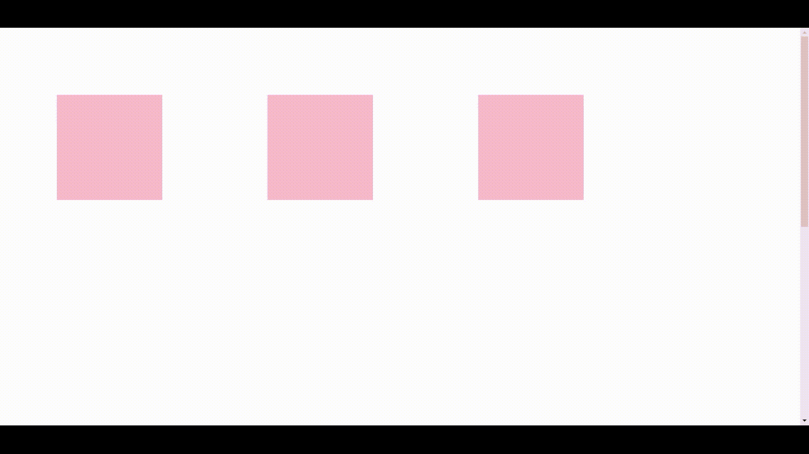

# 如何使用 Anime.js 创建时间轴动画？

> 原文:[https://www . geesforgeks . org/如何创建-时间轴-动画-使用-anime-js/](https://www.geeksforgeeks.org/how-to-create-timeline-animations-using-anime-js/)

[Anime.js](https://www.geeksforgeeks.org/introduction-to-anime-js/) 是一个轻量级的 JavaScript 库，拥有简单小巧的强大 API。它与 DOM 元素、CSS 和 JavaScript 对象一起工作。

**先决条件:**

1.  [HTML 基础知识](https://www.geeksforgeeks.org/html-tutorials/)
2.  [CSS 基础知识](https://www.geeksforgeeks.org/css-tutorials/)
3.  [Javascript 基础知识](https://www.geeksforgeeks.org/javascript-tutorial/)

**anime.js 的安装:**在你的项目中使用 anime . js 有两种方式:

*   可以下载 anime.min.js 文件直接使用。
*   只需谷歌 anime.js CDN，您就会获得链接，并将其放入您的脚本标签中，如下所示。

**动漫 js 中使用的基本属性:**

*   **目标:**Css 选择器，用于定位和识别要应用动画的对象。
*   **持续时间:**动画应该持续的时间(毫秒)。
*   **延迟:**动画开始的时间，单位为毫秒。
*   **translateX:** 将元素放置在 x 坐标。
*   **平移:**将元素置于 Y 坐标。
*   **偏移:**这给出了不同动画之间的延迟。即在前一个动画的 x 秒后开始另一个动画。

**创建应用程序和项目结构:**这是一个简单的网页。我们所需要做的就是创建一个项目，并在其中创建一个名为**index.html**的 HTML 文件。

```
mkdir animation && cd animation
touch index.html 
```

**例 1:**

**index.html**

## 超文本标记语言

```
<!DOCTYPE html>
<html>
   <head>
      <title>A nice example for timeline</title>
      <script src=
"https://cdnjs.cloudflare.com/ajax/libs/animejs/3.2.0/anime.min.js">
      </script>
      <style>
         html{
         min-height: 200vh;
         }
         .ball {
         width: 60px;
         height: 60px;
         margin-top: 120px;
         margin-left:200px;
         border-radius: 50%;
         background-color: pink;
         float: left;
         }
      </style>
   </head>
   <body>
      <body>
         <div class="ball first"></div>
         <div class="ball second"></div>
         <div class="ball third"></div>
         <script>
            let animation = anime.timeline({
            duration: 500, 
            easing: 'easeInOutSine',
            direction: 'alternate',  
            autoplay:false,
            loop: true
            });           

            animation.add({
            targets: '.first',
            translateY: -50,
            backgroundColor: 'rgb(255, 0, 0)'
            }).add({
            targets: '.second',
            translateY: -50,
            backgroundColor: 'rgb(0, 255, 0)'
            }).add({
            targets: '.third',
            translateY: -50,
            backgroundColor: 'rgb(0, 0, 255)'
            });
            window.onscroll=()=>{
            animation.play();
            }
         </script>
   </body>
</html>
```

**输出:**点击**index.html**在浏览器中打开:



**示例 2:** 在本例中，translateX 属性变得更加清晰。它首先转换成-ve x 轴，然后是+ve x 轴。

**index.html**

## 超文本标记语言

```
<!DOCTYPE html>
<html>
   <head>
      <title>A nice example for timeline</title>
      <script src=
"https://cdnjs.cloudflare.com/ajax/libs/animejs/3.2.0/anime.min.js">
      </script>
      <style>
         html{
         min-height:200vh;
         }
         .ball {
         width: 200px;
         height: 200px;
         margin-top: 120px;
         margin-left:200px;
         background-color: pink;
         float: left;
         }
      </style>
   </head>
   <body>
      <body>
         <div class="ball first"></div>
         <div class="ball second"></div>
         <div class="ball third"></div>
         <script>
            let animation = anime.timeline({
            duration: 400, 
            easing: 'easeInOutSine',
            direction: 'alternate',
            autoplay:false,  
            loop: true
            });           

            animation.add({
            targets: '.first',
            translateX: [-100,100],
            backgroundColor: 'rgb(255, 0, 0)',

            }).add({
            targets: '.second',
            translateX: [-100,100],
            backgroundColor: 'rgb(0, 255, 0)',

            }).add({
            targets: '.third',
            translateX: [-100,100],
            backgroundColor: 'rgb(0, 0, 255)',
            });
            window.onscroll=()=>{
            animation.play()
            }
         </script>
   </body>
</html>
```

**输出:**点击**index.html**文件，在浏览器中打开。

