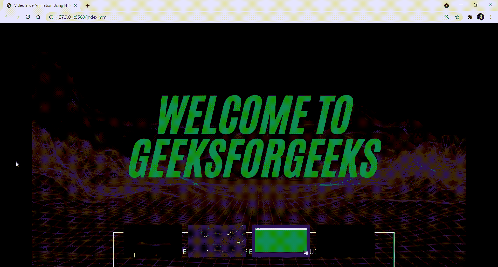

# 使用 HTML CSS JavaScript 设计视频幻灯片动画效果

> 原文:[https://www . geesforgeks . org/如何创建-视频-幻灯片-动画-使用-CSS-和-javascript/](https://www.geeksforgeeks.org/how-to-create-video-slide-animation-using-css-and-javascript/)

如今，视频幻灯片动画非常流行。在本文中，我们将看到如何在任何网页上使用 HTML、CSS 和 JavaScript 制作视频幻灯片动画。下面是如何做的两个步骤。通过参考本文，它将帮助初学者使用 HTML、CSS 和 JS 构建一些非常棒的视频幻灯片动画。

[**什么是 CSS 动画？**](https://www.geeksforgeeks.org/css-animations/)
CSS 动画是一种改变网页中各种元素的外观和行为的技术。它用于通过改变元素的运动或显示来控制元素。它有两部分，一部分包含描述元素动画的 CSS 属性，另一部分包含某些关键帧，这些关键帧指示元素的动画属性以及这些属性必须出现的特定时间间隔。

**进场:**

*   在 HTML 文件的主体中创建一个容器类。
*   在视频标签中使用滑块类。
*   在视频标签中使用自动播放循环静音类(进行循环)。
*   使用 li 标签制作视频列表。
*   使用类给 HTML 元素赋予效果。
*   在视频中使用 onClick 事件。

下面是上述方法的实现。

**示例:**现在我们将看到如何在任何网页上使用 HTML、CSS、JS 创建视频幻灯片动画。

**分步实施**

**第一步:**创建名为*【index.html】*&的 HTML 文件，添加下面的代码。

## index.html

```html
<!DOCTYPE html>
<html lang="en">
  <head>
    <!-- All Meta tags -->
    <meta charset="UTF-8" />
    <meta http-equiv="X-UA-Compatible" content="IE=edge" />
    <meta name="viewport" content="width=device-width, initial-scale=1.0" />
    <meta name="description" content="Free Web tutorials" />
    <meta name="keywords" content="HTML, CSS, JavaScript" />
    <meta name="author" content="John Doe" />

    <title>Video Slide Animation Using HTML | CSS | JS</title>

    <!--Style CSS -->
    <link rel="stylesheet" href="index.css" />
  </head>
  <body>
    <div class="container">
      <video src=
"https://media.geeksforgeeks.org/wp-content/uploads/20211008154349/Welcome-To-GeeksforGeeks-(0).mp4" 
             class="slider" autoplay loop muted>
      </video>

      <ul>
        <li onclick="videoslider
('https://media.geeksforgeeks.org/wp-content/uploads/20211008154349/Welcome-To-GeeksforGeeks-(0).mp4')">
          <video src=
"https://media.geeksforgeeks.org/wp-content/uploads/20211008154349/Welcome-To-GeeksforGeeks-(0).mp4">
          </video>
        </li>
        <li onclick="videoslider
('https://media.geeksforgeeks.org/wp-content/uploads/20211008154455/Welcome-To-GeeksforGeeks-(1).mp4')">
          <video src=
"https://media.geeksforgeeks.org/wp-content/uploads/20211008154455/Welcome-To-GeeksforGeeks-(1).mp4">
          </video>
        </li>
        <li onclick="videoslider
('https://media.geeksforgeeks.org/wp-content/uploads/20211008154736/Welcome-To-GeeksforGeeks-(2).mp4')">
          <video src=
"https://media.geeksforgeeks.org/wp-content/uploads/20211008154736/Welcome-To-GeeksforGeeks-(2).mp4">
          </video>
        </li>
        <li onclick="videoslider
('https://media.geeksforgeeks.org/wp-content/uploads/20211008155009/Welcome-To-GeeksforGeeks-(3).mp4')">
          <video src=
 "https://media.geeksforgeeks.org/wp-content/uploads/20211008155009/Welcome-To-GeeksforGeeks-(3).mp4">
          </video>
        </li>
      </ul>
    </div>
    <script>
      function videoslider(links) {
        document.querySelector(".slider").src = links;
      }
    </script>
  </body>
</html>
```

**第二步:**创建名为 *style.css* &的 CSS 文件，添加下面的代码。

## style.css

```html
* {
    margin: 0;
    padding: 0;
    box-sizing: border-box;
}

.container {
    width: 100%;
    height: 100vh;
    position: relative;
    display: flex;
    background-color: #000000;
    justify-content: center;
    align-items: center;
}

.container .slider {
    position: absolute;
    top: 0;
    left: 0;
    width: 100%;
    height: 100%;
}

.container ul {
    position: absolute;
    bottom: 20px;
    left: 50%;
    transform: translateX(-50%);
    display: flex;
    justify-content: center;
    align-items: center;
    z-index: 20;
}

.container ul li {
    list-style: none;
    cursor: pointer;
    margin: 10px;
}

.container ul li video {
    width: 200px;
    transition: all 0.3s;
}

.container ul li video:hover {
    transform: scale(1.1);
}

.video {
    width: 100%;
    height: 100%;
}
```

**完整代码:**

## 超文本标记语言

```html
<!DOCTYPE html>
<html lang="en">
  <head>
    <!-- All Meta tags -->
    <meta charset="UTF-8" />
    <meta http-equiv="X-UA-Compatible" content="IE=edge" />
    <meta name="viewport" content="width=device-width, initial-scale=1.0" />
    <meta name="description" content="Free Web tutorials" />
    <meta name="keywords" content="HTML, CSS, JavaScript" />
    <meta name="author" content="John Doe" />

    <title>Video Slide Animation Using HTML | CSS | JS</title>

    <!--Style CSS -->
    <style>
      * {
    margin: 0;
    padding: 0;
    box-sizing: border-box;
}

.container {
    width: 100%;
    height: 100vh;
    position: relative;
    display: flex;
    background-color: #000000;
    justify-content: center;
    align-items: center;
}

.container .slider {
    position: absolute;
    top: 0;
    left: 0;
    width: 100%;
    height: 100%;
}

.container ul {
    position: absolute;
    bottom: 20px;
    left: 50%;
    transform: translateX(-50%);
    display: flex;
    justify-content: center;
    align-items: center;
    z-index: 20;
}

.container ul li {
    list-style: none;
    cursor: pointer;
    margin: 10px;
}

.container ul li video {
    width: 200px;
    transition: all 0.3s;
}

.container ul li video:hover {
    transform: scale(1.1);
}

.video {
    width: 100%;
    height: 100%;
}
    </style>
  </head>
  <body>
    <div class="container">
      <video src=
"https://media.geeksforgeeks.org/wp-content/uploads/20211008154349/Welcome-To-GeeksforGeeks-(0).mp4" 
             class="slider" autoplay loop muted>
      </video>

      <ul>
        <li onclick="videoslider
('https://media.geeksforgeeks.org/wp-content/uploads/20211008154349/Welcome-To-GeeksforGeeks-(0).mp4')">
          <video src=
"https://media.geeksforgeeks.org/wp-content/uploads/20211008154349/Welcome-To-GeeksforGeeks-(0).mp4">
          </video>
        </li>
        <li onclick="videoslider
('https://media.geeksforgeeks.org/wp-content/uploads/20211008154455/Welcome-To-GeeksforGeeks-(1).mp4')">
          <video src=
"https://media.geeksforgeeks.org/wp-content/uploads/20211008154455/Welcome-To-GeeksforGeeks-(1).mp4">
          </video>
        </li>
        <li onclick="videoslider
('https://media.geeksforgeeks.org/wp-content/uploads/20211008154736/Welcome-To-GeeksforGeeks-(2).mp4')">
          <video src=
"https://media.geeksforgeeks.org/wp-content/uploads/20211008154736/Welcome-To-GeeksforGeeks-(2).mp4">
          </video>
        </li>
        <li onclick="videoslider
('https://media.geeksforgeeks.org/wp-content/uploads/20211008155009/Welcome-To-GeeksforGeeks-(3).mp4')">
          <video src=
 "https://media.geeksforgeeks.org/wp-content/uploads/20211008155009/Welcome-To-GeeksforGeeks-(3).mp4">
          </video>
        </li>
      </ul>
    </div>
    <script>
      function videoslider(links) {
        document.querySelector(".slider").src = links;
      }
    </script>
  </body>
</html>
```

**输出:**



现在，正如您在输出中看到的，我们在网页中使用 CSS 创建了一个使用 HTML、CSS、JavaScript 的视频幻灯片动画，这将吸引用户在网页上获得更好的用户体验。