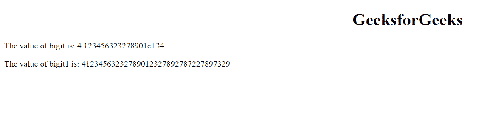
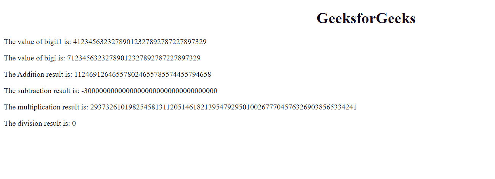

# 如何处理 JavaScript 中的大数？

> 原文:[https://www . geesforgeks . org/如何用 javascript 处理大数/](https://www.geeksforgeeks.org/how-to-deal-with-large-numbers-in-javascript/)

大数是可以容纳巨大内存的数字，评估时间超过了处理的空间和时间。

我们可以使用数据类型 **BigInt 在 JavaScript 中处理大量的数字。**

**优势:**

*   它可以容纳大量的大尺寸。
*   它执行算术运算。

**缺点:**

*   消耗巨大的内存。

**Approach:** 缺省情况下，JavaScript 通过在一个大数字的末尾加上 e+39 来转换它。

```
var variable_name = value
This will print e+39 at last

var bigi = 41234563232789012327892787227897329;
Output: 4.123456323278901e+34

```

所以为了去掉这个，在数字的末尾加上“n”

```
var bigi = 41234563232789012327892787227897329n;
output: 41234563232789012327892787227897329
They are used in numerical calculations used along with operands
```

**例 1:**

## 超文本标记语言

```
<!DOCTYPE html>
<html>

<body>
    <center>
        <h1>GeeksforGeeks</h1>
    </center>

    <p id="gfg1"></p>

    <p id="gfg2"></p>

    <script>
        var bigit = 41234563232789012327892787227897329;
        document.getElementById("gfg1").innerHTML
            = "The value of bigit is: " + bigit;

        // Displaying full number
        var bigit1 = 41234563232789012327892787227897329n;
        document.getElementById("gfg2").innerHTML
            = "The value of bigit1 is: " + bigit1;
    </script>
</body>

</html>
```

**输出:**



**例 2:**

## 超文本标记语言

```
<!DOCTYPE html>
<html>

<body>
    <center>
        <h1>GeeksforGeeks</h1>
    </center>

    <p id="gfg2"></p>
    <p id="gfg3"></p>
    <p id="gfg4"></p>
    <p id="gfg5"></p>
    <p id="gfg6"></p>
    <p id="gfg7"></p>

    <script>
        var bigit1 = 41234563232789012327892787227897329n;
        document.getElementById("gfg2").innerHTML
            = "The value of bigit1 is: " + bigit1;
        // The value of bigit1 is: 
        // 41234563232789012327892787227897329

        // The value of bigi is: 
        // 71234563232789012327892787227897329
        var bigi = 71234563232789012327892787227897329n;
        document.getElementById("gfg3").innerHTML
            = "The value of bigi is: " + bigi;

        // Addition
        var z = bigit1 + bigi
        document.getElementById("gfg4").innerHTML 
            = "The Addition result is: " + z;
        // The Addition result is: 
        // 112469126465578024655785574455794658

        //subtraction
        var a = bigit1 - bigi
        document.getElementById("gfg5").innerHTML
            = "The subtraction result is: " + a;
        // The subtraction result is: 
        // -30000000000000000000000000000000000

        // Multiplication
        var b = bigit1 * bigi
        document.getElementById("gfg6").innerHTML
            = "The multiplication result is: " + b;
        // The multiplication result is: 
        // 293732610198254581311205146182139547
        // 9295010026777045763269038565334241

        // Division
        var c = bigit1 / bigi
        document.getElementById("gfg7").innerHTML
            = "The division result is: " + c;
        // The division result is: 0
    </script>
</body>

</html>
```

**输出:**

