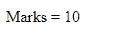

# 如何在 JavaScript 中声明全局变量？

> 原文:[https://www . geesforgeks . org/如何在 javascript 中声明全局变量/](https://www.geeksforgeeks.org/how-to-declare-global-variables-in-javascript/)

**声明变量:**变量既可以声明为全局变量，也可以声明为局部变量。变量可以用 var、let 和 const 关键字来声明。在 ES6 之前，只有一个 var 关键字可以用来声明一个 JavaScript 变量。

**全局变量**是可以从程序中任何地方访问的变量。这些变量在源代码的主体部分和所有函数之外声明。每个函数都可以访问这些变量。

*   全局变量在块的开始(程序的顶部)被声明
*   Var 关键字用于全局声明变量。
*   可以从程序的任何部分访问全局变量。

**注意:**如果给一个变量赋值，却忘记声明该变量，会自动被认为是全局变量。

**示例 1:** 在本例中，我们在程序开始时使用 var 关键字在每个函数之外声明变量。

## 超文本标记语言

```
<!DOCTYPE html> 
<html> 

<body>
    <center>
        <p id="geeks"></p>

        <p id="Geeks"></p>

        <script>
            var Marks = 10; 

            // Declaring global variable outside the function
            myFunction();
                // Global variable accessed from 
                // Within a function

            function myFunction() {
                document.getElementById("geeks").innerHTML =
                    "Marks = "+Marks;
            }
            // Changing value of global
            // Variable from outside of function

            document.getElementById("Geeks").innerHTML =
               "Marks = "+Marks*20;
        </script>
    </center>
</body>

</html>
```

**输出:**


**示例 2:** 使用窗口对象在函数中声明全局变量。使用窗口对象声明的变量是全局变量，可以从程序的任何部分访问。

## 超文本标记语言

```
<html>
<body>
  <p id="geeks"></p>

  <script>
    function a(){  
      // Declaring global variable using window object  
      window.marks=10;
    }  
    function b(){  
      // Accessing global variable from other function 
      document.getElementById("geeks").innerHTML ="Marks = "+window.marks 
    }  
    a();
    b();
  </script>
</body>

</html>
```

**输出:**

