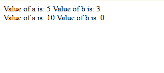
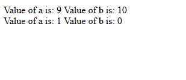

# 如何在 JavaScript 中声明可选的函数参数？

> 原文:[https://www . geesforgeks . org/如何在 javascript 中声明可选函数参数/](https://www.geeksforgeeks.org/how-to-declare-the-optional-function-parameters-in-javascript/)

要在 JavaScript 中声明可选的函数参数，有两种方法:

*   **Using the Logical OR operator (‘||’):**
    In this approach, the optional parameter is Logically ORed with the default value within the body of the function.

    **注意:**可选参数应该总是出现在参数列表的末尾。

    **语法:**

    ```
    function myFunc(a,b) {
      b = b || 0;
      // b will be set either to b or to 0.
    }

    ```

    **例 1:** 在以下程序中，可选参数为**【b】**:

    ```
    <script>
        function check(a, b) {
            b = b || 0;
            document.write("Value of a is: " + a +
                           " Value of b is: " + b +
                           "<br>");
        }
        check(5, 3);
        check(10); 
    </script>
    ```

    **输出:**
    

*   **Using the Assignment operator (“=”):**
    In this approach the optional variable is assigned the default value in the declaration statement itself.

    **注意:**可选参数应该总是出现在参数列表的末尾。

    **语法:**

    ```
    function myFunc(a, b = 0) {
       // function body
    }
    ```

    **例 2:** 在以下程序中，可选参数为**【b】**:

    ```
    <script>
        function check(a, b = 0) {
            document.write("Value of a is: " + a + 
                           " Value of b is: " + b + 
                           "<br>");
        }
        check(9, 10);
        check(1); 
    </script>
    ```

    **输出:**
    