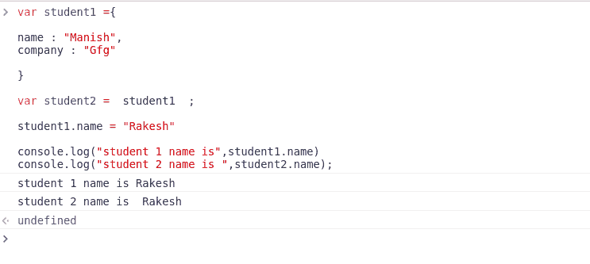
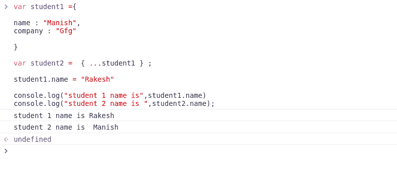
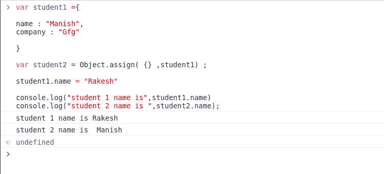
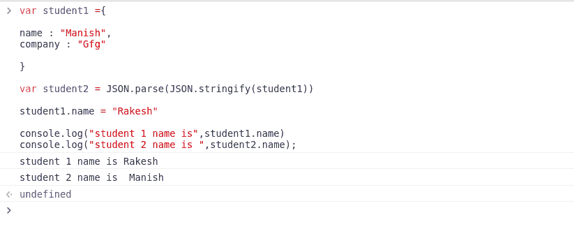

# 如何在 JavaScript 中深度克隆？

> 原文:[https://www . geesforgeks . org/how-deep-clone-in-JavaScript/](https://www.geeksforgeeks.org/how-to-deep-clone-in-javascript/)

一般来说，克隆意味着将一个值复制到另一个值。在 JavaScript 中，我们进行克隆，即使用 JavaScript 将一个值复制到另一个值。更准确地说，它们是 JavaScript 中的两种克隆。作为一名程序员，他/她可能是初学者或老手，他/她应该能够知道深度克隆和浅层克隆之间的区别。由于本文是关于深度克隆的，我们将详细研究深度克隆。克隆是一个可以发生在任何数据类型中的概念，即它可能是一种原始数据类型(如字符串、数字)或复合数据类型(如数组和 JavaScript)。所以为了掌握它，我们需要明确基础。
**深度克隆:**深度克隆是一种技术，每当我们克隆数组时，都会使用它来复制一切，JavaScript 就是为了避免数据丢失。

**示例 1:** 如本例所示，如果我们更改一个对象值，数据就会损坏，然后它会反映在其他对象中，这也是我们使用深度克隆来避免此问题的原因。

## java 描述语言

```
<script>
    var student1 ={
        name : "Manish",
        company : "Gfg"

    }

    var student2 =  student1  ;

    student1.name = "Rakesh"

    console.log("student 1 name is",student1.name)
    console.log("student 2 name is ",student2.name);
</script>
```

**输出:**



**示例 2:** 使用扩展运算符

## java 描述语言

```
<script>
    var student1 ={ 
    name : "Manish",
    company : "Gfg"

    }

    var student2 =  { ...student1 } ;

    student1.name = "Rakesh"

    console.log("student 1 name is",student1.name)
    console.log("student 2 name is ",student2.name);
</script>
```

**输出:**



**示例 3:** 使用对象分配()

## java 描述语言

```
<script>
    var student1 ={
    name : "Manish",
    company : "Gfg"
    }

    var student2 = Object.assign( {} ,student1) ;

    student1.name = "Rakesh"

    console.log("student 1 name is",student1.name)
    console.log("student 2 name is ",student2.name);
</script>
```

**输出:**



**示例 4:** 使用 Json.parse 和 Json.stringify

## java 描述语言

```
<script>
    var student1 ={
    name : "Manish",
    company : "Gfg"

    }

    var student2 = JSON.parse(JSON.stringify(student1))

    student1.name = "Rakesh"

    console.log("student 1 name is",student1.name)
    console.log("student 2 name is ",student2.name);
</script>
```

**输出:**



**结论:**我们可以使用所有这些方法来确保数据是安全的，并且当我们在一个对象中改变时不会发生突变。