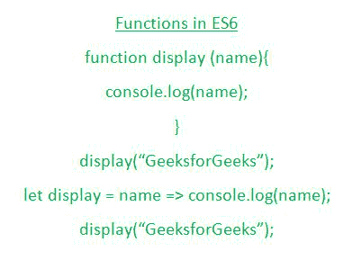

# 如何在 ES6 中定义一个函数？

> 原文:[https://www . geesforgeks . org/如何定义 es6 中的函数/](https://www.geeksforgeeks.org/how-to-define-a-function-in-es6/)

在本文中，我们将尝试理解与函数定义相关联的基本细节，比如函数的语法声明或者与 ES6 (EcmaScript-6)中不同类型的函数声明相关联的一些示例。

让我们首先了解函数到底是什么，以及如何使用不同的语法在 ES6 中声明函数。



**功能:**

*   函数是 JavaScript 的基本模块之一。
*   它包含用户希望重用或仅在调用该函数时调用的代码行。
*   一个函数可以没有输入参数，也可以有不同数量的参数。
*   一个函数必须有一个返回语句或一个打印语句，当该函数在程序执行过程中被调用时，该语句将被执行。
*   一个函数可以用不同的语法来声明，在上面的图示中很少说明。

以下是可用于在 ES6 中声明函数的一些语法:

**语法 1:** 第一个语法是从开始的 ES 版本到这个 ES6 版本都有效的基本语法。

```
function function_name (list_of_parameters) {
    ...
}
```

如果您希望将函数存储在变量中，那么通过使用以下语法，您可以轻松地做到这一点。

```
let variable = function (list_of_parameters) {
    ...
}
```

**语法 2:** 现在声明一个函数的另一个语法是 Arrow 函数语法，如下所述，调用这些特定类型的函数与前面类型的函数一样简单，它只是写名字后面跟圆括号，包括参数(如果有的话)(比如这个 display(name)等等)。

```
let variable = (list_of_parameters) => {
    ...
}
```

即使我们不想写圆括号，我们也可以使用下面的语法。

```
let variable = parameters => {
    ...
}
```

现在我们已经分析了谁在 ES6 中编写了一个函数，让我们引用一些例子来帮助我们更好更有效地理解函数声明。

**示例 1:** 在本例中，我们将看到正常的函数声明。

## java 描述语言

```
<script>
    function squareOfNumber(number) {
        return number * number;
    }

    console.log(squareOfNumber(5));
    console.log(squareOfNumber(14));
    console.log(squareOfNumber(19));
</script>
```