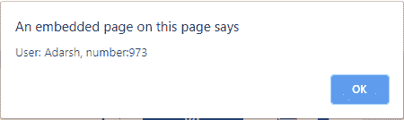
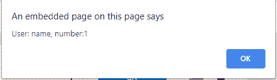

# jsdoc 中如何描述“对象”参数？

> 原文:[https://www . geesforgeks . org/how-description-object-arguments-in-jsdoc/](https://www.geeksforgeeks.org/how-to-describe-object-arguments-in-jsdoc/)

JSDoc 中有各种不同的方式来描述**“对象”**参数。在本文中，我们将探讨 4 种不同的方法，每种方法都有各自的用途。

1.  **To document objects with specified properties:**

    **语法:**

    ```
    /**
     * @param {{a: string, b: number}} Obj description
     */

    ```

    对于只用作给定方法**的参数而不需要进一步记录每个属性的**的对象，该语法是一个很好的实践。这个*也可以*用于**@退货**。

    **示例:**

    ```
    <html>

    <head>
        <title>
            GeeksforGeeks
        </title>
    </head>

    <body>
        <center>
            <h1 style="color:green">
              GeeksforGeeks
          </h1>
            <button onclick="Hello(a, b)">
              Hello
          </button>
            <script>
                /**
                 * @param {{a: string, b: number}} obj User information
                 */
                function Hello(a, b) {
                    alert('User: ' + a + ', number:' + b);
                };
                var a = "Adarsh";
                var b = 973;
            </script>
        </center>
    </body>

    </html>
    ```

    **输出:**
    **前:**
    
    **后:**
    

2.  **To document objects with specified properties (type 2):**

    **语法:**

    ```
    /**
     * @param {Object} Obj  Description
     * @param {string} Obj.a  Description
     * @param {number} Obj.b  Description
     */

    ```

    这种语法对于只用作给定方法**和**的参数的对象来说是一种很好的做法，它们需要每个属性的进一步文档。这个*不能用于**@退货**。*

    **示例:**

    ```
    <html>

    <head>
        <title>
            GeeksforGeeks
        </title>
    </head>

    <body>
        <center>
            <h1 style="color:green">
              GeeksforGeeks
          </h1>
            <button onclick="Hello(a, b)">
              Hello
          </button>
            <script>
                /**
                 * @param {Object} Obj  User information
                 * @param {string} Obj.a  name of user
                 * @param {number} Obj.b  number of user
                 */
                function Hello(a, b) {
                    alert('User: ' + a + ', number:' + b);
                };
                var a = "name";
                var b = 001;
            </script>
        </center>
    </body>

    </html>
    ```

    **输出:**
    **前:**
    
    **后:**
    

3.  **To document objects that will be used more than once in source:**
    **@typedef** is useful in this situation. Once the *type* is defined in source, you can use it as a type for JSDoc tags like **@param** or **@returns** that make use of a *type*.

    **语法:**

    ```
    /**
     * @typedef {Object} Person
     * @property {number} age Length of time the person has lived
     * @property {string} name The word by which the person is addressed
     */

    ```

    也可用于@param 标记:

    **语法:**

    ```
    /**
     * @param {Person} p - Description of p
     */

    ```

    也可以用在@returns 标记中:

    **语法:**

    ```
    /**
     * @returns {Person} Description
     */

    ```

    **示例:**

    ```
    <!DOCTYPE html>
    <html>

    <body>
        <center>
            <h1 style="color:green">
              GeeksforGeeks
          </h1>
            <button onclick="Hello()">
              Hello
          </button>
            <p id="demo"></p>

            <script>
               /**
                * @typedef {Object} Person
                * @property {number} age Length of time the person has lived
                * @property {string} name The word by which the person is addressed
                */
               function Hello() {
                   document.getElementById(
                     "demo").innerHTML = person.name + " " + person.age;
               }
               var person = {
                   name: "John",
                   lastName: "Doe",
                   age: 50,
               };
           </script>
       </center>

    </body>

    </html>
    ```

    **输出:**
    **前:**
    
    **后:**
    

4.  **To document objects that have values of the same type:**

    **语法:**

    ```
    /**
     * @param {Object.} Dict
     */

    ```

    对于值都是相同类型的对象，此语法是一种很好的做法。在这种情况下，第一种类型，即字符串，描述了始终保持字符串类型的 JavaScript 属性的类型(**键**)。第二种类型，即数字，描述了值的类型，它可以是任何类型。

    这个*也可以*用于**@返回**。