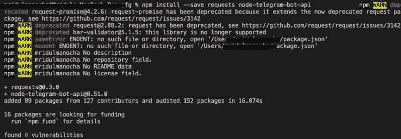
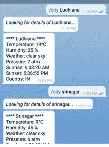

# 如何用 JavaScript 设计电报中的天气机器人？

> 原文:[https://www . geesforgeks . org/how-to-design-a-weather-bot-in-telegram-use-JavaScript/](https://www.geeksforgeeks.org/how-to-design-a-weather-bot-in-telegram-using-javascript/)

电报机器人可以用来了解任何城市、州、国家的完整天气细节，而无需使用其他应用程序。Telegram 提供了一堆 API 方法来执行不同的功能。您可以使用电报机器人应用编程接口创建一个聊天机器人，该机器人根据发送给机器人的参数和命令返回关于城市、州或国家的天气信息。

**先决条件:**

1.  了解 JavaScript 和设置节点环境。
2.  节点的最新版本(版本> 10)
3.  npm 的最新版本(版本> 6)

用于检查系统中是否存在节点和 npm 的命令:

```
$ npm --v
6.14.5

$ node --version
v10.15.0
```

**创建机器人并获取 API 令牌:**

*   打开电报应用，搜索@ BotFather。
*   点击开始按钮或发送/开始。
*   然后发送“/newbot”消息来设置名称和用户名。
*   然后，机器人父亲会给你一个应用编程接口令牌。

**获取天气 API 密钥:**

*   去[打开天气图](https://home.openweathermap.org/users/sign_up)网站。
*   根据限额创建账户。
*   您将收到自己的应用编程接口密钥。
*   如果您想使用不同的参数而不是城市名称，请阅读文档。

**模块安装:**

安装**请求**和**节点-电报-bot-api** (Node.js 模块与官方电报 Bot API 交互)

```
$ npm install --save requests node-telegram-bot-api
```



**文件名:weather.js**

## java 描述语言

```
// Requiring modules
var TelegramBot = require('node-telegram-bot-api')
var request = require('request')

// Token obtained from bot father
var token = "YOUR_TELEGRAM_BOT_TOKEN"

var bot = new TelegramBot(token, { polling: true });

// Create a bot that uses 'polling' to
// fetch new updates
bot.on("polling_error", (err) => console.log(err));

// The 'msg' is the received Message from user and
// 'match' is the result of execution above
// on the text content
bot.onText(/\/city (.+)/, function (msg, match) {

    // Getting the name of movie from the message
    // sent to bot
    var city = match[1];
    var chatId = msg.chat.id
    var query =
'http://api.openweathermap.org/data/2.5/weather?q='
        + city + '&appid=YOUR_WEATHER_API_KEY'

    // Key obtained from openweathermap API
    request(query, function (error, response, body) {

        if (!error && response.statusCode == 200) {

            bot.sendMessage(chatId,
                '_Looking for details of_ ' + city
                + '...', { parse_mode: "Markdown" })
                .then(msg) {
                res = JSON.parse(body)
                var temp = Math.round((parseInt(
                    res.main.temp_min) - 273.15), 2)

                // Kelvin to celsius and then round
                // off and conversion to atm
                var pressure = Math.round(parseInt(
                        res.main.pressure) - 1013.15)

                var rise = new Date(parseInt(
                        res.sys.sunrise) * 1000);

                var set = new Date(parseInt(
                        res.sys.sunset) * 1000);
                // Unix time to IST time conversion

                bot.sendMessage(chatId, '**** '
                    + res.name + ' ****\nTemperature: '
                    + String(temp) + '°C\nHumidity: ' +
                    res.main.humidity + ' %\nWeather: '
                    + res.weather[0].description +
                    '\nPressure: ' + String(pressure)
                    + ' atm\nSunrise: ' +
                    rise.toLocaleTimeString() +
                    ' \nSunset: ' +
                    set.toLocaleTimeString() +
                    '\nCountry: ' + res.sys.country)
            }

            // Sending back the response from
            // the bot to user. The response
            // has many other details also
            // which can be used or sent as
            // per requirement
        }
    })
})
```

**运行程序的步骤:**使用以下命令运行 **weather.js** 文件:

```
$ node weather.js
```

去你的机器人那里输入**/城市城市名**看看结果。

**输出:**



利用电报机器人获取天气信息