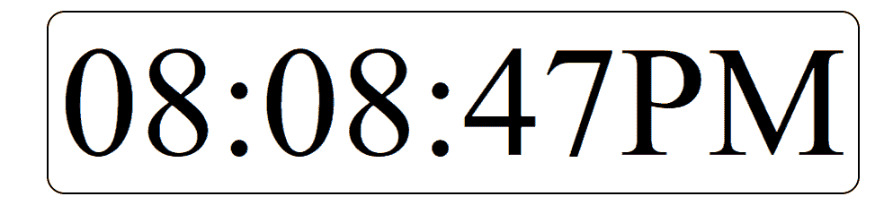

# 如何用 JavaScript 设计数字钟？

> 原文:[https://www . geesforgeks . org/how-design-digital-clock-use-JavaScript/](https://www.geeksforgeeks.org/how-to-design-digital-clock-using-javascript/)

如果使用得当，时钟对于任何用户界面都是有用的元素。时钟可以用在主要关注时间的网站上，比如一些订票网站或一些显示火车、公共汽车、航班等到达时间的应用程序。时钟基本上有两种，模拟和数字。我们将考虑制作一个数字化的。

**方法:**方法是使用*日期*对象获取每秒
的时间，然后使用我们通过每秒调用相同函数获取的*新*时间在浏览器上重新渲染时间。

**HTML 代码:**在本节中，我们有一个包装在“div”标签中的“HH:MM:SS”格式的虚拟时间。

```html
<!DOCTYPE html>
<html lang="en">
<head>
    <meta charset="UTF-8">
    <meta name="viewport" content=
      "width=device-width, initial-scale=1.0">
    <title>Digital Clock</title>
    <link rel="stylesheet" href="clock2.css">
</head>
<body>
    <div id="clock">8:10:45</div>

    <script src="clock2.js"></script>
</body>
</html>
```

**CSS 代码:**对于 CSS，我们刚刚将时钟对准了页面的中心。除此之外，只是一些*字号*和*宽度*，你可以根据自己的需要进行调整。

```html
#clock {
  font-size: 175px;
  width: 900px;
  margin: 200px;
  text-align: center;
  border: 2px solid black;
  border-radius: 20px;
}
```

**JavaScript 代码:**对于 JavaScript，请遵循下面给出的步骤。

*   **步骤 1:** 创建一个函数“showTime”。
*   **步骤 2:** 创建一个**日期**对象的实例。
*   **第三步:**使用**日期**对象的方法得到“小时”、“分钟”和“秒”。
*   **第 4 步:**根据小时值设置 AM/PM。*日期*对象以 24 小时格式工作，所以当它大于 12 时，我们将小时改回 1。上午/下午也随之改变。
*   **第 5 步:**现在使用相同的 HH:MM:SS 格式制作一个字符串，用这些值改变小时、分钟和秒的值，我们从 *Date* 对象方法中得到。
*   **步骤 6:** 现在使用 *innerHTML* 属性替换“div”中的字符串变量。
*   **第七步:**使用*设置间隔()*方法，将时间间隔设置为 1000 毫秒，等于 1s。
*   **第 8 步:**现在调用末尾的函数，在精确的重新加载/渲染时间开始函数，因为 *setInterval()* 将在渲染 1s 后首先调用。

**注意:**可以使用网上提供的数字字体，让时钟看起来更漂亮。为此，您必须将它们的文件下载到您的项目中，然后使用“font-face”属性来使用该自定义字体。

```html
setInterval(showTime, 1000);
function showTime() {
    let time = new Date();
    let hour = time.getHours();
    let min = time.getMinutes();
    let sec = time.getSeconds();
    am_pm = "AM";

    if (hour > 12) {
        hour -= 12;
        am_pm = "PM";
    }
    if (hour == 0) {
        hr = 12;
        am_pm = "AM";
    }

    hour = hour < 10 ? "0" + hour : hour;
    min = min < 10 ? "0" + min : min;
    sec = sec < 10 ? "0" + sec : sec;

    let currentTime = hour + ":" 
            + min + ":" + sec + am_pm;

    document.getElementById("clock")
            .innerHTML = currentTime;
}
showTime();
```

**完整代码:**是以上三段代码的组合。

```html
<!DOCTYPE html>
<html lang="en">

<head>
    <meta charset="UTF-8" />
    <meta name="viewport" content=
        "width=device-width, 
        initial-scale=1.0" />

    <title>Digital Clock</title>

    <style>
        #clock {
            font-size: 175px;
            width: 900px;
            margin: 200px;
            text-align: center;
            border: 2px solid black;
            border-radius: 20px;
        }
    </style>
</head>

<body>
    <div id="clock">8:10:45</div>

    <script>
        setInterval(showTime, 1000);
        function showTime() {
            let time = new Date();
            let hour = time.getHours();
            let min = time.getMinutes();
            let sec = time.getSeconds();
            am_pm = "AM";

            if (hour > 12) {
                hour -= 12;
                am_pm = "PM";
            }
            if (hour == 0) {
                hr = 12;
                am_pm = "AM";
            }

            hour = hour < 10 ? "0" + hour : hour;
            min = min < 10 ? "0" + min : min;
            sec = sec < 10 ? "0" + sec : sec;

            let currentTime = hour + ":" 
                + min + ":" + sec + am_pm;

            document.getElementById("clock")
                .innerHTML = currentTime;
        }

        showTime();
    </script>
</body>

</html>
```

**输出:**


CSS 是网页的基础，通过设计网站和网络应用程序用于网页开发。你可以通过以下 [CSS 教程](https://www.geeksforgeeks.org/css-tutorials/)和 [CSS 示例](https://www.geeksforgeeks.org/css-examples/)从头开始学习 CSS。