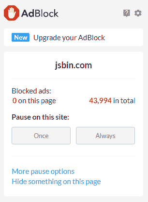
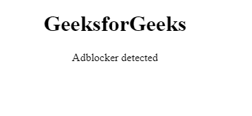
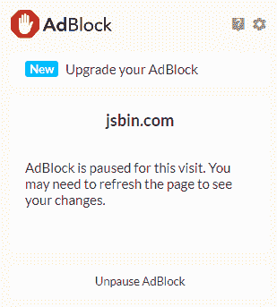
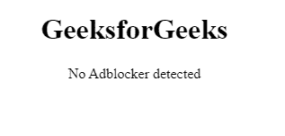
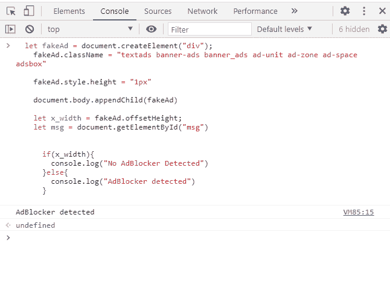

# 如何用 JavaScript 检测 Adblocker？

> 原文:[https://www . geesforgeks . org/如何检测-adblocker-使用-javascript/](https://www.geeksforgeeks.org/how-to-detect-adblocker-using-javascript/)

在本文中，我们将使用 JavaScript 开发一个 adblocker 检测器。广告拦截器是一个扩展，用于拦截网站提供的广告。广告拦截器拦截 DOM 和包含显示广告代码的脚本。广告拦截器有大量的阻止列表文件名数据，广告拦截器检测网站是否正在使用其中的任何文件，它限制该文件下载，因此广告脚本不会加载。 [easylist.text](https://easylist-downloads.adblockplus.org/easylist.txt) 是一个庞大的阻止列表列表，包含了大部分的 adblocking 文件名。

根据一项调查，10%的人使用广告拦截器浏览任何广告。这意味着网站的收入减少了 10%。这对于单纯依靠广告的网站来说是可悲的，他们中的一些人使用广告拦截器检测脚本，并限制用户在不禁用广告拦截器的情况下进入网站(但从搜索引擎优化的角度来看，这是一个坏主意)。

**使用诱饵脚本检测 adblocker】在这个方法中，你必须创建一个名为 *ad-zone* **的 *div* 。**使 div 为 1px 高度。现在写一个脚本，检查父级 *div* 的偏移*高度*是否为零，那么用户正在使用一个广告拦截器。adblocker 阻止了 *div* 渲染，因此偏移高度变为零。如果 *div* 的偏移高度保持不变，则浏览器中不存在 adblocker。原因是类名*ad-zone***ad blocker 用来检查哪个元素的类名看起来像 ad。****

**easylist.text 中有大量这样的类名。每个 adblocker 都有自己的一组将要被阻塞的类名，这就是为什么我们不应该只依赖一个类名。一些常见的类名是*文本广告、横幅广告、横幅广告、广告单元、广告区、广告空间*，它们被广告拦截器检测到用于广告。**

****示例:****

## **超文本标记语言**

```
<!DOCTYPE html>
<html>
<head>

  <style>
    .ad-zone{
      height: 10px;
    }
  </style>

</head>
<body>
  <h1>
    <center>GeeksforGeeks</center>
  </h1>
  <center>
    <p id="msg">checking for adblocker...</p>

  </center>

  <div 
     class="ad-zone ad-space ad-unit textads banner-ads banner_ads">
  </div>

</body>
</html>
```

## **java 描述语言**

```
let x = document.querySelector(".ad-zone");
   let x_height = x.offsetHeight;
   let msg = document.getElementById("msg")

   if(x_height){
     msg.innerText = "No Adblocker detected"
   } else{
     msg.innerText = "Adblocker detected"
}
```

****输出:****

*   **我们正在 jsbin.com 上运行我们的代码，并使用扩展 AdBlock。当 adblocker 运行时，可以看到以下输出。**

    ** **

*   **当 jsbin.com 关闭 adblocker 时，可以看到以下输出。**

    ** **

****例 2:** 以下代码可以在<脚本>标签下的任何网页中使用。**

## **java 描述语言**

```
let fakeAd = document.createElement("div");
  fakeAd.className = 
  "textads banner-ads banner_ads ad-unit ad-zone ad-space adsbox"

  fakeAd.style.height = "1px"

  document.body.appendChild(fakeAd)

  let x_width = fakeAd.offsetHeight;
  let msg = document.getElementById("msg")

    if(x_width){
      console.log("No AdBlocker Detected")
    }else{
      console.log("AdBlocker detected")
    }
```

****输出:**您可以将此代码粘贴到任何浏览器控制台中，也可以在*脚本*标签中使用。**

**

adblock 检测器**