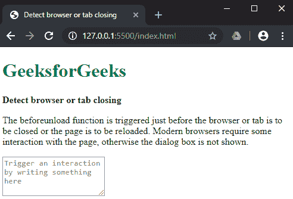
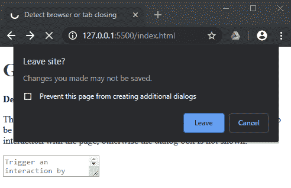

# 如何在 JavaScript 中检测浏览器或标签页关闭？

> 原文:[https://www . geesforgeks . org/如何检测-浏览器-或-tab-关闭-在 javascript 中/](https://www.geeksforgeeks.org/how-to-detect-browser-or-tab-closing-in-javascript/)

使用 beforeunload 事件可以检测到浏览器中的选项卡或窗口关闭。这可用于在页面上的某些数据未保存，或者用户通过关闭选项卡或浏览器错误地导航离开当前页面的情况下提醒用户。

addEventListener()方法用于在特定事件发生时设置函数。beforeunload 事件就在要卸载窗口及其资源之前激发。触发此事件时，网页可见，此时事件仍可取消。

事件处理程序应该调用 preventDefault()来根据规范显示确认对话框。如果用户希望继续到新页面，则导航到新页面，否则导航被取消。但是，较旧的浏览器可能不支持此方法，并且使用了一种遗留方法，其中事件处理程序必须返回一个字符串。这个返回的字符串可以是空的。

一些浏览器可能决定不显示任何确认框，除非用户已经与页面交互。这用于防止不需要的或恶意的网站创建不必要的弹出窗口。用户可能必须与页面交互才能看到确认消息。

此方法适用于检测选项卡何时关闭或浏览器何时关闭。

**语法:**

```
window.addEventListener('beforeunload', function (e) {
    e.preventDefault();
    e.returnValue = '';
});

```

**示例:**

```
<!DOCTYPE html>
<html>

<head>
    <title>
        How to detect browser or tab closing
    </title>
</head>

<body>
    <h1 style="color: green">
        GeeksforGeeks
    </h1>

    <b>Detect browser or tab closing</b>

    <p>
        The beforeunload function is triggered
        just before the browser or tab is to be
        closed or the page is to be reloaded.
        Modern browsers require some interaction
        with the page, otherwise the dialog box
        is not shown.
    </p>

    <form>
        <textarea placeholder = "Trigger an 
         interaction by writing something here">
        </textarea>
    </form>

    <script type="text/javascript">
        window.addEventListener('beforeunload', function (e) {
            e.preventDefault();
            e.returnValue = '';
        });
    </script>
</body>

</html>                    
```

**输出:**

*   **导航标签前:**
    
*   **尝试导航离开页面后:**
    
*   **尝试重新加载页面后:**
    
*   **尝试关闭浏览器后:**
    

JavaScript 最出名的是网页开发，但它也用于各种非浏览器环境。您可以通过以下 [JavaScript 教程](https://www.geeksforgeeks.org/javascript-tutorial/)和 [JavaScript 示例](https://www.geeksforgeeks.org/javascript-examples/)从头开始学习 JavaScript。