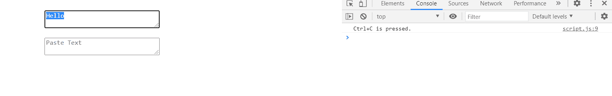
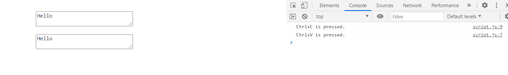

# 如何用 JavaScript 检测复制粘贴命令 Ctrl+V，Ctrl+C？

> 原文:[https://www . geesforgeks . org/how-detect-copy-paste-commands-ctrl LV-ctrlc-using-JavaScript/](https://www.geeksforgeeks.org/how-to-detect-copy-paste-commands-ctrlv-ctrlc-using-javascript/)

为了检测带有“Ctrl”的组合键，我们使用了*向下键*事件的 *ctrl* 属性。当按键事件被触发时，它返回一个“布尔值”来判断“ctrl”是否被按下。

**语法:**

```html
event.ctrlKey
```

**返回值:**

*   **真:**按下“ctrl”时。
*   **假:**未按“ctrl”时。

**HTML 代码:**下面是文件“index.html”检测“Ctrl+C”和“Ctrl+V”组合的代码。

## 超文本标记语言

```html
<!DOCTYPE html>
<html lang="en">

<head>
    <meta charset="UTF-8">
    <meta name="viewport" content=
        "width=device-width, initial-scale=1.0">
    <meta http-equiv="X-UA-Compatible" content="ie-edge">
    <link rel="stylesheet" href="style.css">
</head>

<body>
    <div class="container">
        <textarea cols="30" row="5" 
            placeholder="Enter Text">
        </textarea>

        <textarea cols="30" row="5" 
            placeholder="Paste Text">
        </textarea>
    </div>

    <script src="script.js"></script>
</body>

</html>
```

**CSS 代码:**下面的代码演示了上面 HTML 文件中使用的文件“style.css”。

```html
.container{
   display: flex;
   flex-direction: column;
   align-items: center;
}

textarea{
   margin-top: 20px;
}
```

**Javascript 代码:**下面演示了上述 HTML 文件中使用的文件“script.js”的代码。

## java 描述语言

```html
document.body.addEventListener("keydown", function (ev) {

    // function to check the detection
    ev = ev || window.event;  // Event object 'ev'
    var key = ev.which || ev.keyCode; // Detecting keyCode

    // Detecting Ctrl
    var ctrl = ev.ctrlKey ? ev.ctrlKey : ((key === 17)
        ? true : false);

    // If key pressed is V and if ctrl is true.
    if (key == 86 && ctrl) {
        // print in console.
        console.log("Ctrl+V is pressed.");
    }
    else if (key == 67 && ctrl) {

        // If key pressed is C and if ctrl is true.
        // print in console.
        console.log("Ctrl+C is pressed.");
    }

}, false);
```

**输出:**

*   **按 Ctrl+C 时:**
    
*   **按 Ctrl+V 时:**
    