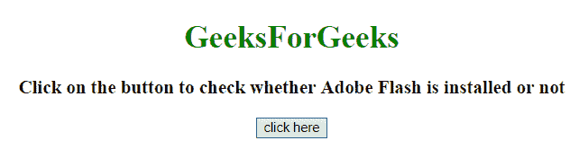
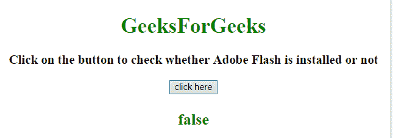
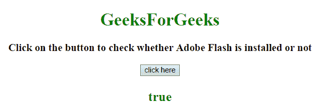

# 如何使用 JavaScript 检测 flash 是否安装？

> 原文:[https://www . geesforgeks . org/如何检测 flash 是安装还是不使用 javascript/](https://www.geeksforgeeks.org/how-to-detect-flash-is-installed-or-not-using-javascript/)

任务是在 JavaScript 的帮助下检测用户是否安装了 Adobe Flash 播放器。我们将讨论 2 个技巧。

**进场:**

*   创建**冲击波闪光。冲击波闪光**物体。
*   如果实例的值为真，则安装闪存。
*   如果出现任何错误，使用 **navigator.mimetypes 属性**了解闪存是否已安装。

**示例 1:** 本示例检查闪存播放器是否安装。

```
<!DOCTYPE HTML>
<html>

<head>
    <title>
        How to detect flash is installed
        or not using JavaScript ?
    </title>
</head>

<body style="text-align:center;">

    <h1 style="color:green;"> 
        GeeksForGeeks
    </h1>

    <p id="GFG_UP" style=
        "font-size: 19px;font-weight: bold;">
    </p>

    <button onclick="GFG_Fun()">
        click here
    </button>

    <p id="GFG_DOWN" style=
        "color: green; font-size: 24px; font-weight: bold;">
    </p>

    <script>
        var el_up = document.getElementById("GFG_UP");
        var el_down = document.getElementById("GFG_DOWN");

        el_up.innerHTML = "Click on the button to check"+
                " whether Adobe Flash is installed or not";

        var Flash = false;

        function GFG_Fun() {
            try {
                Flash = 
                Boolean(new ActiveXObject('ShockwaveFlash.ShockwaveFlash'));
            } catch (exception) {
                Flash = ('undefined' != typeof navigator.mimeTypes[
                    'application/x-shockwave-flash']);
            }
            el_down.innerHTML = Flash;
        }
    </script>
</body>

</html>
```

**输出:**

*   **点击按钮前:**
    
*   **点击按钮后:**
    

**示例 2:** 本示例检查是否安装了 flash 播放器。

```
<!DOCTYPE HTML>
<html>

<head>
    <title>
        How to detect flash is installed
        or not using JavaScript ?
    </title>
</head>

<body style="text-align:center;">

    <h1 style="color:green;"> 
        GeeksForGeeks
    </h1>

    <p id="GFG_UP" style=
        "font-size: 19px;font-weight: bold;">
    </p>

    <button onclick="GFG_Fun()">
        click here
    </button>

    <p id="GFG_DOWN" style=
        "color: green; font-size: 24px; font-weight: bold;">
    </p>

    <script>
        var el_up = document.getElementById("GFG_UP");

        var el_down = document.getElementById("GFG_DOWN");

        el_up.innerHTML = "Click on the button to check whether"
                + " Adobe Flash is installed or not";
        var Flash = false;

        function GFG_Fun() {
            try {
                var fo = 
                new ActiveXObject('ShockwaveFlash.ShockwaveFlash');

                if (fo) {
                    hasFlash = true;
                }
            } catch (e) {
                if (navigator.mimeTypes && navigator.mimeTypes[
                'application/x-shockwave-flash'] != undefined &&
                    navigator.mimeTypes['application/x-shockwave-flash'
                                    ].enabledPlugin) {
                    hasFlash = true;
                }
            }
            el_down.innerHTML = Flash;
        }
    </script>
</body>

</html>
```

**输出:**

*   **点击按钮前:**
    
*   **点击按钮后:**
    