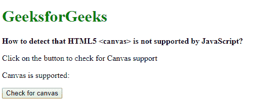

# 如何检测 HTML 5

<canvas>不被 JavaScript 支持？</canvas>

T3】

> 原文:[https://www . geesforgeks . org/如何检测-html-5-canvas-不受 javascript 支持/](https://www.geeksforgeeks.org/how-to-detect-html-5-canvas-is-not-supported-by-javascript/)

**方法 1:创建画布元素并使用 getContext()方法:**画布对象的 **getContext()** 方法用于返回画布元素的绘制上下文。如果不支持上下文标识符，则返回 null。此属性可用于检查画布元素是否受支持，因为不支持 HTML5 的浏览器将返回空值。
首先使用 document.createElement()方法创建一个新的画布元素。getContext()方法用于此画布元素，参数为“2d”。它将检查“二维”渲染上下文的上下文标识符。

若要将返回值转换为布尔值，请使用 double negation(！！)在结果之前使用。这将强制结果转换为布尔值。空值将被转换为假，任何其他非空值将被转换为真。casted 结果可用于检查浏览器中是否支持 HTML 5 画布。

**示例:**

```
<!DOCTYPE html>
<html>

<head>
    <title>
        How to detect HTML 5 canvas is
        not supported by JavaScript?
    </title>
</head>

<body>
    <h1 style="color: green">
        GeeksforGeeks
    </h1>

    <b>
        How to detect that HTML5 <canvas>
        is not supported by JavaScript?
    </b>

    <p>
        Click on the button to check
        for Canvas support
    </p>

    <p>
        Canvas is supported:
        <span class="output"></span>
    </p>

    <button onclick="checkCanvas()">
        Check for canvas
    </button>

    <script type="text/javascript">
        function checkCanvas() {

            canvasElem = document.createElement('canvas');

            isSupported = !!canvasElem.getContext('2d');

            document.querySelector('.output').textContent
                    = isSupported;
        }
    </script>
</body>

</html>
```

**输出:**

*   **点击按钮前:**
    
*   **点击按钮后:**
    

**方法 2:检查 HTMLCanvasElement 接口:****html canvaselement**是一个提供属性和方法来操作画布对象的接口。可以从 window 对象访问该接口，以检查是否支持 canvas 元素。如果返回值为空，则意味着不支持画布元素。

若要将返回值转换为布尔值，请使用 double negation(！！)在结果之前使用。这将强制结果转换为布尔值。空值将被转换为假，任何其他非空值将被转换为真。转换结果可以用来检查浏览器中是否支持 HTML5 画布。

**示例:**

```
<!DOCTYPE html>
<html>

<head>
    <title>
        How to detect HTML 5 canvas is
        not supported by JavaScript?
    </title>
</head>

<body>
    <h1 style="color: green">
        GeeksforGeeks
    </h1>

    <b>
        How to detect that HTML5 <canvas>
        is not supported by JavaScript?
    </b>

    <p>
        Click on the button to check
        for Canvas support
    </p>

    <p>
        Canvas is supported: 
        <span class="output"></span>
    </p>

    <button onclick="checkCanvas()">
        Check for canvas
    </button>

    <script type="text/javascript">

        function checkCanvas() {
            isSupported = !!window.HTMLCanvasElement;

            document.querySelector('.output').textContent
                    = isSupported;
        }
    </script>
</body>

</html>
```

**输出:**

*   **点击按钮前:**
    
*   **点击按钮后:**
    