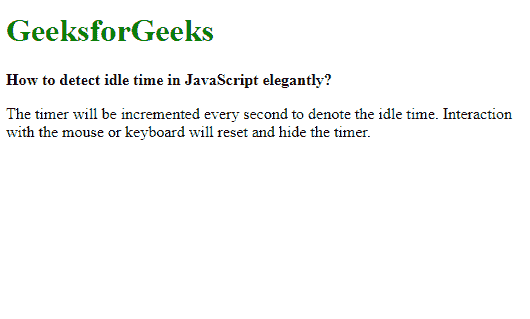
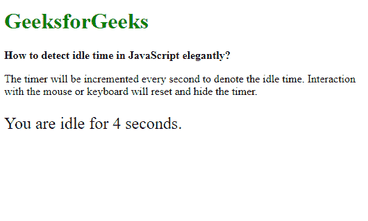

# 如何检测 JavaScript 中的空闲时间？

> 原文:[https://www . geesforgeks . org/如何检测 javascript 中的空闲时间/](https://www.geeksforgeeks.org/how-to-detect-idle-time-in-javascript/)

空闲时间是用户不与网页交互的时间。这种交互可以是移动鼠标、点击页面或使用键盘。可以检测这个时间来执行某些事件，这些事件可能需要在某段空闲时间后发生。

**方法 1:使用 JavaScript:** 对于实现，创建了两个函数，一个是每当检测到用户交互时重置计时器的函数，另一个是在用户空闲期间将定期执行的函数。复位功能由**设置间隔()**功能组成，用于创建一个新的间隔，该间隔将重复调用另一个功能。创建的计时器被分配给一个变量，每当在用户交互中再次调用该函数时，该变量将用于清除旧计时器。

通过将其绑定到导致与页面交互的事件来调用该函数。这些方法包括 onload、onmousemove、onmousedown、ontouchstart、onclick 和 onkeypress。

当用户空闲时将调用的另一个功能可用于记录时间，并在用户长时间不活动时执行操作。这方面的一个例子是，当用户处于非活动状态超过指定时间时，将其注销。

**示例:**

```
<!DOCTYPE html>
<html>

<head>
    <title>
        How to detect idle
        time in JavaScript ?
    </title>
</head>

<body>
    <h1 style="color:green">
        GeeksforGeeks
    </h1>

    <b>
        How to detect idle time in
        JavaScript elegantly?
    </b>

    <p>
        The timer will be incremented every
        second to denote the idle time.
        Interaction with the mouse or
        keyboard will reset and hide the timer.
    </p>

    <p class="timertext" 
        style="font-size: 1.5rem;">
        You are idle for
        <span class="secs"></span> seconds.
    </p>

    <script type="text/javascript">
        let timer, currSeconds = 0;

        function resetTimer() {

            /* Hide the timer text */
            document.querySelector(".timertext")
                    .style.display = 'none';

            /* Clear the previous interval */
            clearInterval(timer);

            /* Reset the seconds of the timer */
            currSeconds = 0;

            /* Set a new interval */
            timer = 
                setInterval(startIdleTimer, 1000);
        }

        // Define the events that
        // would reset the timer
        window.onload = resetTimer;
        window.onmousemove = resetTimer;
        window.onmousedown = resetTimer;
        window.ontouchstart = resetTimer;
        window.onclick = resetTimer;
        window.onkeypress = resetTimer;

        function startIdleTimer() {

            /* Increment the
                timer seconds */
            currSeconds++;

            /* Set the timer text
                to the new value */
            document.querySelector(".secs")
                .textContent = currSeconds;

            /* Display the timer text */
            document.querySelector(".timertext")
                .style.display = 'block';
        }
    </script>
</body>

</html>
```

**输出:**

*   **与页面交互后:**
    
*   **不与页面交互后:**
    

**方法 2:使用 jQuery:** 它类似于上面的方法，但是这里并不是每次检测到用户交互时都会创建一个新的计时器。相反，只要检测到用户交互，运行计时器就会重置为 0。对于该实现，创建了两个功能，一个是每当检测到用户交互时将计时器重置为 0 的功能，另一个是在用户空闲期间周期性执行的功能。
定义了一个新变量，该变量将全局表示空闲计时器的当前时间。

使用 document.ready()事件，创建一个带有 **setInterval()** 函数的计时器，该计时器重复调用另一个函数，该函数处理当用户空闲指定时间时将发生的事情。reset 函数由一个简单的语句组成，该语句将计时器变量的值更改为 0，从而有效地重置当前空闲时间。通过将其绑定到导致与页面交互的事件来调用该函数。这些方法包括 onload、onmousemove、onmousedown、ontouchstart、onclick 和 onkeypress。

**示例:**

```
<!DOCTYPE html>
<html>

<head>
    <title>
        How to detect idle
        time in JavaScript ?
    </title>

        <script src=
"https://code.jquery.com/jquery-3.4.1.min.js">
    </script>
</head>

<body>
    <h1 style="color: green">
        GeeksforGeeks
    </h1>

    <b>
        How to detect idle time in
        JavaScript elegantly?
    </b>

    <p>
        The timer will be incremented every 
        second to denote the idle time.
        Interaction with the mouse or keyboard
        will reset and hide the timer.
    </p>

    <p class="timertext"
        style="font-size: 1.5rem;">
        You are idle for
        <span class="secs"></span> seconds.
    </p>

    <script type="text/javascript">
        var currSeconds = 0;

        $(document).ready(function() {

            /* Increment the idle time
                counter every second */
            let idleInterval =
                setInterval(timerIncrement, 1000);

            /* Zero the idle timer
                on mouse movement */
            $(this).mousemove(resetTimer);
            $(this).keypress(resetTimer);
        });

        function resetTimer() {

            /* Hide the timer text */
            document.querySelector(".timertext")
                .style.display = 'none';

            currSeconds = 0;
        }

        function timerIncrement() {
            currSeconds = currSeconds + 1;

            /* Set the timer text to
                the new value */
            document.querySelector(".secs")
                .textContent = currSeconds;

            /* Display the timer text */
            document.querySelector(".timertext")
                .style.display = 'block';
        }
    </script>
</body>

</html>
```

**输出:**

*   **与页面交互后:**
    
*   **不与页面交互后:**
    