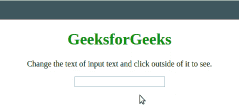
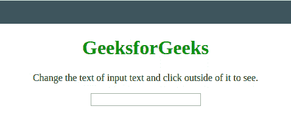

# 如何使用 JavaScript 检测文本框内容是否有变化？

> 原文:[https://www . geesforgeks . org/如何使用 javascript 检测文本框内容是否已更改/](https://www.geeksforgeeks.org/how-to-detect-if-textbox-content-has-changed-using-javascript/)

任务是用 JavaScript 检测文本框内容的变化。下面讨论两种方法。

**方法 1:** 我们将在输入元素中使用 [**onchange 事件**](https://www.geeksforgeeks.org/html-onchange-event-attribute/) 并调用一个函数来查看效果。

*   **例:**

    ```html
    <!DOCTYPE html>
    <html>

    <head>
        <title>
            Detect If Textbox content has
            changed using pure JavaScript
        </title>
    </head>

    <body style="text-align:center;">
        <h1 style="color:green;"> 
          GeeksforGeeks 
        </h1>
        <p>
          Change the text of input text
          and click outside of it to see.
        </p>
        <input id="input" name="input"
               onchange="GFG_Fun()" />
        <br>
        <br>
        <script>
            function GFG_Fun() {
                alert('Changed');
            }
        </script>
    </body>

    </html>
    ```

*   **输出:** 

**方法 2:** 很少有其他事件可以用来检测文本框内容的变化。在输入元素中使用其中任意或全部 [**onchange 事件**](https://www.geeksforgeeks.org/html-onchange-event-attribute/) 、  、 [**onkeyup 事件**](https://www.geeksforgeeks.org/html-dom-onkeyup-event/) 、 [**onpaste 事件**](https://www.geeksforgeeks.org/html-onpaste-event-attribute/) 和 [**oninput 事件**](https://www.geeksforgeeks.org/html-oninput-event-attribute/) 并调用函数查看效果。

*   **例:**

    ```html
    <!DOCTYPE html>
    <html>

    <head>
        <title>
            Detect If Textbox content has 
            changed using pure JavaScript
        </title>
    </head>

    <body style="text-align:center;">
        <h1 style="color:green;">  
          GeeksforGeeks  
        </h1>
        <p> 
          Change the text of input text and
          click outside of it to see.
        </p>
        <input id="input" name="input"
               onchange 
               onpropertychange 
               onkeyuponpaste oninput="GFG_Fun()" />
        <br>
        <br>
        <script>
            function GFG_Fun() {
                alert('Changed');
            }
        </script>
    </body>

    </html>
    ```

*   **输出:** 