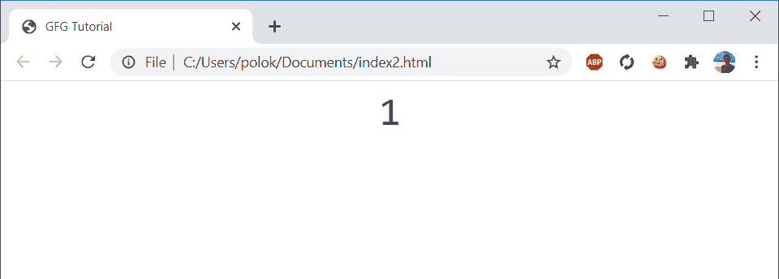
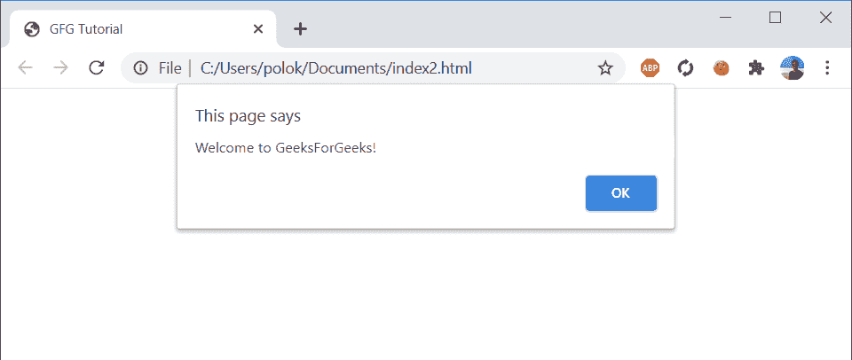
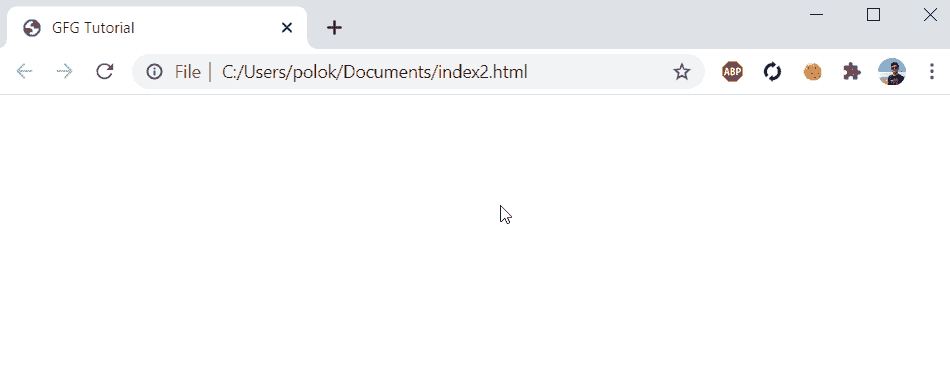

# 如何用 JavaScript 检测按键？

> 原文:[https://www . geesforgeks . org/如何使用 javascript 检测按键/](https://www.geeksforgeeks.org/how-to-detect-keypress-using-javascript/)

在本文中，键盘检测是使用 HTML 和 CSS 执行的。
**HTML** 代表“超文本标记语言”。HTML 语言帮助开发人员为 web 应用程序创建和设计网页元素，如链接、节、段落、标题和块引用。

**CSS** 代表“层叠样式表”。级联样式表用于设计网页布局。样式被定义为给表格、大小和文本赋予样式。

**JavaScript** 是一种在客户端和服务器端使用的脚本编程语言，它使得网页之间可以对话和交流。
上述所有技术都用于实现按键检测。
像 **Atom** 或**崇高文本**这样的程序编辑器应用程序可以用来编译程序。

**示例:**
为以下代码创建一个*index.html*文件。

```html
<html>
<head>   
     <link rel="stylesheet" type="text/css"
     href="main.css">
    <script type="text/javascript" src="main.js">
    </script>
</head>
<body>
    <div id="demo"></div>
</body>
</html>
```

对于上面的 HTML 代码，我们需要包含 *main.css* 和 *main.js*

**CSS 代码:**以下代码写在 *main.css* 文件中。

```html
body
{
    font-family: monospace, arial;
    font-size: 38px;
    text-align: center;
}
```

**JavaScript 代码:**以下代码写在 *main.js* 文件中。

```html
window.onload = function(){
    var demo = document.getElementById('demo');
    var value = 0;
    var space_bar = 32;
    var right_arrow = 39;

    window.onkeydown= function(gfg){
        if(gfg.keyCode === space_bar){
            value++;
            demo.innerHTML = value;
        };
        if(gfg.keyCode === right_arrow)
       {
           alert("Welcome to GeeksForGeeks!");
       };
    };
};    
```

在这里，

```html
var space_bar = 32 
```

和

```html
var right_arrow = 39 
```

实际上是对应于特定密钥的密钥代码。每当单击空格键或右箭头时，HTML 将检测单击的类型，并通过单击的次数或消息进行响应。

**输出:**

*   
*   单击空格键后会显示一个数字。

    

*   单击右箭头时，页面会显示一条消息。

    

*   