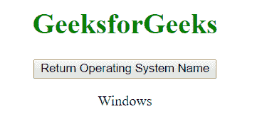
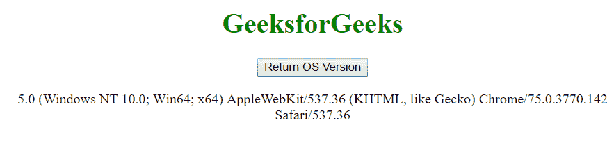

# 如何使用 JavaScript 检测客户端机器上的操作系统？

> 原文:[https://www . geesforgeks . org/如何使用 javascript 检测客户端机器上的操作系统/](https://www.geeksforgeeks.org/how-to-detect-operating-system-on-the-client-machine-using-javascript/)

要检测客户机上的操作系统，只需使用 navigator.appVersion 或 navigator.userAgent 属性。
Navigator appVersion 属性是一个只读属性，它返回一个表示浏览器版本信息的字符串。

**语法**

```
navigator.appVersion
```

**示例 1:** 本示例使用 navigator.appVersion 属性显示操作系统名称。

```
<!DOCTYPE html> 
<html> 

<head> 
    <title>
        How to detect operating system on the
        client machine using JavaScript ?
    </title>
</head> 

<body style="text-align:center;"> 

    <h1 style="color:green;">GeeksforGeeks</h1> 

    <button ondblclick="operatingSytem()"> 
        Return Operating System Name 
    </button> 

    <p id="OS"></p> 

    <!-- Script to display the OS name -->
    <script> 
        function operatingSytem() { 
            var OSName="Unknown OS";
            if (navigator.appVersion.indexOf("Win")!=-1) OSName="Windows";
            if (navigator.appVersion.indexOf("Mac")!=-1) OSName="MacOS";
            if (navigator.appVersion.indexOf("X11")!=-1) OSName="UNIX";
            if (navigator.appVersion.indexOf("Linux")!=-1) OSName="Linux";

            // Display the OS name
            document.getElementById("OS").innerHTML = OSName;
        } 
    </script> 

</body> 

</html>
```

**输出:**

*   **之前点击按钮:**
    
*   **点击按钮后:**
    

**示例 2:** 本示例使用 navigator.appVersion 属性显示客户端机器的所有属性。

```
<!DOCTYPE html> 
<html> 

<head> 
    <title>
        How to detect operating system on the
        client machine using JavaScript ?
    </title>
</head> 

<body style="text-align:center;"> 

    <h1 style="color:green;">GeeksforGeeks</h1>

    <button ondblclick="version()"> 
        Return OS Version 
    </button> 

    <p id="OS"></p> 

    <!-- Script to return OS details -->
    <script> 
        function version() { 
            var os = navigator.appVersion; 

            // Display the OS details
            document.getElementById("OS").innerHTML = os; 
        } 
    </script> 
</body> 

</html>                 
```

**输出:**

*   **之前点击按钮:**
    
*   **点击按钮后:**
    