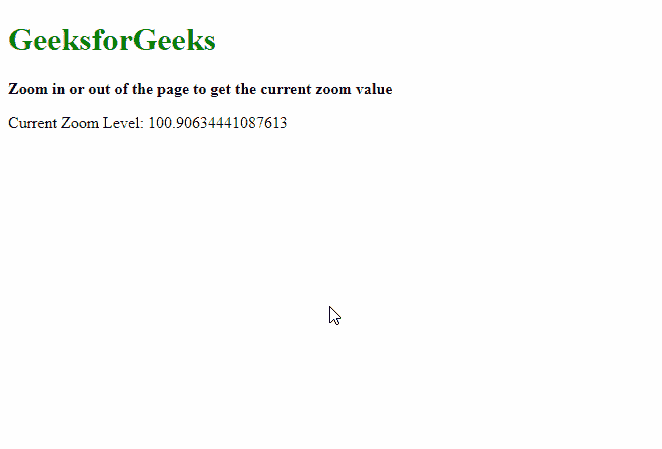
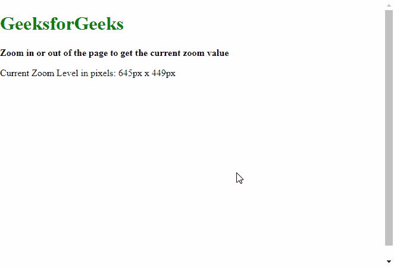

# 如何在所有使用 JavaScript 的现代浏览器中检测页面缩放级别？

> 原文:[https://www . geeksforgeeks . org/如何检测页面-缩放级别-在所有现代浏览器中-使用-javascript/](https://www.geeksforgeeks.org/how-to-detect-page-zoom-level-in-all-modern-browsers-using-javascript/)

在本文中，我们将讨论如何在网页上找到当前的缩放量。

**方法一:使用 outerWidth 和 innerWidth 属性:**在 Chrome、Microsoft Edge 等 webkit 浏览器中更容易检测缩放级别。这个方法使用了**外宽**和**内宽**属性，这是 JavaScript 的内置功能。首先将**外部宽度**减去 10，以表示滚动条，然后用**内部宽度**分割，以获得缩放级别。

**注意:**缩放量可能不完全是浏览器显示的缩放量。这可以通过四舍五入来解决。

**语法:**

```html
let zoom = (( window.outerWidth - 10 ) / window.innerWidth) * 100;
```

**示例:**

## 超文本标记语言

```html
<!DOCTYPE html>
<html lang="en">

<body>
    <h1 style="color: green">
        GeeksforGeeks
    </h1>

    <b>
        Zoom in or out of the page to
        get the current zoom value
    </b>

    <p>Current Zoom Level:
        <span class="output">
        </span>
    </p>

    <script>
        window.addEventListener(
            "resize", getSizes, false);

        let out = document.querySelector(".output");

        function getSizes() {
            let zoom = ((window.outerWidth - 10)
                / window.innerWidth) * 100;

            out.textContent = zoom;
        }
    </script>
</body>

</html>
```

**输出:**



**方法二:使用 clientWidth 和 clientHeight 属性:**由于在几个浏览器中找不到缩放量，所以可以找出网站的维度，使用页面的这些维度进行操作。该方法使用**客户端宽度**和**客户端高度**属性，这是 JavaScript 的内置功能。

**语法:**

```html
let zoom = body.clientWidth + "px x " + body.clientHeight + "px";
```

**示例:**

## 超文本标记语言

```html
<!DOCTYPE html>
<html lang="en">

<head>
    <style>
        /* Set the body to occupy the
           whole browser window
           when there is less content */
        body {
            height: 100vh;
            margin: 0;
        }
    </style>
</head>

<body>
    <h1 style="color: green">
        GeeksforGeeks
    </h1>

    <b>
        Zoom in or out of the page to
        get the current zoom value
    </b>

    <p>
        Current Zoom Level in pixels:
        <span class="output">
        </span>
    </p>

    <script>
        window.addEventListener(
                "resize", getSizes, false);

        let out = document.querySelector(".output");

        function getSizes() {
            let body = document.body;
            let zoom = body.clientWidth + "px x " +
                body.clientHeight + "px";
            out.textContent = zoom;
        }
    </script>
</body>

</html>
```

**输出:**

