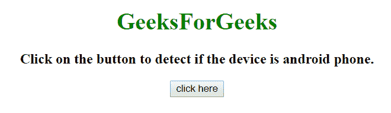
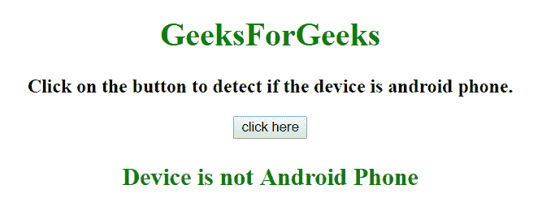

# 如何用 JavaScript 检测设备是安卓设备？

> 原文:[https://www . geesforgeks . org/如何检测设备是使用 javascript 的安卓设备/](https://www.geeksforgeeks.org/how-to-detect-the-device-is-an-android-device-using-javascript/)

任务是检测一个设备，这个设备是**安卓手机**还是没有使用 JavaScript。

**方法 1:**

*   使用 **navigator.userAgent 属性**获取浏览器发送给服务器的用户代理头的值。
*   检查用户代理中“android”的索引。
*   如果指数大于-1，那么它是安卓手机，而不是安卓手机。

**示例:**本示例检查设备是否为安卓手机。

```
<!DOCTYPE HTML> 
<html> 

<head> 
    <title> 
        How to detect Android Phone
        using JavaScript ?
    </title>
</head> 

<body style = "text-align:center;"> 

    <h1 style = "color:green;" > 
        GeeksForGeeks
    </h1>

    <p id = "GFG_UP" style =
        "font-size: 19px; font-weight: bold;">
    </p>

    <button onclick = "GFG_Fun()">
        click here
    </button>

    <p id = "GFG_DOWN" style =
        "color: green; font-size: 24px; font-weight: bold;">
    </p>

    <script>
        var el_up = document.getElementById("GFG_UP");
        var el_down = document.getElementById("GFG_DOWN");
        el_up.innerHTML = "Click on the button to detect if"
                    + " the device is android phone.";

        function GFG_Fun() {
            var res = "Device is not Android Phone";
            var userAgent = navigator.userAgent.toLowerCase();
            var Android = userAgent.indexOf("android") > -1;

            if(Android) {
                res = "Device is Android Phone";
            }
            el_down.innerHTML = res;
        }
    </script> 
</body> 

</html>
```

**输出:**

*   **点击按钮前:**
    
*   **在电脑上运行，点击按钮:**
    
*   **在安卓手机上运行，点击按钮:**
    

**方法 2:**

*   获取变量名用户代理中的**导航器.用户代理属性**。
*   使用**正则表达式**在用户代理中检查“安卓”
*   如果*安卓*的值不是 0，那么就是安卓手机，否则不是安卓手机。

**示例:**

```
<!DOCTYPE HTML> 
<html> 

<head> 
    <title> 
        How to detect Android Phone
        using JavaScript ?
    </title>
</head> 

<body style = "text-align:center;"> 

    <h1 style = "color:green;" > 
        GeeksForGeeks
    </h1>

    <p id = "GFG_UP" style =
        "font-size: 19px; font-weight: bold;">
    </p>

    <button onclick = "GFG_Fun()">
        click here
    </button>

    <p id = "GFG_DOWN" style =
        "color: green; font-size: 24px; font-weight: bold;">
    </p>

    <script>
        var el_up = document.getElementById("GFG_UP");
        var el_down = document.getElementById("GFG_DOWN");
        el_up.innerHTML = "Click on the button to detect if"
                + " the device is android phone.";

        function GFG_Fun() {
            var res = "Device is not Android Phone";
            var Android = /(android)/i.test(navigator.userAgent);

            if(Android) {
                res = "Device is Android Phone";
            }

            el_down.innerHTML = res;
        }
    </script> 
</body> 

</html>
```

**输出:**

*   **点击按钮前:**
    
*   **在电脑上运行，点击按钮:**
    
*   **在安卓手机上运行，点击按钮:**
    