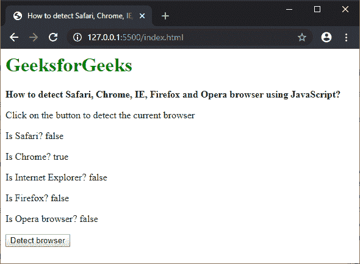
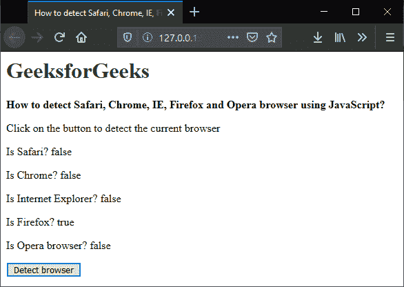
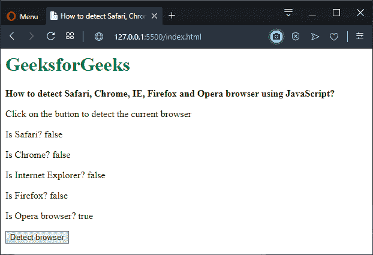

# 如何用 JavaScript 检测用户浏览器(Safari、Chrome、IE、Firefox、Opera)？

> 原文:[https://www . geesforgeks . org/如何检测用户-浏览器-safari-chrome-ie-Firefox-和-opera-使用-javascript/](https://www.geeksforgeeks.org/how-to-detect-the-user-browser-safari-chrome-ie-firefox-and-opera-using-javascript/)

可以使用 JavaScript 检查当前页面正在打开的浏览器。

navigator 对象的 **userAgent** 属性用于返回浏览器发送的用户代理头字符串。该用户代理字符串包含浏览器的相关信息，包括某些可以测试其存在性的关键字。

可以使用 **indexOf()** 方法检测特定用户字符串的存在。indexOf()方法用于返回字符串中指定字符串值的第一个匹配项。如果字符串中没有出现该值，则返回“-1”。

浏览器的用户代理字符串使用 **navigator.userAgent** 属性访问，然后存储在变量中。浏览器字符串在这个用户代理字符串中的存在被逐个检测到。

*   **Detecting the Chrome browser:** The user-agent of the Chrome browser is “Chrome”. This value is passed to indexOf() method to detect this value in the user-agent string.

    由于 indexOf()方法将返回一个大于“-1”的值来表示搜索成功，因此“大于”运算符用于返回一个布尔值来表示搜索是否成功。以下所有测试都是如此。

    ```
    // Detect Chrome
    let chromeAgent = userAgentString.indexOf("Chrome") > -1;
    ```

*   **检测互联网浏览器:**互联网浏览器的用户代理为“MSIE”或“rv:”。这两个值都被传递给 indexOf()方法，以检测用户代理字符串中的这个值，并且它们的结果都与 OR 运算符一起使用。

    ```
    // Detect Internet Explorer
    let IExplorerAgent = userAgentString.indexOf("MSIE") > -1 || 
                         userAgentString.indexOf("rv:") > -1;
    ```

*   **检测火狐浏览器:**火狐浏览器的用户代理是“火狐”。该值被传递给 indexOf()方法，以检测用户代理字符串中的该值。

    ```
    // Detect Firefox
    let firefoxAgent = userAgentString.indexOf("Firefox") > -1;
    ```

*   **Detecting the Safari browser:** The user-agent of the Safari browser is “Safari”. This value is passed to indexOf() method to detect this value in the user-agent string.

    在 Safari 浏览器的情况下，需要进行一项额外的检查，因为 Chrome 浏览器的用户代理也包括 Safari 浏览器的用户代理。如果 Chrome 和 Safari 的用户代理都在用户代理中，这意味着浏览器是 Chrome，因此 Safari 浏览器值被丢弃。

    ```
    // Detect Safari
    let safariAgent = userAgentString.indexOf("Safari") > -1;

    // Discard Safari since it also matches Chrome
    if ((chromeAgent) && (safariAgent)) safariAgent = false;
    ```

*   **Detecting the Opera browser:** The user-agent of the Opera browser is “OP”. This value is passed to indexOf() method to detect this value in the user-agent string.

    在这种浏览器的情况下，还需要额外的检查，因为 Opera 浏览器的用户代理也包括 Chrome 浏览器的用户代理。如果 Chrome 和 Opera 的用户代理都在用户代理中，这意味着浏览器是 Opera，因此 Chrome 浏览器值被丢弃。

    ```
    // Detect Opera
    let operaAgent = userAgentString.indexOf("OP") > -1;

    // Discard Chrome since it also matches Opera        
    if ((chromeAgent) && (operaAgent)) chromeAgent = false;
    ```

**示例:**

```
<!DOCTYPE html>
<html>

<head>
    <title>
        How to detect Safari, Chrome, IE, Firefox
        and Opera browser using JavaScript?
    </title>
</head>

<body>
    <h1 style="color: green">GeeksforGeeks</h1>

    <b>
        How to detect Safari, Chrome, IE, Firefox
        and Opera browser using JavaScript?
    </b>

    <p>
        Click on the button to detect
        the current browser
    </p>

    <p>
        Is Safari? 
        <span class="output-safari"></span>
    </p>

    <p>
        Is Chrome? 
        <span class="output-chrome"></span>
    </p>

    <p>
        Is Internet Explorer? 
        <span class="output-ie"></span>
    </p>

    <p>
        Is Firefox? 
        <span class="output-firefox"></span>
    </p>

    <p>
        Is Opera browser? 
        <span class="output-opera"></span>
    </p>

    <button onclick="checkBrowser()">
        Detect browser
    </button>

    <script>
        function checkBrowser() {

            // Get the user-agent string
            let userAgentString = 
                navigator.userAgent;

            // Detect Chrome
            let chromeAgent = 
                userAgentString.indexOf("Chrome") > -1;

            // Detect Internet Explorer
            let IExplorerAgent = 
                userAgentString.indexOf("MSIE") > -1 || 
                userAgentString.indexOf("rv:") > -1;

            // Detect Firefox
            let firefoxAgent = 
                userAgentString.indexOf("Firefox") > -1;

            // Detect Safari
            let safariAgent = 
                userAgentString.indexOf("Safari") > -1;

            // Discard Safari since it also matches Chrome
            if ((chromeAgent) && (safariAgent)) 
                safariAgent = false;

            // Detect Opera
            let operaAgent = 
                userAgentString.indexOf("OP") > -1;

            // Discard Chrome since it also matches Opera     
            if ((chromeAgent) && (operaAgent)) 
                chromeAgent = false;

            document.querySelector(".output-safari").textContent
                        = safariAgent;
            document.querySelector(".output-chrome").textContent
                        = chromeAgent;
            document.querySelector(".output-ie").textContent
                        = IExplorerAgent;
            document.querySelector(".output-opera").textContent
                        = operaAgent;
            document.querySelector(".output-firefox").textContent
                        = firefoxAgent;
        }
    </script>
</body>

</html>
```

**输出:**

*   **在 Chrome 浏览器上输出:**
    
*   **火狐浏览器上的输出:**
    
*   **在 Opera 浏览器上输出:**
    