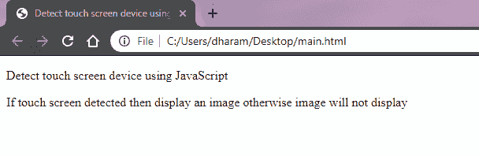
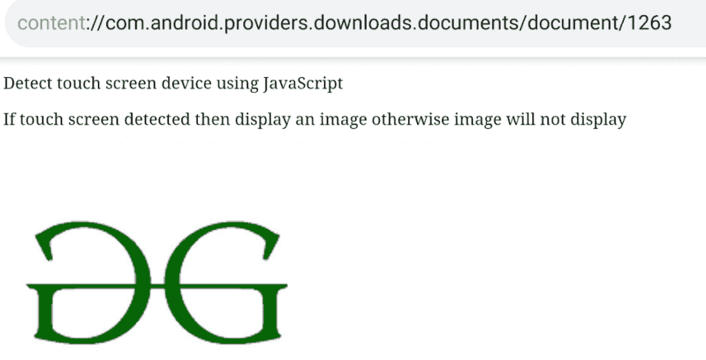
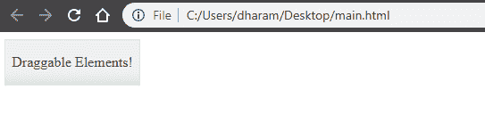
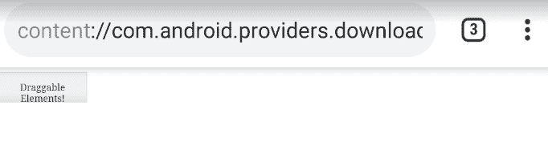

# 如何使用 JavaScript 检测触摸屏设备？

> 原文:[https://www . geesforgeks . org/如何检测-触摸屏-设备-使用-javascript/](https://www.geeksforgeeks.org/how-to-detect-touch-screen-device-using-javascript/)

有时候，你可能会寻找一些功能来加入到你的网络应用中，这些功能应该只对带有触摸屏的设备可用。您可能需要这种检测，同时在游戏应用程序或全球定位系统和导航应用程序中为触摸屏用户引入更新更智能的控制。虽然有许多 JavaScript 库，如 [Modernizer](https://modernizr.com/) 、jQuery 等，都是明确设计来完成这类任务的。

请注意，该设备支持触摸事件并不一定意味着它只是触摸屏设备。许多高端超极本都支持触控。因此，为了获得更好的用户体验，除了检查触摸屏设备之外，您还应该考虑一些属性。

为了执行这个检查，针对所有可能的浏览器，我们将使用以下三个属性；

*   **ontouchstart:** 一个事件处理程序，处理在触摸 DOM 元素后触发的事件。
*   **maxTouchPoints:**Navigator 界面的只读属性返回设备支持的同时触摸接触点的最大数量。
*   **msMaxTouchPoints:** 同上，只是用厂商前缀“ms”来定位 IE 10 及以下的浏览器。

**语法:**

```
function is_touch_enabled() {
    return ( 'ontouchstart' in window ) || 
           ( navigator.maxTouchPoints > 0 ) || 
           ( navigator.msMaxTouchPoints > 0 );
}
```

**示例:**如果检测到触摸屏设备，则本示例显示图像，否则图像将不会显示。

```
<!DOCTYPE html>
<html>

<head>
    <title>
        Detect touch screen device 
        using JavaScript
    </title>
</head>

<body>
    <p>
        Detect touch screen device 
        using JavaScript
    </p>

    <p>
        If touch screen detected then display
        an image otherwise image will not
        display    
    </p>

    <div id="GFG"></div>

    <script type="text/javascript">

        function is_touch_enabled() {
            return ( 'ontouchstart' in window ) || 
                   ( navigator.maxTouchPoints > 0 ) ||
                   ( navigator.msMaxTouchPoints > 0 );
        }

        var src = 
"https://contribute.geeksforgeeks.org/wp-content/uploads/gfg-39.png"; 

        if( is_touch_enabled() ) {
            var img = "";;
        }
        else {
            var img = "";
        }

        document.getElementById('GFG').innerHTML = img;
    </script>
</body>

</html>                    
```

**输出:**

*   **非触摸屏输出:**
    
*   **触摸屏输出:**
    

**示例 2:** 在本例中，只有当设备启用触摸时，才可拖动<分区>。

```
<!DOCTYPE html>
<html>

<head>
    <title>
        Detect touch screen device 
        using JavaScript
    </title>

    <link href=
"https://code.jquery.com/ui/1.10.4/themes/ui-lightness/jquery-ui.css"
    rel="stylesheet"> 

    <script src="https://code.jquery.com/jquery-1.10.2.js"></script> 

    <script src="https://code.jquery.com/ui/1.12.1/jquery-ui.min.js">
    </script>

    <script src=
"https://cdnjs.cloudflare.com/ajax/libs/jqueryui-touch-punch/0.2.3/
jquery.ui.touch-punch.min.js">
    </script> 

    <style>
        #draggable {
            width: 150px;
            height: 50px;
            text-align: center;
        }
    </style>

    <script>
        function is_touch_enabled() {
            return ( 'ontouchstart' in window ) || 
                   ( navigator.maxTouchPoints > 0 ) ||
                   ( navigator.msMaxTouchPoints > 0 );
        }

        if( is_touch_enabled() ) {
            $(function() { 
                $( "#draggable" ).draggable();
            });
        }
    </script>
</head>

<body>
    <div id="draggable" class="ui-widget-content"> 
        <p>Draggable Elements!</p> 
    </div> 
</body>

</html>                    
```

**输出:**

*   **非触摸屏输出:**
    
*   **触摸屏输出:**
    
    