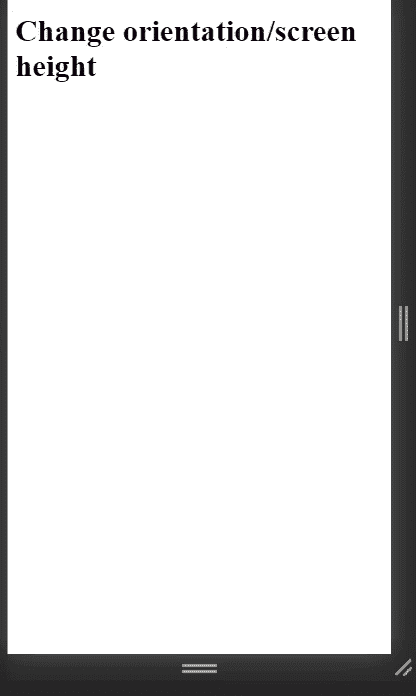
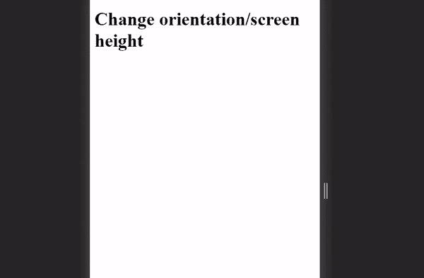

# 如何使用 JavaScript 检测虚拟键盘？

> 原文:[https://www . geesforgeks . org/如何检测-虚拟键盘-使用-javascript/](https://www.geeksforgeeks.org/how-to-detect-virtual-keyboard-using-javascript/)

给定一个 HTML 文档，任务是检测虚拟键盘是否在设备屏幕上弹出。虚拟键盘是一种在不使用物理键盘的情况下帮助输入字符的工具。它广泛应用于触摸屏设备。

**方法:**不幸的是，目前还没有直接的方法来检测虚拟键盘是否出现在使用 JavaScript 的屏幕上。然而，当虚拟键盘出现在设备屏幕上时，我们可以通过一些间接的方法来检测。

1.  **Using the ‘resize’ event listener in JavaScript**

    如果虚拟键盘出现在屏幕上，屏幕的高度将会改变。因此，我们可以使用 JavaScript 中的“调整大小”事件监听器来监听这个事件，以检测屏幕高度的变化。这个事件侦听器可以直接添加到窗口对象中。

2.  **Using CSS media queries**

    在少数情况下，当屏幕上弹出虚拟键盘时，屏幕的方向会从纵向变为横向。因此，利用这一事实，我们可以使用 CSS“方向:横向”媒体查询**来检测屏幕方向的变化。**

**示例:**

## 超文本标记语言

```
<!DOCTYPE html>
<html lang="en">
  <head>
    <meta charset="UTF-8" />
    <meta name="viewport" 
          content="width=device-width,
                   initial-scale=1.0" />
    <title>Document</title>

    <style>
      /*media query to detect orientation change*/
      @media screen and (orientation: landscape) {
        h1 {
          color: green;
        }
      }
    </style>
  </head>
  <body>
    <h1 id="text">Change orientation/screen height</h1>

    <script>
      const text = document.querySelector("#text");

// resize event listener to detect change in screen height
      window.addEventListener("resize", (e) => {
        text.innerHTML = "Virtual keyboard detected!!!";
      });
    </script>
  </body>
</html>
```

**输出:**



屏幕高度变化时的检测



屏幕方向改变时的检测