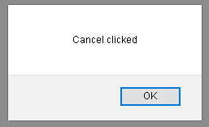

# 如何检测在使用 JavaScript 输入文件时点击取消？

> 原文:[https://www . geesforgeks . org/如何检测-点击取消-文件-输入-使用-javascript/](https://www.geeksforgeeks.org/how-to-detect-when-cancel-is-clicked-on-file-input-using-javascript/)

本文描述了处理用户试图输入文件，但后来无法上传文件的情况的方法。它向用户提供文件未上传的状态。这在需要提交重要文件或应用程序需要该文件来实现其功能的情况下可能会很有用。

**注意:**这种方法在谷歌 Chrome、Safari 等 WebKit 浏览器上效果最好。它可能无法在 Mozilla Firefox 上可靠地工作。

**示例:**

**HTML 代码:**以下代码是在页面的 HTML 中定义的。

```html
<input type='file' id='theFile' onclick="initialize()" />
```

**说明:**

*   属性值 **type="file"** 表示用户输入的输入类型是文件。
*   属性值**id = " FIle "**用于使用 getElementById()方法将 JavaScript 代码链接到它。
*   属性值 **onclick="initialize()"** 用于指定用户点击输入时的函数调用。

**JavaScript 代码:**

## java 描述语言

```html
// Get the file input element
var theFile = document.getElementById('theFile');

// Define a function to be called
// when the input is focused
function initialize() {
    document.body.onfocus = checkIt;
    console.log('initializing');
}

// Define a function to check if
// the user failed to upload file
function checkIt() {
    // Check if the number of files
    // is not zero
    if (theFile.value.length) {
      alert('Files Loaded');
    }
    // Alert the user if the number
    // of file is zero
    else {
      alert('Cancel clicked');
    }
    document.body.onfocus = null;
    console.log('checked');
}        
```

**initialize()函数说明:**

*   变量**文件**被创建，并且使用其 id 选择输入元素。
*   “document.body.onfocus = checkIt”行定义了当一个元素获得焦点时，onfocus 事件被激发。

【checkIt()功能说明:

*   当用户上传任何文件时，使用 File.value.length 属性可以找到文件的长度。当该值变为非零值时，条件得到满足，并出现一个显示“文件已加载”的警告框。
*   当用户不上传文件时，文件的长度为零。因此，条件不会得到满足，并且会出现一个警告框，显示“已单击取消”。

**完整代码:**在本节中，我们将结合以上两段代码来检测在文件输入时何时点击取消。

```html
<!DOCTYPE html>
<html lang="en">

<head>
    <meta charset="UTF-8">
    <meta name="viewport" content=
        "width=device-width, initial-scale=1.0">

    <title>
        How to detect when cancel 
        is clicked on file input?
    </title>
</head>

<body>
    <input type='file' id='theFile' 
            onclick="initialize()" />

    <script>
        // Get the file input element
        var theFile = 
            document.getElementById('theFile');

        // Define a function to be called
        // when the input is focused
        function initialize() {
            document.body.onfocus = checkIt;
            console.log('initializing');
        }

        // Define a function to check if
        // the user failed to upload file
        function checkIt() {

            // Check if the number of files
            // is not zero
            if (theFile.value.length) {
                alert('Files Loaded');
            }

            // Alert the user if the number
            // of file is zero
            else {
                alert('Cancel clicked');
            }
            document.body.onfocus = null;
            console.log('checked');
        }        
    </script>
</body>

</html>
```

**输出:**

*   **文件输入供用户选择文件:**


*   **用户未能输入文件时提醒:**



*   **上传成功后，文件名按预期显示:**

