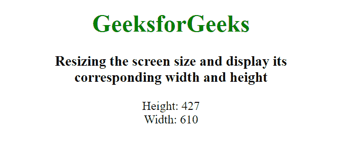

# 如何用 JavaScript 检测窗口大小何时调整？

> 原文:[https://www . geeksforgeeks . org/如何使用 javascript 检测窗口大小何时调整大小/](https://www.geeksforgeeks.org/how-to-detect-when-the-window-size-is-resized-using-javascript/)

每当浏览器窗口的大小发生变化时，就会发生窗口大小调整事件。我们可以通过两种方式收听调整大小事件:

1.  使用**设定**事件
2.  使用**调整观察器**应用编程接口

**方法 1:使用 resize 事件:**我们可以给 body 元素添加一个事件监听器，每次调整窗口大小时都会触发。

**示例:**

```
<!DOCTYPE html>
<html>

<head>
    <title>
        How to detect and resize
        the window size
    </title>

    <style>
        body {
            text-align: center;
        }
        h1 {
            color:green;
        }
    </style>
</head>

<body>
    <h1>GeeksforGeeks</h1>

    <h3>
        Resizing the screen size and display its 
        <br>corresponding width and height
    </h3>
    <div id="height">Height: <span></span></div>
    <div id="width">Width: <span></span></div>

    <script>
        const height = document.querySelector("#height span");
        const width = document.querySelector("#width span");

        // Insert values on load of page
        window.onload = function() {
            height.innerHTML = window.innerHeight;
            width.innerHTML = window.innerWidth;
        };

        // Change values when window is resized
        window.onresize = function() {

            // Setting the current height & width
            // to the elements
            height.innerHTML = window.innerHeight; 
            width.innerHTML = window.innerWidth;
        };
    </script>
</body>

</html>
```

**输出:**


**方法二:使用 ResizeObserver API:** 我们可以使用最新的 [ResizeObserver API](https://www.geeksforgeeks.org/javascript-resizeobserver-interface/) 来监听窗口调整大小事件。不完全支持此应用编程接口。

**示例:**

```
<!DOCTYPE html>
<html>

<head>
    <title>
        How to detect and resize
        the window size
    </title>

    <style>
        body {
            text-align: center;
        }
        h1 {
            color:green;
        }
    </style>
</head>

<body>
    <h1>GeeksforGeeks</h1>

    <h3>
        Resizing the screen size and display its 
        <br>corresponding width and height
    </h3>
    <div id="height">Height: <span></span></div>
    <div id="width">Width: <span></span></div>

    <script>
        const body = document.getElementsByTagName("body")[0];

        const height = document.querySelector("#height span");
        const width = document.querySelector("#width span");

        // Initialize resize observer object
        let resizeObserver = new ResizeObserver(() => {

            // Set the current height and width
            // to the element
            height.innerHTML = window.innerHeight;
            width.innerHTML = window.innerWidth;

        });

        // Add a listener to body
        resizeObserver.observe(body);
    </script>
</body>

</html>
```

**输出:**


**参考文献:**

*   [MDN](https://developer.mozilla.org/en-US/docs/Web/API/ResizeObserver)
*   [浏览器支持](https://caniuse.com/#feat=resizeobserver)