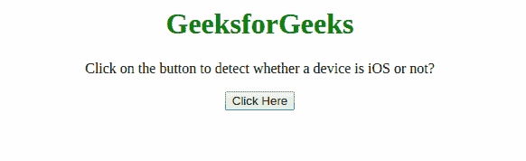

# 不使用 JavaScript 中的正则表达式如何检测设备是否为 iOS？

> 原文:[https://www . geeksforgeeks . org/如何检测设备是否是不使用 javascript 正则表达式的 IOs/](https://www.geeksforgeeks.org/how-to-detect-whether-a-device-is-ios-without-using-regular-expression-in-javascript/)

任务是在没有借助 JavaScript 使用 RegExp 的情况下，检测设备是否是 iOS。下面讨论两种方法。

**方法 1:** 使用[**navigator . platform property**](https://www.geeksforgeeks.org/html-navigator-platform-property/)使用 [**indexOf()方法**](https://www.geeksforgeeks.org/javascript-array-indexof/) 检查属于 iOS 设备的特定关键词。

*   **例:**

    ```html
    <!DOCTYPE html>
    <html>
        <head>
            <title>
                Detect whether a device is iOS 
                without using RegExp
            </title>
        </head>
        <body style="text-align: center;">
            <h1 style="color: green;">
                GeeksforGeeks
            </h1>
            <p>
                Click on the button to detect 
                whether a device is iOS or not?
            </p>
            <button onclick="gfg_Run()">
                Click Here
            </button>
            <p id="gfg"></p>
       <script>
          var el_down = document.getElementById("gfg");
          function gfg_Run() {
          const isIOS = ["iPad Simulator", 
                         "iPhone Simulator", 
                         "iPod Simulator", 
                         "iPad", "iPhone", 
                         "iPod"]
              .indexOf(navigator.platform) !== -1;
               el_down.innerHTML = isIOS;
                }
            </script>
        </body>
    </html>
    ```

*   **输出:** 

**方法 2:** 使用[**navigator . platform property**](https://www.geeksforgeeks.org/html-navigator-platform-property/)检查列表中属于 iOS 设备的特定关键词。用 [**pop()方法**](https://www.geeksforgeeks.org/javascript-array-prototype-pop/) 逐个拿出来对比。

*   **例:**

    ```html
    <!DOCTYPE html>
    <html>
        <head>
            <title>
                Detect whether a device is 
                iOS without using RegExp
            </title>
        </head>
        <body style="text-align: center;">
            <h1 style="color: green;">
                GeeksforGeeks
            </h1>
            <p>
                Click on the button to detect 
                whether a device is iOS or not?
            </p>
            <button onclick="gfg_Run()">
                Click Here
            </button>
            <p id="gfg"></p>
      <script>
        var el_down = document.getElementById("gfg");
        function iOS() {
            var Devices = ["iPad Simulator", 
                           "iPhone Simulator", 
                           "iPod Simulator", 
                           "iPad", "iPhone",
                           "iPod"];
             if (!!navigator.platform) {
                while (Devices.length) {
                  if (navigator.platform === Devices.pop()) {
                                return true;
                            }
                        }
                    }
                    return false;
                }
                function gfg_Run() {
                    el_down.innerHTML = iOS();
                }
            </script>
        </body>
    </html>
    ```

*   **输出:** 