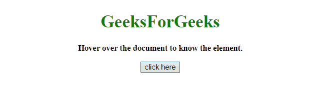
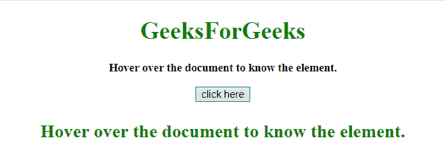
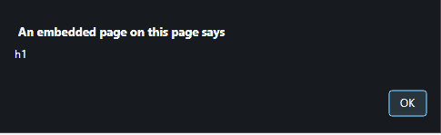

# 如何用 JavaScript 确定鼠标指针移动到哪个元素上？

> 原文:[https://www . geesforgeks . org/如何使用 javascript 确定鼠标指针移动到哪个元素上/](https://www.geeksforgeeks.org/how-to-determine-which-element-the-mouse-pointer-move-over-using-javascript/)

给定一个 HTML 文档，任务是获取鼠标指针移动到的元素。有两种方法可以解决这个问题，讨论如下:

**方法 1:**

*   使用**获取 x、y 坐标值。clientX** 和**。clientY** 物业。
*   使用 **document.elementFromPoint(x，y)** 方法获取鼠标指针移动到该位置时的元素内容。

**示例 1:** 该示例实现了上述方法。

```
<!DOCTYPE HTML> 
<html> 

<head> 
    <title> 
        How to determine which element the mouse
        pointer move over using JavaScript ?
    </title> 
</head> 

<body style = "text-align:center;"> 

    <h1 style = "color:green;" onmouseover = "GFG_Fun()"> 
        GeeksForGeeks 
    </h1> 

    <p id = "GFG_UP" onmouseover = "GFG_Fun()"
            style = "font-size: 15px; font-weight: bold;"> 
    </p>

    <button onmouseover = "GFG_Fun()"> 
        click here 
    </button> 

    <p id = "GFG_DOWN" style = 
        "font-size: 24px; font-weight: bold; color: green;"> 
    </p>

    <script> 
        var up = document.getElementById('GFG_UP'); 
        var down = document.getElementById('GFG_DOWN'); 
        up.innerHTML = "Hover over the document to know the element."; 

        function GFG_Fun() { 
            var x = event.clientX;
            var y = event.clientY;
            el = document.elementFromPoint(x, y);
            down.innerHTML = el.innerHTML;
        } 
    </script> 
</body>

</html>
```

**输出:**

*   **悬停在按钮上之前:**
    
*   **悬停在按钮上后:**
    

**方法 2:**

*   将事件“onmouseover”附加到元素。
*   每次事件发生时，用该元素的 id 调用 alert 函数。

**示例 2:** 该示例使用上述方法。

```
<!DOCTYPE HTML> 
<html> 

<head> 
    <title> 
        How to determine which element the mouse
        pointer move over using JavaScript ?
    </title> 
</head> 

<body style = "text-align:center;"> 

    <h1 id = "h1" style = "color:green;"
            onmouseover = "alert(this.id)"> 
        GeeksForGeeks 
    </h1> 

    <p id = "p" onmouseover = "alert(this.id)"
            style = "font-size: 15px; font-weight: bold;"> 
        Hover over the document to know the element.
    </p>

    <button id = "button" onmouseover = "alert(this.id)"> 
        click here 
    </button> 
</body> 

</html>
```

**输出:**

*   **悬停在按钮上之前:**
    
*   **悬停在按钮上后:**
    