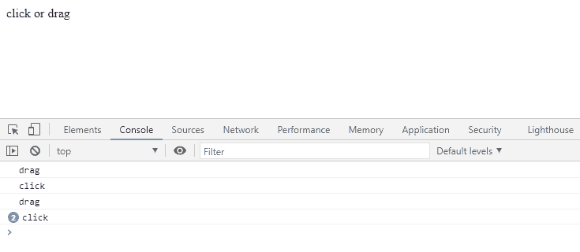
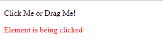
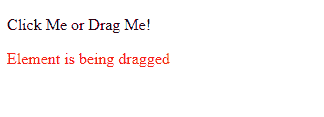

# 如何用 JavaScript 区分鼠标“点击”和“拖动”事件？

> 原文:[https://www . geesforgeks . org/如何区分-鼠标点击-拖动-事件-使用-javascript/](https://www.geeksforgeeks.org/how-to-differentiate-mouse-click-and-drag-event-using-javascript/)

使用 web 元素时，用户可以根据需要拖动或单击元素。区分拖动和点击事件非常重要。JavaScript 是一种高级的动态类型编程语言，可用于区分拖放事件。JavaScript 有一个拖拽和点击事件，有助于区分两者。本文演示了区分点击和拖动事件的两种方法。在第一种方法中，我们将在控制台上显示输出，而在第二种方法中，我们将在网页本身上显示输出。用户可以在方便的时候选择任何一种方法。

**方法 1:** 我们有一个网页，其中任何类型的点击或拖动事件都记录在控制台中。点击和拖动事件之间的基本区别是鼠标移动。区分点击和拖动事件的鼠标事件是“鼠标移动”事件。在“点击”事件中，不存在“鼠标移动”事件。但是，“鼠标向下”和“鼠标向上”事件对于单击和拖动都保持不变。
下面的 JavaScript 代码显示了一个名为 *drag* 的变量以一个“ *false* 布尔值开始。对于“鼠标按下”事件‘*拖动*’变量保持*假*。但是一旦触发“鼠标移动”事件，拖动*变量就被设置为“*真*”。在“鼠标向上”事件中，检查*拖动*变量的值。如果值为*真*，则发生“拖动”事件，输出显示在控制台中。如果该值为“*假*，这意味着没有发生“鼠标移动”事件，这也意味着发生了“点击”事件。因此，点击输出显示在控制台上。*

```html
*<script type="text/javascript">
    let drag = false;
    document.addEventListener(
        'mousedown', () => drag = false);

    document.addEventListener(
        'mousemove', () => drag = true);

    document.addEventListener(
        'mouseup', () => console.log(
            drag ? 'drag' : 'click'));
</script>*
```

***输出:**在点击和拖动事件时，输出显示在控制台中，如下所示。*

**

***方法 2:** 第二种方法是元素特定的，不适用于网页中的所有其他元素。我们选择一个元素来记录“点击”或“拖动”事件。在下面的例子中，选择一个段落作为所需的元素，我们将“*可拖动*”和“*可点击*”属性指定为*真*，这意味着该元素既可以被拖动，也可以被点击。*

*JavaScript 事件 **ondrag** 和 **onclick** 帮助我们达到预期的结果。当单击元素时，在网页本身的元素下方会显示一条单击消息。当拖动元素时，在网页本身的元素下方会显示一条拖动消息。点击和拖动事件根据用户用户活动触发，然后执行对应于这些事件的操作。*

```html
*<!DOCTYPE html>
<html>

<body>
    <p id="dragtarget" draggable="true" clickable="true">
        Click Me or Drag Me!
    </p>

    <p id="demo" style="color:red;"></p>

    <script type="text/javascript">
        document.ondrag = function (event) {
            document.getElementById("demo").innerHTML
                        = "Element is being dragged";
        };

        document.onclick = function (event) {
            document.getElementById("demo").innerHTML
                    = "Element is being clicked!";
        };
    </script>
</body>

</html>*
```

***输出:***

*   *单击元素时:*

    **

*   *拖动元素时:*

    **