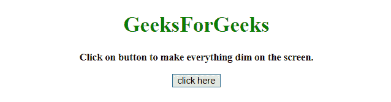
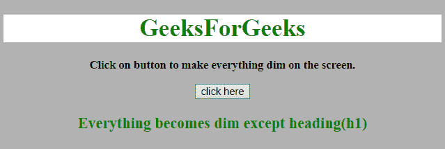
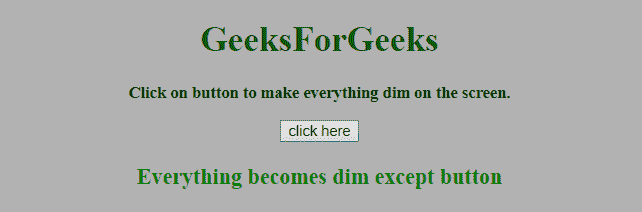

# 如何用 JavaScript 调暗除固定区域外的整个屏幕？

> 原文:[https://www . geeksforgeeks . org/如何使用 javascript 将整个屏幕变暗(固定区域除外)/](https://www.geeksforgeeks.org/how-to-dim-entire-screen-except-a-fixed-area-using-javascript/)

给定一个 HTML 文档，任务是除了一个或几个元素之外，使整个屏幕变暗。这需要使用 JavaScript 在页面的某个部分引起用户的注意。

**进场:**

*   选择焦点的元素。
*   使用**框阴影**属性使该区域可见。

**示例 1:** 本示例聚焦 HTML 文档的一个 div，其他部分变暗。

```
<!DOCTYPE HTML> 
<html> 

<head> 
    <title> 
        Dim the entire screen except
        a fixed area in JavaScript ?
    </title>     

    <style>
        .dim {
            /* For Internet Explorer */
            box-shadow: 0 0 0 1000px rgba(0, 0, 0, .3);

            /* For other browsers */
            box-shadow: 0 0 0 100vmax rgba(0, 0, 0, .3);
        }
    </style>
</head>

<body style = "text-align:center;"> 

    <h1 style = "color:green;" id = "h1"> 
        GeeksForGeeks 
    </h1>

    <p id = "GFG_UP" style =
        "font-size: 15px; font-weight: bold;">
    </p>

    <button onclick = "GFG_Fun()">
        click here
    </button>

    <p id = "GFG_DOWN" style =
        "color:green; font-size: 20px; font-weight: bold;">
    </p>

    <script> 
        var up = document.getElementById('GFG_UP');
        up.innerHTML = "Click on button to make everything"
                + " dim on the screen.";
        var down = document.getElementById('GFG_DOWN'); 
        var heading = document.getElementById('h1');
        function GFG_Fun() {
            heading.classList.add('dim');
            down.innerHTML = "Everything becomes dim "
                    + "except heading(h1)";
        }
    </script> 
</body> 

</html>
```

**输出:**

*   **点击按钮前:**
    
*   **点击按钮后:**
    

**示例 2:** 在此示例中，按钮被聚焦，并且**指针事件**属性设置为无，其他部分变暗。

```
<!DOCTYPE HTML> 
<html> 

<head> 
    <title> 
        Dim the entire screen except
        a fixed area in JavaScript ?
    </title>     

    <style>
        .dim {

            /* For Internet Explorer */
            box-shadow: 0 0 0 1000px rgba(0, 0, 0, .3);

            /* For other browsers */
            box-shadow: 0 0 0 100vmax rgba(0, 0, 0, .3);
            pointer-events: none;
        } 
    </style>
</head>

<body style = "text-align:center;" id = "body">  

    <h1 style = "color:green;">  
        GeeksForGeeks  
    </h1>

    <p id = "GFG_UP" style =
        "font-size: 15px; font-weight: bold;">
    </p>

    <button onclick = "GFG_Fun()" id = "button">
        click here
    </button>

    <p id = "GFG_DOWN" style = 
        "color:green; font-size: 20px; font-weight: bold;">
    </p>

    <script> 
        var up = document.getElementById('GFG_UP');

        up.innerHTML = "Click on button to make everything"
                + " dim on the screen.";
        var down = document.getElementById('GFG_DOWN'); 
        var button = document.getElementById('button');

        function GFG_Fun() {
          button.classList.add('dim');
          down.innerHTML = "Everything becomes dim"
                + " except button";
        }
    </script> 
</body>  

</html>
```

**输出:**

*   **点击按钮前:**
    
*   **点击按钮后:**
    