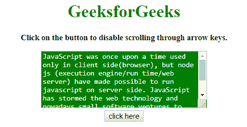
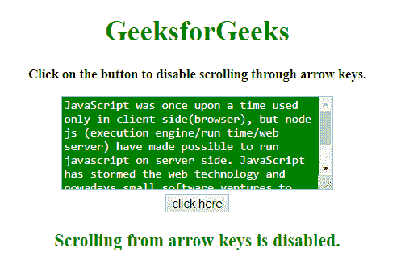

# 如何用 JavaScript 禁用 textarea 中的箭头键？

> 原文:[https://www . geesforgeks . org/如何使用 javascript 禁用文本区域箭头键/](https://www.geeksforgeeks.org/how-to-disable-arrow-key-in-textarea-using-javascript/)

给定一个包含<textarea>元素的 HTML 元素，任务是在 JavaScript 的帮助下禁止滚动箭头键。</textarea>

**方法 1:**

*   在窗口上添加一个事件监听器 **onkeydown** 。
*   如果事件发生，检查键是否是箭头。
*   如果按下箭头键，则防止其默认行为。

**示例:**该示例实现了上述方法。

```
<!DOCTYPE HTML> 
<html> 

<head> 
    <title> 
        How to disable arrow key in
        textarea using JavaScript ?
    </title>

    <style>
        #t {
            height: 100px;
            width: 300px;
            background: green;
            color: white;
        }
    </style>
</head> 

<body style = "text-align:center;"> 

    <h1 style = "color:green;" > 
        GeeksforGeeks 
    </h1>

    <p id = "GFG_UP" style =
        "font-size: 15px; font-weight: bold;">
    </p>

    <textarea id = "t">
        JavaScript was once upon a time used
        only in client side(browser), but node
        js (execution engine/run time/web 
        server) have made possible to run
        javascript on server side. JavaScript
        has stormed the web technology and
        nowadays small software ventures to
        fortune 500, all are using node js
        for web apps. 
    </textarea>
    <br>

    <button onclick = "gfg_Run()"> 
        click here
    </button>

    <p id = "GFG_DOWN" style = "color:green;
        font-size: 20px; font-weight: bold;">
    </p>

    <script>
        var el_up = document.getElementById("GFG_UP");
        var el_down = document.getElementById("GFG_DOWN");

        el_up.innerHTML = "Click on the button to disable"
                    + " scrolling through arrow keys.";

        function gfg_Run() {
            window.addEventListener("keydown", function(e) {
                if([32, 37, 38, 39, 40].indexOf(e.keyCode) > -1){
                    e.preventDefault();
                }
            }, false);

            el_down.innerHTML = 
                "Scrolling from arrow keys is disabled.";
        }         
    </script> 
</body> 

</html>
```

**输出:**

*   **点击按钮前:**
    
*   **点击按钮后:**
    

**方法 2:**

*   这个例子和上一个非常相似。它还维护一个按下哪些键的数组，当按键事件发生时，它会将它们从数组中移除。
*   在窗口上添加一个事件监听器 **onkeydown** 。
*   如果事件发生，检查键是否是箭头。
*   如果按下箭头键，则防止其默认行为。

**示例:**该示例实现了上述方法。

```
<!DOCTYPE HTML> 
<html> 

<head> 
    <title> 
        How to disable arrow key in
        textarea using JavaScript ?
    </title>

    <style>
        #t {
            height: 100px;
            width: 300px;
            background: green;
            color: white;
        }
    </style>
</head> 

<body style = "text-align:center;"> 

    <h1 style = "color:green;" > 
        GeeksforGeeks 
    </h1>

    <p id = "GFG_UP" style =
        "font-size: 15px; font-weight: bold;">
    </p>

    <textarea id = "t">
        JavaScript was once upon a time used
        only in client side(browser), but node
        js (execution engine/run time/web 
        server) have made possible to run
        javascript on server side. JavaScript
        has stormed the web technology and
        nowadays small software ventures to
        fortune 500, all are using node js
        for web apps. 
    </textarea>
    <br>

    <button onclick = "gfg_Run()"> 
        click here
    </button>

    <p id = "GFG_DOWN" style = "color:green;
        font-size: 20px; font-weight: bold;">
    </p>

    <script>
        var el_up = document.getElementById("GFG_UP");
        var el_down = document.getElementById("GFG_DOWN");

        el_up.innerHTML = "Click on the button to disable"
                + " scrolling through arrow keys.";

        function gfg_Run() {
            var key = {};
            window.addEventListener("keydown", function(e) {
                key[e.keyCode] = true;
                switch(e.keyCode){
                    case 37: case 39: case 38: case 40:
                    case 32: e.preventDefault(); break; 
                    default: break;
                }
            }, false);

            window.addEventListener('keyup', function(e){
                key[e.keyCode] = false;
            }, false);

            el_down.innerHTML = 
                "Scrolling from arrow keys is disabled.";
        }         
    </script> 
</body> 

</html>
```

**输出:**

*   **点击按钮前:**
    
*   **点击按钮后:**
    